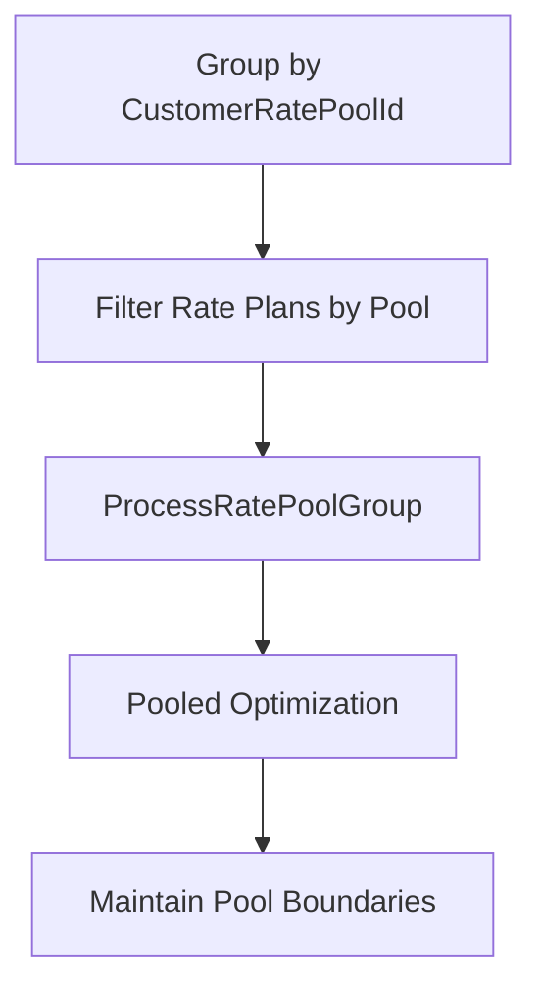
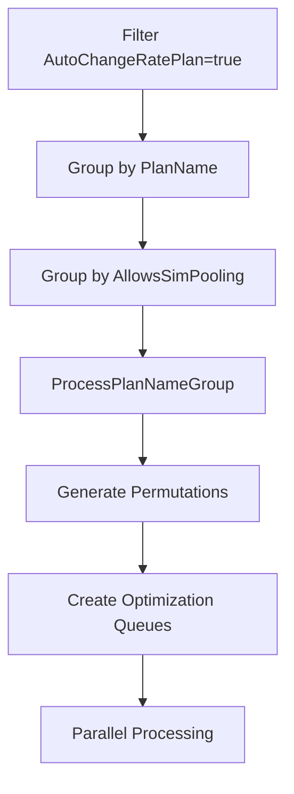
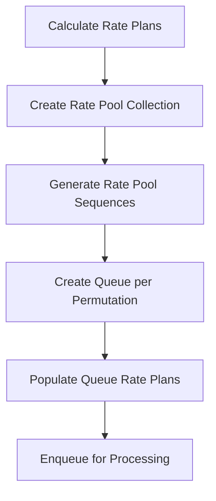

# Advanced Optimization Features Analysis - 10 Sentence Algorithms

## 1. Auto Change Logic

Auto Change Logic determines whether the optimization algorithm can dynamically change rate plans during optimization or uses fixed customer rate pool groupings.

### Algorithm (10 Sentences)
```
1. Extract all rate plans from the customer's billing period and service provider context.
2. Iterate through each rate plan and check the AutoChangeRatePlan boolean property.
3. Create two separate collections: one for rate plans with AutoChangeRatePlan set to true and another for false.
4. For rate plans with AutoChangeRatePlan disabled, filter them into ratePlansByCustomerRatePool collection.
5. Validate that disabled auto-change rate plans have non-zero DataPerOverageCharge and OverageRate values.
6. Process disabled plans using ProcessDevicesWithAutoChangeDisabledRatePlans method with fixed customer rate pool assignments.
7. For rate plans with AutoChangeRatePlan enabled, group them by PlanName to organize similar rate plan families.
8. Apply service provider compatibility filtering for CrossProvider scenarios to ensure valid rate plan assignments.
9. Process enabled plans using ProcessPlanNameGroup method which allows dynamic rate plan switching during optimization.
10. Execute appropriate optimization strategy based on the auto-change capability determination for maximum cost efficiency.
```

### Code Locations

**Primary File**: `AltaworxSimCardCostQueueCustomerOptimization.cs`

#### Auto Change Disabled Processing
```csharp
var ratePlansByCustomerRatePool = ratePlans.Where(ratePlan => !ratePlan.AutoChangeRatePlan).ToList();
if (ratePlansByCustomerRatePool.Any())
{
    if (CheckZeroValueRatePlans(context, instanceId, ratePlansByCustomerRatePool, shouldStopInstance: true))
    {
        return true;
    }
    else
    {
        optimizationSimCards = ProcessDevicesWithAutoChangeDisabledRatePlans(context, integrationAuthenticationId, usesProration, revAccountNumber, AMOPCustomerId, billingPeriod, nextBillingPeriod, instanceId, optimizationSimCards, ratePlansByCustomerRatePool, tenantId);
    }
}
```

#### Auto Change Enabled Processing
```csharp
var ratePlansByCodes = ratePlans.Where(ratePlan => ratePlan.AutoChangeRatePlan && ratePlanCodes.Contains(ratePlan.PlanName)).GroupBy(x => x.PlanName);
foreach (var ratePlansByCode in ratePlansByCodes)
{
    isError = await ProcessPlanNameGroup(context, integrationAuthenticationId, usesProration, revAccountNumber, AMOPCustomerId, billingPeriod, instanceId, chargeType, ratePlansByCode, simCardsByRatePoolId.ToList());
}
```

#### CrossProvider Auto Change Processing
```csharp
var autoChangeRatePlans = ratePlans.Where(ratePlan => ratePlan.AutoChangeRatePlan);
if (autoChangeRatePlans.Any() && !string.IsNullOrWhiteSpace(serviceProviderIds))
{
    var serviceProviderIdList = serviceProviderIds.Replace(" ", "").Split(CommonConstants.STRING_ITEMS_SEPERATOR).ToList();
    autoChangeRatePlans = autoChangeRatePlans.Where(x => x.ServiceProviderIds.Split(CommonConstants.STRING_ITEMS_SEPERATOR).ToList().ContainsAllItems(serviceProviderIdList)).ToList();
    if (!autoChangeRatePlans.Any())
    {
        LogInfo(context, CommonConstants.ERROR, string.Format(LogCommonStrings.NO_VALID_CROSS_PROVIDER_CUSTOMER_RATE_PLAN_FOUND, serviceProviderIds));
        return true;
    }
}
```

---

## 2. Bill in Advance Features

Bill in Advance Features identify rate plans eligible for advance billing processing, load next billing periods, and set charge types to OverageOnly for advance billing scenarios.

### Algorithm (10 Sentences)
```
1. Analyze all retrieved customer rate plans and count those with IsBillInAdvanceEligible property set to true.
2. Set the useBillInAdvance flag based on whether any eligible rate plans exist in the customer's portfolio.
3. Override the useBillInAdvance flag to false due to current system limitations referenced in PORT-166 ticket.
4. Log the bill in advance eligibility status for debugging and audit purposes during optimization processing.
5. Retrieve the next billing period information by calling GetNextBillingPeriod with current period's service provider and end date.
6. Extract the billInAdvanceBillingPeriodId from the next billing period to enable advance billing calculations.
7. Validate that both current and next billing periods exist to ensure continuity for advance billing scenarios.
8. Set optimization charge type to OverageOnly if bill in advance is enabled, otherwise use RateChargeAndOverage.
9. Log error and terminate optimization if bill in advance is requested but next billing period cannot be found.
10. Skip actual bill in advance calculation logic as it requires new implementation for Auto Change Rate Plan compatibility.
```

### Code Locations

**Primary File**: `AltaworxSimCardCostQueueCustomerOptimization.cs`

#### Bill in Advance Eligibility Detection
```csharp
var useBillInAdvance = ratePlans.Count(x => x.IsBillInAdvanceEligible) > 0;
//Disable bill in advance logic until new logic is defined (PORT-166)
useBillInAdvance = false;

LogInfo(context, "INFO", $"Use Bill In Advance: {useBillInAdvance}");
```

#### Next Billing Period Loading
```csharp
BillingPeriod nextBillingPeriod = null;
if (billingPeriod != null)
{
    nextBillingPeriod = GetNextBillingPeriod(context, billingPeriod.ServiceProviderId, billingPeriod.BillingPeriodEnd);
}

var billInAdvanceBillingPeriodId = nextBillingPeriod?.Id;

if (useBillInAdvance && (billInAdvanceBillingPeriodId == null || billingPeriod == null))
{
    LogInfo(context, "ERROR", $"A Billing Period past Billing Period Id could not be found for this Customer. So, billing in advance is not possible at this time. Optimization not run.");
    return;
}
```

#### Charge Type Setting
```csharp
var chargeType = OptimizationChargeType.RateChargeAndOverage;
if (useBillInAdvance)
{
    chargeType = OptimizationChargeType.OverageOnly;
}
```

#### Bill in Advance Calculation Logic (Currently Disabled)
```csharp
if (useBillInAdvance)
{
    LogInfo(context, LogTypeConstant.Info, "Bill In Advance calculation logic is not implemented for Optimization with Auto Change Rate Plan enabled.");
}
```

---

## 3. Processing Strategies

Processing Strategies encompass four key approaches: Customer Rate Pool Processing, Auto Change Processing, Permutation Generation, and Queue Creation for parallel processing.

### 3.1 Customer Rate Pool Processing

Groups devices by customer rate pool ID for pooled optimization where rate plans are fixed.

#### Algorithm (10 Sentences)
```
1. Retrieve all optimization sim cards for the current customer from the database using service provider and billing period filters.
2. Group the optimization sim cards by their CustomerRatePoolId property to organize devices into rate pool collections.
3. Iterate through each distinct rate pool group to process devices within their assigned pool boundaries.
4. Extract unique customer rate plan codes from all devices within the current rate pool group for filtering.
5. Filter the available rate plans to only include those whose PlanName matches the device rate plan codes.
6. Validate that the rate pool group has a non-null CustomerRatePoolId indicating it's a valid pooled assignment.
7. Log the current rate pool ID being processed for debugging and optimization tracking purposes.
8. Call ProcessRatePoolGroup method with the filtered rate plans and devices to execute pooled optimization strategy.
9. Maintain rate pool integrity by ensuring devices remain within their assigned pool during optimization processing.
10. Continue to the next rate pool group while preserving all rate pool relationships and assignments.
```

#### Code Locations
```csharp
var simCardsByRatePoolIds = optimizationSimCards.GroupBy(x => x.CustomerRatePoolId).Distinct();

foreach (var simCardsByRatePoolId in simCardsByRatePoolIds)
{
    LogInfo(context, CommonConstants.INFO, $"RatePoolId: {simCardsByRatePoolId}");
    var ratePlanCodes = simCardsByRatePoolId.Select(x => x.CustomerRatePlanCode).Distinct();
    var isError = false;
    if (simCardsByRatePoolId.Key != null)
    {
        var ratePlansForPool = ratePlans.Where(x => ratePlanCodes.Contains(x.PlanName));
        isError = await ProcessRatePoolGroup(context, integrationAuthenticationId, usesProration, revAccountNumber, AMOPCustomerId, billingPeriod, instanceId, chargeType, ratePlansForPool, simCardsByRatePoolId.ToList(), simCardsByRatePoolId?.Key, queuesPerInstance: QueuesPerInstance);
    }
}
```

### 3.2 Auto Change Processing

Groups devices by rate plan code for dynamic rate plan changes during optimization.

#### Algorithm (10 Sentences)
```
1. Filter the complete rate plan collection to identify only those with AutoChangeRatePlan property set to true.
2. Cross-reference the auto-change enabled rate plans with device rate plan codes to ensure relevance.
3. Group the filtered auto-change rate plans by their PlanName property to organize similar plan families.
4. Iterate through each plan name group to process devices that can utilize dynamic rate plan switching.
5. Within each plan name group, further subdivide rate plans by their AllowsSimPooling capability for specialized handling.
6. Validate that each rate plan group has non-zero DataPerOverageCharge and OverageRate values for proper calculations.
7. Check that the device count meets minimum requirements for running permutation-based optimization algorithms.
8. Ensure the rate plan count stays within the maximum limit of 15 plans to prevent computational complexity explosion.
9. Call ProcessPlanNameGroup method to execute algorithmic optimization with dynamic rate plan assignment capabilities.
10. Allow the optimization engine to test different rate plan combinations and select the most cost-effective assignment.
```

#### Code Locations
```csharp
var ratePlansByCodes = ratePlans.Where(ratePlan => ratePlan.AutoChangeRatePlan && ratePlanCodes.Contains(ratePlan.PlanName)).GroupBy(x => x.PlanName);
foreach (var ratePlansByCode in ratePlansByCodes)
{
    isError = await ProcessPlanNameGroup(context, integrationAuthenticationId, usesProration, revAccountNumber, AMOPCustomerId, billingPeriod, instanceId, chargeType, ratePlansByCode, simCardsByRatePoolId.ToList());
}
```

### 3.3 Permutation Generation

Creates all valid rate plan combinations for testing during optimization to find the most cost-effective assignments.

#### Algorithm (10 Sentences)
```
1. Create a new communication plan group using CreateCommPlanGroup to organize the rate plan permutation processing.
2. Calculate maximum average usage for all rate plans in the group using RatePoolCalculator.CalculateMaxAvgUsage method.
3. Generate rate pool objects from the calculated plans using RatePoolFactory.CreateRatePools with billing period and charge type.
4. Create a rate pool collection using RatePoolCollectionFactory.CreateRatePoolCollection to enable permutation logic execution.
5. Log the start of permutation generation process including the total count of rate plans being processed.
6. Call RatePoolAssigner.GenerateRatePoolSequences to create all mathematically valid permutations of rate pool assignments.
7. Log the completion of rate pool sequence generation to track permutation processing performance and status.
8. Iterate through each generated rate pool sequence to create individual optimization queues for parallel testing.
9. Create a unique queue for each permutation using CreateQueue method with appropriate service provider and proration settings.
10. Populate each queue with its corresponding rate plan sequence using AddRatePlansToQueue and persist the data structure.
```

#### Code Locations
```csharp
// Create rate pool collection for permutation
var commPlanGroupId = CreateCommPlanGroup(context, instanceId);
var calculatedPlans = RatePoolCalculator.CalculateMaxAvgUsage(groupRatePlans, null);
var ratePools = RatePoolFactory.CreateRatePools(calculatedPlans, billingPeriod, usesProration, chargeType);
var ratePoolCollection = RatePoolCollectionFactory.CreateRatePoolCollection(ratePools);

// Generate permutations and create queues
GeneratePermutationQueueRatePlans(context, usesProration, billingPeriod, instanceId, commPlanGroupId, ratePoolCollection, commGroupRatePlanTable);

private void GeneratePermutationQueueRatePlans(KeySysLambdaContext context, bool usesProration, BillingPeriod billingPeriod, long instanceId, long commPlanGroupId, RatePoolCollection ratePoolCollection, DataTable commGroupRatePlanTable)
{
    LogInfo(context, LogTypeConstant.Sub, detail: $"Start GenerateRatePoolSequences for {ratePoolCollection.RatePools.Count} Rate Plans");
    var ratePoolSequences = RatePoolAssigner.GenerateRatePoolSequences(ratePoolCollection.RatePools);
    LogInfo(context, LogTypeConstant.Sub, "End GenerateRatePoolSequences");
}
```

### 3.4 Queue Creation

Generates optimization queues for parallel processing of different optimization scenarios and rate plan combinations.

#### Algorithm (10 Sentences)
```
1. Initialize a new DataTable structure to store queue and rate plan relationship mappings for database persistence.
2. Add required columns to the DataTable including QueueId, CommGroup_RatePlanId, SequenceOrder, CreatedBy, and CreatedDate.
3. Iterate through each rate pool sequence generated from the permutation logic to create individual optimization queues.
4. Call CreateQueue method for each permutation with instance ID, communication plan group, service provider, and proration parameters.
5. Generate queue rate plan mappings using AddRatePlansToQueue method with the current rate pool sequence and sequence order.
6. Validate that the queue rate plan temporary data table contains valid records before proceeding with data insertion.
7. Append all queue rate plan mapping rows from the temporary table to the main DataTable structure.
8. Call CreateQueueRatePlans method to persist all queue and rate plan relationships to the database for processing.
9. Create special queues for unused devices that don't have assigned rate plan codes using default cost values.
10. Enqueue all optimization tasks using EnqueueOptimizationRunsAsync for parallel execution with customer optimization enabled.
```

#### Code Locations

#### Queue Creation Methods
```csharp
// Create queue for rate plan permutation
var queueId = CreateQueue(context, instanceId, commPlanGroupId, billingPeriod.ServiceProviderId, usesProration);

// Create queue for unused devices
var unusedQueueId = CreateQueue(context, instanceId, unusedCommPlanGroupId, null, usesProration);
```

#### Queue Population and Execution
```csharp
// Enqueue optimization runs for parallel processing
await EnqueueOptimizationRunsAsync(context, instanceId, new List<long>() { commPlanGroupId }, chargeType, QueuesPerInstance, skipLowerCostCheck: true, isCustomerOptimization: true);

// Add rate plans to queue with sequence tracking
var dtQueueRatePlanTemp = AddRatePlansToQueue(queueId, ratePoolSequence, commGroupRatePlanTable);
if (dtQueueRatePlanTemp != null && dtQueueRatePlanTemp.Rows.Count > 0)
{
    foreach (DataRow dr in dtQueueRatePlanTemp.Rows)
    {
        dtQueueRatePlan.Rows.Add(dr.ItemArray);
    }
}
```

## Processing Strategy Flow Comparison

### Customer Rate Pool Processing Flow


### Auto Change Processing Flow


### Permutation Generation Flow


## Error Handling Summary

### Auto Change Logic Errors
- **Zero Value Rate Plans**: Validation prevents optimization with invalid rate plans
- **Service Provider Mismatch**: CrossProvider validation ensures compatible rate plans
- **Empty Plan Groups**: Validation prevents processing of empty rate plan collections

### Bill in Advance Errors
- **Missing Next Period**: Error when next billing period cannot be found
- **Implementation Status**: Clear logging that feature is currently disabled
- **Validation Failures**: Proper error handling for advance billing prerequisites

### Processing Strategy Errors
- **Insufficient Devices**: Minimum device count validation for optimization viability
- **Rate Plan Limits**: Maximum rate plan count validation to prevent complexity explosion
- **Queue Creation Failures**: Error handling for queue creation and population issues