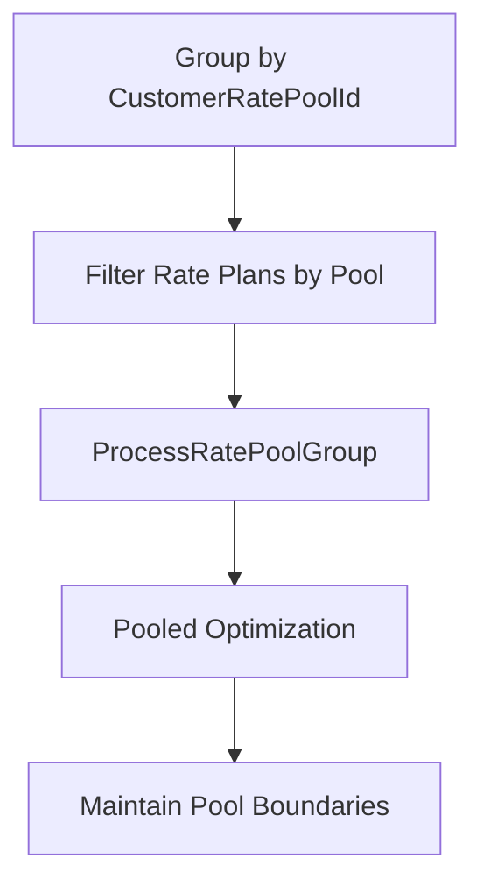
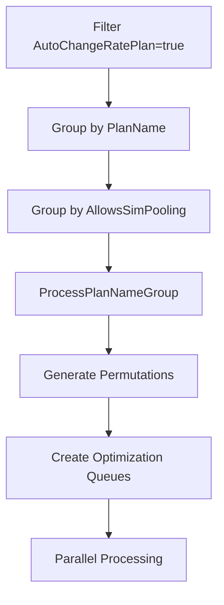
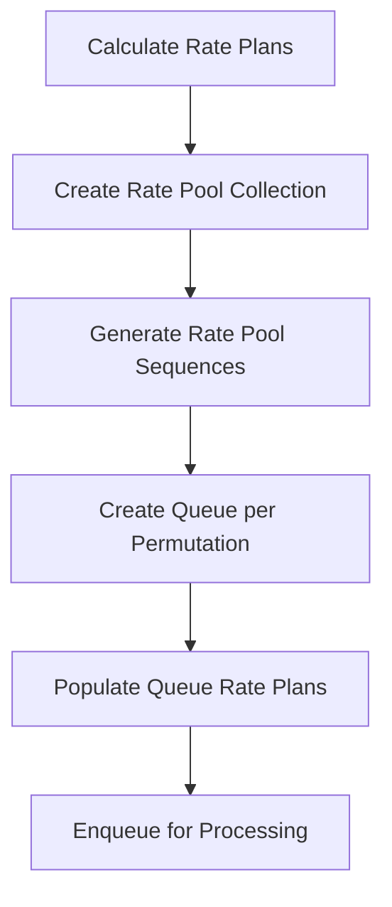

# Advanced Optimization Features Analysis

## 1. Auto Change Logic

### What, Why, How

**WHAT**: Auto Change Logic determines whether the optimization algorithm can dynamically change rate plans during optimization or uses fixed customer rate pool groupings.

**WHY**: Auto Change capability provides flexibility in optimization strategies - enabling dynamic plan switching for better cost optimization while maintaining control over customers who require fixed rate plan assignments.

**HOW**: The system evaluates the `AutoChangeRatePlan` property on each rate plan to separate them into two processing paths: dynamic optimization for auto-change enabled plans and pooled optimization for auto-change disabled plans.

### Algorithm

```
AUTO CHANGE LOGIC ALGORITHM:

1. EVALUATE rate plan auto change capability
   ├── FOR each ratePlan in ratePlans collection
   ├── CHECK ratePlan.AutoChangeRatePlan property
   └── SEPARATE into two collections based on capability

2. PROCESS auto change disabled rate plans (Fixed Groupings)
   ├── Filter ratePlans.Where(ratePlan => !ratePlan.AutoChangeRatePlan)
   ├── Group by CustomerRatePoolId for pool-based optimization
   ├── Call ProcessDevicesWithAutoChangeDisabledRatePlans()
   ├── Use existing customer rate pool assignments
   └── Maintain fixed rate plan groupings

3. PROCESS auto change enabled rate plans (Dynamic Changes)
   ├── Filter ratePlans.Where(ratePlan => ratePlan.AutoChangeRatePlan)
   ├── Group by PlanName for algorithmic optimization
   ├── Call ProcessPlanNameGroup() for each group
   ├── Enable permutation-based optimization
   └── Allow dynamic rate plan switching

4. VALIDATE auto change logic results
   ├── Check if each group has sufficient devices for optimization
   ├── Ensure rate plan collections are not empty
   ├── Validate zero-value rate plans before processing
   └── Proceed with appropriate optimization strategy

5. APPLY optimization strategy based on auto change capability
   ├── IF AutoChangeRatePlan == false: Use pooled optimization
   ├── IF AutoChangeRatePlan == true: Use permutation optimization
   └── Process each group with its designated strategy
```

### Code Locations

**Primary File**: `AltaworxSimCardCostQueueCustomerOptimization.cs`

#### Auto Change Disabled Rate Plans Processing
**Lines 518-528**
```csharp
var ratePlansByCustomerRatePool = ratePlans.Where(ratePlan => !ratePlan.AutoChangeRatePlan).ToList();
if (ratePlansByCustomerRatePool.Any())
{
    if (CheckZeroValueRatePlans(context, instanceId, ratePlansByCustomerRatePool, shouldStopInstance: true))
    {
        return true;
    }
    else
    {
        // process and return the remaining devices for optimization with algorithm
        optimizationSimCards = ProcessDevicesWithAutoChangeDisabledRatePlans(context, integrationAuthenticationId, usesProration, revAccountNumber, AMOPCustomerId, billingPeriod, nextBillingPeriod, instanceId, optimizationSimCards, ratePlansByCustomerRatePool, tenantId);
    }
}
```

#### Auto Change Enabled Rate Plans Processing
**Lines 548-552**
```csharp
// Group rate plans by rate plan code and run auto change optimization logic for this group of devices
var ratePlansByCodes = ratePlans.Where(ratePlan => ratePlan.AutoChangeRatePlan && ratePlanCodes.Contains(ratePlan.PlanName)).GroupBy(x => x.PlanName);
foreach (var ratePlansByCode in ratePlansByCodes)
{
    isError = await ProcessPlanNameGroup(context, integrationAuthenticationId, usesProration, revAccountNumber, AMOPCustomerId, billingPeriod, instanceId, chargeType, ratePlansByCode, simCardsByRatePoolId.ToList());
}
```

#### CrossProvider Auto Change Processing
**Lines 806-813**
```csharp
var autoChangeRatePlans = ratePlans.Where(ratePlan => ratePlan.AutoChangeRatePlan);
if (autoChangeRatePlans.Any() && !string.IsNullOrWhiteSpace(serviceProviderIds))
{
    var serviceProviderIdList = serviceProviderIds.Replace(" ", "").Split(CommonConstants.STRING_ITEMS_SEPERATOR).ToList();
    autoChangeRatePlans = autoChangeRatePlans.Where(x => x.ServiceProviderIds.Split(CommonConstants.STRING_ITEMS_SEPERATOR).ToList().ContainsAllItems(serviceProviderIdList)).ToList();
    if (!autoChangeRatePlans.Any())
    {
        LogInfo(context, CommonConstants.ERROR, string.Format(LogCommonStrings.NO_VALID_CROSS_PROVIDER_CUSTOMER_RATE_PLAN_FOUND, serviceProviderIds));
        return true;
    }
}
```

---

## 2. Bill in Advance Features

### What, Why, How

**WHAT**: Bill in Advance Features identify rate plans eligible for advance billing processing, load next billing periods, and set charge types to OverageOnly for advance billing scenarios.

**WHY**: Bill in Advance allows customers to pay for future usage in advance, reducing billing complexity and providing predictable costs, but requires special handling for overage-only calculations.

**HOW**: The system checks rate plans for `IsBillInAdvanceEligible` property, retrieves next billing period data, and sets charge type to OverageOnly, though currently disabled pending new logic implementation.

### Algorithm

```
BILL IN ADVANCE FEATURES ALGORITHM:

1. IDENTIFY eligible rate plans for bill in advance
   ├── Count ratePlans where IsBillInAdvanceEligible == true
   ├── Set useBillInAdvance = (eligibleCount > 0)
   └── Log bill in advance eligibility status

2. DISABLE bill in advance logic (Current Implementation)
   ├── Override useBillInAdvance = false
   ├── Reference PORT-166 ticket for new logic implementation
   └── Log that bill in advance is currently disabled

3. LOAD next billing period for advance calculations
   ├── Call GetNextBillingPeriod(context, serviceProviderId, billingPeriodEnd)
   ├── Set billInAdvanceBillingPeriodId = nextBillingPeriod?.Id
   └── Validate next billing period exists for advance billing

4. VALIDATE bill in advance prerequisites
   ├── IF useBillInAdvance == true AND billInAdvanceBillingPeriodId == null
   ├── Log error: "A Billing Period past Billing Period Id could not be found"
   ├── Return early to prevent optimization execution
   └── Ensure billing period continuity for advance billing

5. SET charge type for bill in advance scenarios
   ├── IF useBillInAdvance == true
   ├── Set chargeType = OptimizationChargeType.OverageOnly
   ├── ELSE set chargeType = OptimizationChargeType.RateChargeAndOverage
   └── Use appropriate charge calculation method

6. HANDLE bill in advance calculation logic
   ├── IF useBillInAdvance == true after processing
   ├── Log: "Bill In Advance calculation logic is not implemented for Optimization with Auto Change Rate Plan enabled"
   ├── Reference PORT-655 for M2M customer optimization requirements
   └── Skip advance calculation until new logic is implemented
```

### Code Locations

**Primary File**: `AltaworxSimCardCostQueueCustomerOptimization.cs`

#### Bill in Advance Eligibility Detection
**Lines 287-291 (Rev Customers), 404-406 (AMOP Customers), 699-703 (CrossProvider)**
```csharp
var useBillInAdvance = ratePlans.Count(x => x.IsBillInAdvanceEligible) > 0;
//Disable bill in advance logic until new logic is defined (PORT-166)
useBillInAdvance = false;

LogInfo(context, "INFO", $"Use Bill In Advance: {useBillInAdvance}");
```

#### Next Billing Period Loading
**Lines 302-309 (Rev), 417-424 (AMOP), 708-717 (CrossProvider)**
```csharp
BillingPeriod nextBillingPeriod = null;
if (billingPeriod != null)
{
    nextBillingPeriod = GetNextBillingPeriod(context, billingPeriod.ServiceProviderId, billingPeriod.BillingPeriodEnd);
}

var billInAdvanceBillingPeriodId = nextBillingPeriod?.Id;

if (useBillInAdvance && (billInAdvanceBillingPeriodId == null || billingPeriod == null))
{
    LogInfo(context, "ERROR", $"A Billing Period past Billing Period Id = {billingPeriodId.Value} could not be found for this Customer. So, billing in advance is not possible at this time. Optimization not run.");
    return;
}
```

#### Charge Type Setting for Bill in Advance
**Lines 322-325 (Rev), 437-440 (AMOP)**
```csharp
var chargeType = OptimizationChargeType.RateChargeAndOverage;
if (useBillInAdvance)
{
    chargeType = OptimizationChargeType.OverageOnly;
}
```

#### Bill in Advance Calculation Logic (Currently Disabled)
**Lines 354-357 (Rev), 469-471 (AMOP)**
```csharp
// (Optional) Calculate Bill in Advance Charges
if (useBillInAdvance)
{
    // Original logic here was using Mobility customer Optimization Bill in advance logic, but that does not take into account the changing rate plans logic of M2M Customer Optimization so we need to reimplement(PORT-655)
    LogInfo(context, LogTypeConstant.Info, "Bill In Advance calculation logic is not implemented for Optimization with Auto Change Rate Plan enabled.");
}
```

---

## 3. Processing Strategies

### What, Why, How

**WHAT**: Processing Strategies encompass four key approaches: Customer Rate Pool Processing, Auto Change Processing, Permutation Generation, and Queue Creation for parallel processing.

**WHY**: Different processing strategies are needed to handle various optimization scenarios efficiently, from fixed pooled assignments to dynamic rate plan changes, enabling parallel processing for performance.

**HOW**: The system routes optimization tasks through appropriate processing strategies based on rate plan capabilities, device groupings, and optimization requirements.

### 3.1 Customer Rate Pool Processing

#### What, Why, How
**WHAT**: Groups devices by customer rate pool ID for pooled optimization where rate plans are fixed.

**WHY**: Customers with fixed rate pool assignments need pooled optimization to maintain their existing rate plan groupings while still optimizing costs within those constraints.

**HOW**: Groups optimization sim cards by CustomerRatePoolId and processes each pool as a separate optimization unit.

#### Algorithm
```
CUSTOMER RATE POOL PROCESSING ALGORITHM:

1. GROUP devices by customer rate pool ID
   ├── var simCardsByRatePoolIds = optimizationSimCards.GroupBy(x => x.CustomerRatePoolId)
   ├── Process each rate pool group separately
   └── Maintain rate pool boundaries during optimization

2. PROCESS each rate pool group
   ├── FOR each simCardsByRatePoolId in simCardsByRatePoolIds
   ├── IF simCardsByRatePoolId.Key != null (has rate pool assignment)
   ├── Filter ratePlans by matching rate plan codes
   └── Call ProcessRatePoolGroup() for pooled optimization

3. VALIDATE rate pool assignments
   ├── Ensure rate pool has valid rate plan codes
   ├── Check device assignments within rate pool
   └── Proceed with pooled optimization strategy

4. MAINTAIN pool integrity during optimization
   ├── Keep devices within their assigned rate pools
   ├── Optimize usage and assignments within pool constraints
   └── Preserve customer rate pool relationships
```

#### Code Locations
**Lines 532-544**
```csharp
var simCardsByRatePoolIds = optimizationSimCards.GroupBy(x => x.CustomerRatePoolId).Distinct();

foreach (var simCardsByRatePoolId in simCardsByRatePoolIds)
{
    LogInfo(context, CommonConstants.INFO, $"RatePoolId: {simCardsByRatePoolId}");
    // Get all rate plan codes from the devices
    var ratePlanCodes = simCardsByRatePoolId.Select(x => x.CustomerRatePlanCode).Distinct();
    var isError = false;
    if (simCardsByRatePoolId.Key != null)
    {
        // Get all rate plans with matching rate plan codes
        var ratePlansForPool = ratePlans.Where(x => ratePlanCodes.Contains(x.PlanName));
        isError = await ProcessRatePoolGroup(context, integrationAuthenticationId, usesProration, revAccountNumber, AMOPCustomerId, billingPeriod, instanceId, chargeType, ratePlansForPool, simCardsByRatePoolId.ToList(), simCardsByRatePoolId?.Key, queuesPerInstance: QueuesPerInstance);
    }
}
```

### 3.2 Auto Change Processing

#### What, Why, How
**WHAT**: Groups devices by rate plan code for dynamic rate plan changes during optimization.

**WHY**: Auto change enabled rate plans allow algorithmic optimization to find the best rate plan assignments dynamically, potentially achieving better cost optimization.

**HOW**: Groups rate plans by PlanName and applies permutation-based optimization to find optimal rate plan assignments.

#### Algorithm
```
AUTO CHANGE PROCESSING ALGORITHM:

1. GROUP rate plans by plan name for auto change optimization
   ├── Filter ratePlans where AutoChangeRatePlan == true
   ├── Group by PlanName to organize similar plans
   └── Process each plan name group separately

2. APPLY permutation-based optimization
   ├── FOR each ratePlansByCode group
   ├── Call ProcessPlanNameGroup() for algorithmic optimization
   ├── Generate all possible rate plan combinations
   └── Test permutations to find optimal assignments

3. HANDLE SIM pooling sub-grouping
   ├── Within each plan name group
   ├── Group by AllowsSimPooling capability
   ├── Apply different optimization rules per pooling type
   └── Maintain SIM pooling constraints during optimization

4. VALIDATE optimization constraints
   ├── Check minimum device count requirements
   ├── Validate rate plan count limits (max 15 plans)
   ├── Ensure zero-value rate plan validation
   └── Proceed with permutation generation if valid
```

#### Code Locations
**Lines 548-552, 835-838**
```csharp
// Group rate plans by rate plan code and run auto change optimization logic for this group of devices
var ratePlansByCodes = ratePlans.Where(ratePlan => ratePlan.AutoChangeRatePlan && ratePlanCodes.Contains(ratePlan.PlanName)).GroupBy(x => x.PlanName);
foreach (var ratePlansByCode in ratePlansByCodes)
{
    isError = await ProcessPlanNameGroup(context, integrationAuthenticationId, usesProration, revAccountNumber, AMOPCustomerId, billingPeriod, instanceId, chargeType, ratePlansByCode, simCardsByRatePoolId.ToList());
}
```

### 3.3 Permutation Generation

#### What, Why, How
**WHAT**: Creates all valid rate plan combinations for testing during optimization to find the most cost-effective assignments.

**WHY**: Permutation generation enables comprehensive testing of rate plan combinations to identify optimal cost scenarios that wouldn't be found through simple assignments.

**HOW**: Generates rate pool sequences using algorithmic permutation logic and creates optimization queues for parallel testing of each combination.

#### Algorithm
```
PERMUTATION GENERATION ALGORITHM:

1. PREPARE rate plan collections for permutation
   ├── Calculate max average usage for rate plans
   ├── Create rate pools using RatePoolFactory.CreateRatePools()
   ├── Generate rate pool collection for permutation logic
   └── Validate rate plan count within limits (≤15 plans)

2. GENERATE rate pool sequences
   ├── Call RatePoolAssigner.GenerateRatePoolSequences()
   ├── Create all valid permutations of rate pool assignments
   ├── Log permutation generation progress
   └── Prepare sequences for queue creation

3. CREATE optimization queues for each permutation
   ├── FOR each ratePoolSequence in sequences
   ├── Create new queue with CreateQueue()
   ├── Add rate plans to queue using AddRatePlansToQueue()
   └── Store queue rate plan relationships

4. PERSIST permutation data
   ├── Build DataTable with queue rate plan mappings
   ├── Include sequence order for permutation tracking
   ├── Call CreateQueueRatePlans() to persist data
   └── Enable parallel processing of permutations
```

#### Code Locations
**Lines 589-597, 616, 629-658**
```csharp
// Create rate pool collection for permutation
var commPlanGroupId = CreateCommPlanGroup(context, instanceId);
var calculatedPlans = RatePoolCalculator.CalculateMaxAvgUsage(groupRatePlans, null);
var ratePools = RatePoolFactory.CreateRatePools(calculatedPlans, billingPeriod, usesProration, chargeType);
var ratePoolCollection = RatePoolCollectionFactory.CreateRatePoolCollection(ratePools);

// Generate permutations and create queues
GeneratePermutationQueueRatePlans(context, usesProration, billingPeriod, instanceId, commPlanGroupId, ratePoolCollection, commGroupRatePlanTable);

private void GeneratePermutationQueueRatePlans(KeySysLambdaContext context, bool usesProration, BillingPeriod billingPeriod, long instanceId, long commPlanGroupId, RatePoolCollection ratePoolCollection, DataTable commGroupRatePlanTable)
{
    LogInfo(context, LogTypeConstant.Sub, detail: $"Start GenerateRatePoolSequences for {ratePoolCollection.RatePools.Count} Rate Plans");
    var ratePoolSequences = RatePoolAssigner.GenerateRatePoolSequences(ratePoolCollection.RatePools);
    LogInfo(context, LogTypeConstant.Sub, "End GenerateRatePoolSequences");
    
    // Create queues for each permutation...
}
```

### 3.4 Queue Creation

#### What, Why, How
**WHAT**: Generates optimization queues for parallel processing of different optimization scenarios and rate plan combinations.

**WHY**: Queue creation enables parallel processing of optimization tasks, improving performance and allowing concurrent testing of multiple optimization strategies.

**HOW**: Creates queues for different optimization scenarios including permutation testing, unused device processing, and rate pool group processing.

#### Algorithm
```
QUEUE CREATION ALGORITHM:

1. CREATE optimization queues for parallel processing
   ├── Call CreateQueue() for each optimization scenario
   ├── Assign unique queue ID for tracking
   ├── Associate with instance ID and comm plan group
   └── Configure queue parameters (service provider, proration)

2. POPULATE queues with rate plan assignments
   ├── Add rate plans to each queue using AddRatePlansToQueue()
   ├── Include sequence order for permutation tracking
   ├── Map rate plans to queue for processing
   └── Maintain queue rate plan relationships

3. ENQUEUE optimization tasks for execution
   ├── Call EnqueueOptimizationRunsAsync() for parallel processing
   ├── Set optimization parameters (charge type, queue limits)
   ├── Enable customer optimization and lower cost check skipping
   └── Submit queues for optimization engine processing

4. HANDLE special queue scenarios
   ├── Create unused device queues for devices without rate plans
   ├── Set default cost values for unassigned devices
   ├── Process no-rate-plan devices separately
   └── Ensure all devices are accounted for in optimization
```

#### Code Locations

#### Queue Creation Methods
**Lines 645, 672, 862**
```csharp
// Create queue for rate plan permutation
var queueId = CreateQueue(context, instanceId, commPlanGroupId, billingPeriod.ServiceProviderId, usesProration);

// Create queue for unused devices
var unusedQueueId = CreateQueue(context, instanceId, unusedCommPlanGroupId, null, usesProration);
```

#### Queue Population and Execution
**Lines 619, 647-657**
```csharp
// Enqueue optimization runs for parallel processing
await EnqueueOptimizationRunsAsync(context, instanceId, new List<long>() { commPlanGroupId }, chargeType, QueuesPerInstance, skipLowerCostCheck: true, isCustomerOptimization: true);

// Add rate plans to queue with sequence tracking
var dtQueueRatePlanTemp = AddRatePlansToQueue(queueId, ratePoolSequence, commGroupRatePlanTable);
if (dtQueueRatePlanTemp != null && dtQueueRatePlanTemp.Rows.Count > 0)
{
    foreach (DataRow dr in dtQueueRatePlanTemp.Rows)
    {
        dtQueueRatePlan.Rows.Add(dr.ItemArray);
    }
}
```

## Processing Strategy Flow Comparison

### Customer Rate Pool Processing Flow


### Auto Change Processing Flow


### Permutation Generation Flow


## Performance Considerations

### Auto Change Logic
- **Separation Efficiency**: Early separation of rate plans reduces processing overhead
- **Strategy Selection**: Appropriate strategy selection based on capability reduces unnecessary processing
- **Validation**: Early validation prevents invalid processing paths

### Bill in Advance Features
- **Disabled Logic**: Currently disabled to prevent performance impact until new implementation
- **Next Period Loading**: Efficient next billing period lookup for advance calculations
- **Charge Type Optimization**: Appropriate charge type selection for calculation efficiency

### Processing Strategies
- **Parallel Processing**: Queue creation enables concurrent optimization processing
- **Memory Management**: Efficient grouping and processing reduces memory overhead
- **Permutation Limits**: Rate plan count limits prevent exponential processing complexity

## Error Handling Summary

### Auto Change Logic Errors
- **Zero Value Rate Plans**: Validation prevents optimization with invalid rate plans
- **Service Provider Mismatch**: CrossProvider validation ensures compatible rate plans
- **Empty Plan Groups**: Validation prevents processing of empty rate plan collections

### Bill in Advance Errors
- **Missing Next Period**: Error when next billing period cannot be found
- **Implementation Status**: Clear logging that feature is currently disabled
- **Validation Failures**: Proper error handling for advance billing prerequisites

### Processing Strategy Errors
- **Insufficient Devices**: Minimum device count validation for optimization viability
- **Rate Plan Limits**: Maximum rate plan count validation to prevent complexity explosion
- **Queue Creation Failures**: Error handling for queue creation and population issues