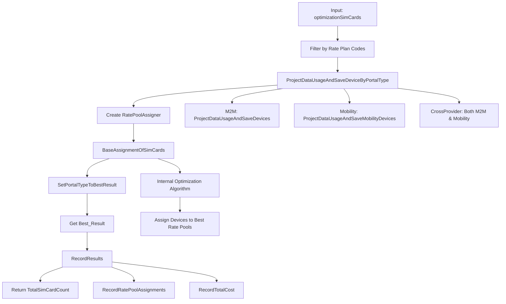

# BaseDeviceAssignment Process Flow Documentation

## Overview
The `BaseDeviceAssignment` method is a core optimization function that processes SIM cards through rate plan optimization algorithms and returns the count of successfully assigned devices.

## Method Signature
```csharp
public int BaseDeviceAssignment(
    KeySysLambdaContext context, 
    long instanceId, 
    long commPlanGroupId, 
    int? serviceProviderId,
    string revAccountNumber, 
    int? integrationAuthenticationId, 
    List<string> commPlanNames, 
    RatePoolCollection ratePoolCollection,
    List<M2MRatePool> ratePools, 
    List<vwOptimizationSimCard> providerSimList, 
    BillingPeriod billingPeriod, 
    bool usesProration, 
    int? AMOPCustomerId = null, 
    bool shouldFilterByRatePlanType = false
)
```

## Process Flow Diagram



## Detailed Step-by-Step Process

### 1. **Initialization and Setup** (Lines 2028-2030)
```csharp
var queueId = CreateQueue(context, instanceId, commPlanGroupId, serviceProviderId, usesProration);
var simList = providerSimList.ToList();
```
- Creates optimization queue for tracking
- Initializes SIM card list from input

### 2. **Filtering Phase** (Lines 2032-2040)
```csharp
if (!string.IsNullOrWhiteSpace(revAccountNumber) || AMOPCustomerId != null)
{
    var customerRatePlanCodes = ratePoolCollection.RatePools
        .Select(x => x.RatePlan.PlanName).Distinct().ToList();
    simList = simList.Where(x => customerRatePlanCodes.Contains(x.CustomerRatePlanCode)).ToList();
}
```
**Purpose**: Filter devices to only include those matching available rate plans
- **Input Count**: `providerSimList.Count`
- **Output Count**: `simList.Count` (≤ input count)

### 3. **Device Processing Phase** (Line 2044)
```csharp
var simCards = ProjectDataUsageAndSaveDeviceByPortalType(context, billingPeriod, instanceId, 
    simList, autoChangeRatePlan: true, commPlanGroupId);
```

#### 3.1 Portal Type Processing
Based on `PortalType`, devices are processed differently:

##### **M2M Portal (Lines 2916-2918)**
```csharp
simCards = ProjectDataUsageAndSaveDevices(context, instanceId, devices, billingPeriod, autoChangeRatePlan, commGroupId);
```

**ProjectDataUsageAndSaveDevices Process** (Lines 2109-2149):
1. Create `DataTable` for OptimizationDevice
2. **For each device in optimizationSimCards**:
   - Calculate projected data usage
   - Create database row with device details
   - **Create SimCard object**: `SimCardFromOptimizationSimCard(optSimCard, billingPeriod)`
   - Add to `simCards` list
3. Bulk insert to OptimizationDevice table
4. **Return**: `List<SimCard>` with count = input device count

##### **Mobility Portal (Lines 2912-2914)**
```csharp
simCards = optimizationMobilityDeviceRepository.ProjectDataUsageAndSaveMobilityDevices(context, instanceId, devices, billingPeriod, autoChangeRatePlan, commGroupId);
```

##### **CrossProvider Portal (Lines 2920-2938)**
Groups devices by portal type and processes each group separately.

### 4. **Caching Phase** (Lines 2047-2051)
```csharp
if (isUsingRedisCache)
{
    ProjectDataUsageAndSaveDevicesToCache(context, instanceId, simList, billingPeriod, commPlanGroupId);
}
```
- Saves processed devices to Redis cache for faster access

### 5. **Optimization Phase** (Lines 2053-2057)
```csharp
var assigner = new RatePoolAssigner(string.Empty, ratePoolCollection, simCards, 
    context.LambdaContext, isUsingRedisCache, PortalType, shouldFilterByRatePlanType,
    ratePoolCollection.ShouldPoolByOptimizationGroup);
assigner.BaseAssignmentOfSimCards(ratePools, queueId);
```

**RatePoolAssigner Process**:
- **Input**: `simCards` (processed devices), `ratePoolCollection` (available rate plans)
- **Algorithm**: Internal optimization logic assigns each device to optimal rate pool
- **Output**: Populates `Best_Result` with optimized assignments

### 6. **Result Processing Phase** (Lines 2059-2062)
```csharp
assigner.SetPortalTypeToBestResult(PortalType);
var result = assigner.Best_Result;
var totalCost = result.CombinedRatePools.TotalDataCost;
```
- Sets portal type on best optimization result
- Retrieves the best assignment result
- **Key**: `result.CombinedRatePools` contains all optimized rate pool assignments

### 7. **Recording Phase** (Lines 2065-2072)
```csharp
if (AMOPCustomerId == null)
    RecordResults(context, queueId, revAccountNumber, result);
else
    RecordResults(context, queueId, AMOPCustomerId.GetValueOrDefault(0), result);
```

#### Recording Process Flow:
```
RecordResults
├── OptimizationResultDbWriter.RecordResults
    ├── RecordRatePoolAssignments
    │   ├── For each RatePoolCollection in result.RawRatePools
    │   ├── For each RatePool in collection
    │   │   ├── Check: ratePool.SimCards.Count > 0
    │   │   └── RecordRatePoolByPortalType
    │   └── Count devices per rate pool
    └── RecordTotalCost
        └── Aggregate costs across all rate pools
```

**Key Recording Details** (Lines 211-224):
```csharp
foreach (var ratePool in collection.RatePools)
{
    if (ratePool.SimCards.Count <= 0)
    {
        context.LogInfo("SUB", $"No Sim card for rate pool {ratePool.RatePlan.PlanName}");
        continue;
    }
    // Record devices assigned to this rate pool
}
```

### 8. **Count Calculation and Return** (Lines 2075-2078)
```csharp
StopQueue(context, queueId);
return result.CombinedRatePools.TotalSimCardCount;
```

## Count Flow Analysis

### Count Tracking Through Process
```
Stage 1: Input Devices
├── providerSimList.Count = N (initial device count)

Stage 2: Filtered Devices  
├── simList.Count = M (where M ≤ N)
└── Filtered by rate plan code matching

Stage 3: Processed Devices
├── simCards.Count = M (same as filtered count)
└── Each device converted to SimCard object

Stage 4: Optimized Assignments
├── result.CombinedRatePools.TotalSimCardCount = K (where K ≤ M)
└── Count of devices successfully assigned to rate pools

Stage 5: Return Value
└── K = Final assigned device count
```

### Factors Affecting Final Count

1. **Rate Plan Filtering**: Only devices with matching rate plan codes are processed
2. **Optimization Success**: Not all devices may be optimally assignable
3. **Rate Pool Capacity**: Rate pools may have capacity constraints
4. **Business Rules**: Various validation rules may exclude devices

## Key Methods and Their Responsibilities

### ProjectDataUsage Calculation
```csharp
var projectedDataUsage = ProjectDataUsage(optSimCard.CycleDataUsageMB, optSimCard.Status, 
    optSimCard.UsageDate, billingPeriod.BillingPeriodStart, billingPeriod.BillingPeriodEnd, 
    billingPeriod.BillingTimeZone);
```
- Projects data usage based on historical usage and billing period
- Accounts for device status and activation dates

### SimCard Object Creation
```csharp
public static SimCard SimCardFromOptimizationSimCard(vwOptimizationSimCard optSimCard, BillingPeriod billingPeriod)
{
    var simCard = new SimCard()
    {
        Id = optSimCard.Id,
        ICCID = optSimCard.ICCID,
        MSISDN = optSimCard.MSISDN,
        CommunicationPlan = optSimCard.CommunicationPlan,
        CycleDataUsageMB = optSimCard.CycleDataUsageMB,
        // ... other properties
    };
}
```

## Database Operations

### Tables Updated
1. **OptimizationDevice**: M2M device details and projections
2. **OptimizationMobilityDevice**: Mobility device details  
3. **OptimizationResult**: Final optimization assignments
4. **OptimizationQueue**: Process tracking and status

### Bulk Operations
- Uses `SqlBulkCopy` for efficient database writes
- Processes devices in batches for performance

## Error Handling and Validation

### Zero Value Rate Plans (From calling code)
```csharp
var zeroValueRatePlans = groupRatePlans.FindAll(x => x.DataPerOverageCharge == 0.0M || x.OverageRate == 0.0M);
if (zeroValueRatePlans.Count > 0)
{
    LogInfo(context, LogTypeConstant.Exception, $"Rate plans with zero values detected");
    return true; // Early exit
}
```

### Device Validation
- Validates device status and activation dates
- Checks for required device properties
- Handles portal type-specific validation

## Performance Considerations

### Caching Strategy
- Redis cache for processed devices
- Faster subsequent optimization runs
- Reduces database load

### Batch Processing
- Bulk database operations
- Efficient data table operations
- Optimized SQL queries

## Return Value Interpretation

The returned `int` value represents:
- **Total number of SIM cards successfully assigned to optimal rate plans**
- **May be less than input count due to filtering and optimization constraints**
- **Used by calling code to track assignment success rate**

## Usage in Calling Code
```csharp
var baseAssignedSimCardsCount = BaseDeviceAssignment(context, instanceId, commPlanGroupId, 
    billingPeriod.ServiceProviderId, revAccountNumber, integrationAuthenticationId, null, 
    ratePoolCollection, ratePools, optimizationSimCards, billingPeriod, usesProration, AMOPCustomerId);
```
The returned count helps determine optimization success and can be used for further processing decisions.