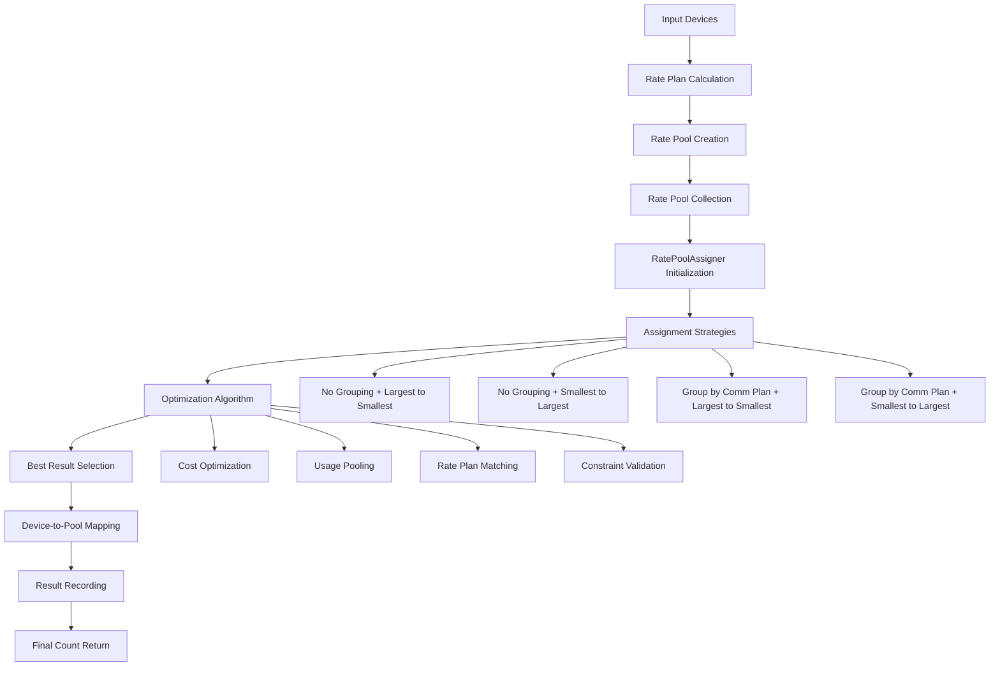
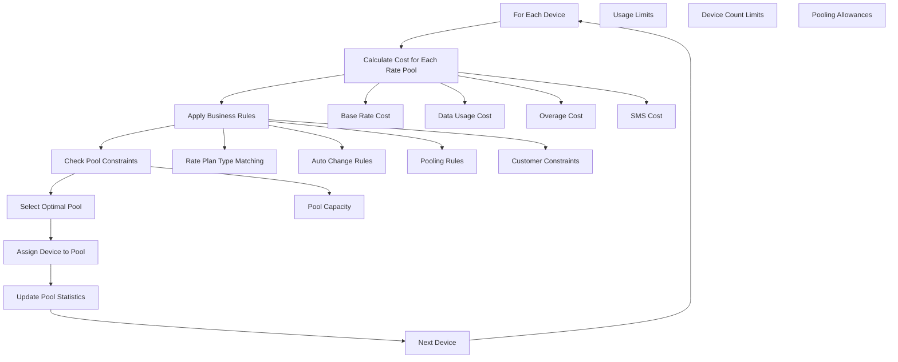
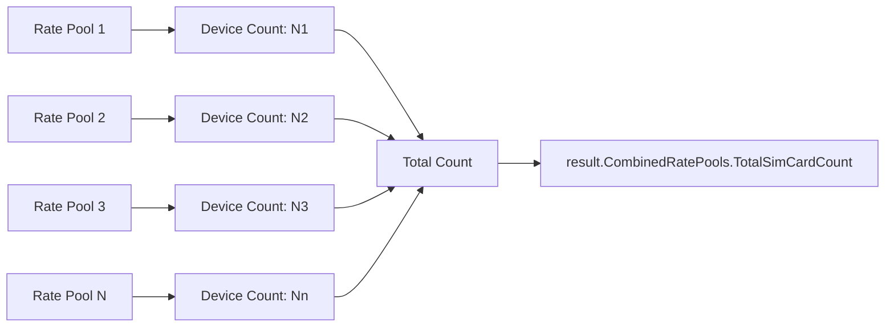

# Complete Device Assignment Process Documentation

## Overview
This document provides a comprehensive explanation of how devices are assigned to rate pools in the optimization system, including the internal algorithms, strategies, and decision-making processes.

## High-Level Assignment Architecture



## Phase 1: Rate Plan Preparation

### 1.1 Rate Plan Calculation
```csharp
var calculatedPlans = RatePoolCalculator.CalculateMaxAvgUsage(groupRatePlans, null);
```

**Purpose**: Calculate optimal usage thresholds for each rate plan
- **Input**: Raw rate plans from database
- **Process**: Analyzes data allowances, overage rates, and usage patterns
- **Output**: Rate plans with calculated maximum average usage values

### 1.2 Rate Pool Creation
```csharp
var ratePools = RatePoolFactory.CreateRatePools(calculatedPlans, billingPeriod, usesProration, chargeType);
```

**Creates Rate Pools with**:
- Base rate charges
- Data allowances
- Overage calculations
- Proration handling (if applicable)
- Charge type configurations

### 1.3 Rate Pool Collection Assembly
```csharp
var ratePoolCollection = RatePoolCollectionFactory.CreateRatePoolCollection(ratePools);
```

**Assembles**:
- Available rate pools for assignment
- Pooling capabilities (SIM pooling allowed/not allowed)
- Optimization group configurations
- Collection-level constraints

## Phase 2: Device Processing and Preparation

### 2.1 Device Filtering
```csharp
var customerRatePlanCodes = ratePoolCollection.RatePools.Select(x => x.RatePlan.PlanName).Distinct().ToList();
simList = simList.Where(x => customerRatePlanCodes.Contains(x.CustomerRatePlanCode)).ToList();
```

**Filtering Criteria**:
- **Rate Plan Code Matching**: Only devices with rate plans available in the collection
- **Service Provider Matching**: Devices must belong to the correct service provider
- **Account/Customer Filtering**: Filter by revenue account or AMOP customer ID

### 2.2 Device Data Projection
```csharp
var projectedDataUsage = ProjectDataUsage(optSimCard.CycleDataUsageMB, optSimCard.Status, 
    optSimCard.UsageDate, billingPeriod.BillingPeriodStart, billingPeriod.BillingPeriodEnd, 
    billingPeriod.BillingTimeZone);
```

**Projection Logic**:
- **Historical Usage Analysis**: Analyzes past data consumption patterns
- **Billing Period Adjustment**: Projects usage for the specific billing period
- **Device Status Consideration**: Accounts for device activation status
- **Timezone Normalization**: Adjusts for billing timezone differences

### 2.3 SimCard Object Creation
```csharp
var simCard = SimCardFromOptimizationSimCard(optSimCard, billingPeriod);
```

**Creates SimCard with**:
- Device identifiers (ICCID, MSISDN)
- Projected data usage
- Current communication plan
- Activation details
- Usage history
- SMS usage data

## Phase 3: Assignment Strategy Execution

### 3.1 RatePoolAssigner Initialization
```csharp
var assigner = new RatePoolAssigner(
    string.Empty,                           // Customer identifier
    ratePoolCollection,                     // Available rate pools
    simCards,                              // Devices to assign
    context.LambdaContext,                 // AWS context
    isUsingRedisCache,                     // Cache configuration
    PortalType,                            // M2M, Mobility, or CrossProvider
    shouldFilterByRatePlanType,            // Type filtering flag
    ratePoolCollection.ShouldPoolByOptimizationGroup  // Pooling strategy
);
```

### 3.2 Assignment Strategy Selection

#### **For M2M Devices**:
```csharp
var simCardGroupings = new List<SimCardGrouping> {
    SimCardGrouping.NoGrouping,
    SimCardGrouping.GroupByCommunicationPlan
};
```

**4 Sequential Calculation Strategies**:
1. **No Grouping + Largest to Smallest**: Assign highest usage devices first
2. **No Grouping + Smallest to Largest**: Assign lowest usage devices first
3. **Group by Communication Plan + Largest to Smallest**: Group by current plan, then assign by usage
4. **Group by Communication Plan + Smallest to Largest**: Group by current plan, then assign by usage

#### **For Mobility Devices**:
```csharp
var simCardGroupings = new List<SimCardGrouping> { SimCardGrouping.NoGrouping };
```

**Single Strategy**: No grouping approach for mobility optimization

### 3.3 Assignment Algorithm Execution
```csharp
assigner.AssignSimCards(simCardGroupings, billingTimeZone, false, false, ratePoolSequences);
```

## Phase 4: Internal Optimization Algorithm

### 4.1 Cost-Based Assignment Process



### 4.2 Assignment Decision Matrix

For each device, the algorithm evaluates:

| Criteria | Weight | Description |
|----------|--------|-------------|
| **Total Cost** | High | Base + Usage + Overage costs |
| **Rate Plan Match** | High | Device's current plan compatibility |
| **Usage Efficiency** | Medium | How well device usage fits pool allowance |
| **Pooling Benefits** | Medium | Shared data pool advantages |
| **Future Scalability** | Low | Room for usage growth |

### 4.3 Cost Calculation Formula

```csharp
// For each rate pool option
decimal totalCost = baseRateCost + dataUsageCost + overageCost + smsCharges;

// Where:
baseRateCost = ratePlan.BaseRate * (usesProration ? prorationFactor : 1);
dataUsageCost = projectedUsage <= ratePlan.DataAllowance ? 0 : 
                (projectedUsage - ratePlan.DataAllowance) * ratePlan.OverageRate;
overageCost = dataUsageCost;
smsCharges = smsUsage * ratePlan.SmsRate;
```

### 4.4 Assignment Rules and Constraints

#### **Primary Rules**:
1. **Exact Rate Plan Matching**: Device assigned to matching rate plan if available
2. **Cost Optimization**: Select the most cost-effective pool
3. **Usage Fit**: Prefer pools where device usage fits within allowances
4. **Pooling Benefits**: Consider shared data pool advantages

#### **Business Constraints**:
1. **Auto Change Rate Plan**: Respect auto-change flags
2. **Rate Plan Type Filtering**: Filter by portal type if required
3. **Customer-Specific Rules**: Apply customer-specific constraints
4. **Service Provider Limits**: Respect provider-specific limits

#### **Pool Constraints**:
1. **SIM Pooling Allowed**: Only pool if rate plan allows pooling
2. **Pool Capacity**: Respect maximum devices per pool
3. **Usage Limits**: Don't exceed total pool usage limits
4. **Optimization Group**: Respect optimization group boundaries

## Phase 5: Result Optimization and Selection

### 5.1 Strategy Comparison
```csharp
// Each strategy produces a result, algorithm selects best one
foreach (var strategy in assignmentStrategies)
{
    var result = ExecuteStrategy(strategy);
    if (result.TotalCost < bestResult.TotalCost)
    {
        bestResult = result;
    }
}
```

### 5.2 Best Result Selection Criteria
1. **Lowest Total Cost**: Primary selection criterion
2. **Highest Assignment Success Rate**: Secondary criterion
3. **Best Usage Efficiency**: Tertiary criterion
4. **Constraint Compliance**: Must meet all business rules

### 5.3 Result Structure
```csharp
assigner.SetPortalTypeToBestResult(PortalType);
var result = assigner.Best_Result;
// result.CombinedRatePools contains final assignments
```

## Phase 6: Device-to-Pool Mapping Process

### 6.1 Assignment Recording Structure
```csharp
private static void AddSimCardsToResultRatePools(List<SimCardResult> deviceResults, List<ResultRatePool> ratePools)
{
    foreach (var deviceResult in deviceResults)
    {
        foreach (var pool in ratePools)
        {
            var deviceKey = ResultRatePool.SimCardKeyByType(pool.KeyType, deviceResult);
            if (pool.RatePlan.Id == deviceResult.RatePlanId && pool.RatePoolName == deviceResult.RatePoolName)
            {
                // Device matches this pool - assign it
                if (pool.SimCards.ContainsKey(deviceKey))
                {
                    // Merge with existing assignment
                    pool.SimCards[deviceKey] = pool.SimCards[deviceKey].MergeSimCardResult(deviceResult);
                }
                else
                {
                    // New assignment
                    pool.AddSimCard(deviceResult);
                }
                break;
            }
            // Handle unassigned devices
            else if (pool.RatePlan.Id == OptimizationConstant.UnassignedRatePlanId)
            {
                // Assign to unassigned pool as fallback
                pool.AddSimCard(deviceResult);
                break;
            }
        }
    }
}
```

### 6.2 Assignment Key Generation
```csharp
var deviceKey = ResultRatePool.SimCardKeyByType(pool.KeyType, deviceResult);
```

**Key Types**:
- **ICCID**: For device-specific tracking
- **MSISDN**: For phone number tracking  
- **Device ID**: For internal reference
- **Composite**: Combination of multiple identifiers

### 6.3 Pool Population Process

1. **Primary Assignment**: Device assigned to optimal rate pool
2. **Merge Handling**: Multiple assignments to same pool are merged
3. **Fallback Assignment**: Unmatched devices go to "Unassigned" pool
4. **Statistics Update**: Pool statistics updated with each assignment

## Phase 7: Count Calculation and Validation

### 7.1 Assignment Count Tracking


### 7.2 Count Calculation Logic
```csharp
// For each rate pool in the collection
foreach (var ratePool in collection.RatePools)
{
    if (ratePool.SimCards.Count > 0)
    {
        totalAssignedCount += ratePool.SimCards.Count;
        // Record assignments for this pool
        RecordRatePoolByPortalType(context, queueId, revAccountNumber, ratePool, portalType);
    }
}

return totalAssignedCount; // This becomes TotalSimCardCount
```

### 7.3 Assignment Success Metrics

| Metric | Calculation | Purpose |
|--------|-------------|---------|
| **Assignment Rate** | Assigned / Total Input | Overall success percentage |
| **Cost Efficiency** | Total Cost / Assigned Devices | Cost per device |
| **Usage Efficiency** | Used Allowance / Total Allowance | Resource utilization |
| **Pool Distribution** | Devices per Pool | Load balancing |

## Phase 8: Database Recording and Persistence

### 8.1 Recording Hierarchy
```
RecordResults
├── RecordRatePoolAssignments
│   ├── For each RatePoolCollection
│   │   ├── For each RatePool with devices
│   │   │   ├── RecordRatePoolByPortalType
│   │   │   │   ├── Insert OptimizationResult records
│   │   │   │   ├── Insert OptimizationMobilityResult records
│   │   │   │   └── Update device assignments
│   │   │   └── Record shared pool assignments (if applicable)
│   │   └── Skip empty pools
│   └── Aggregate assignment statistics
└── RecordTotalCost
    ├── Calculate total costs across all pools
    ├── Record cost breakdown by type
    └── Update optimization summary
```

### 8.2 Database Tables Updated

#### **OptimizationResult Table**
- Queue ID and execution context
- Device assignment details
- Rate plan assignments
- Cost calculations
- Assignment timestamps

#### **OptimizationMobilityResult Table** (for Mobility devices)
- Mobility-specific assignments
- Optimization group associations
- Carrier-specific details

#### **OptimizationDevice Table**
- Device processing details
- Projected usage calculations
- Assignment flags
- Communication group associations

### 8.3 Assignment Validation
```csharp
foreach (var ratePool in collection.RatePools)
{
    if (ratePool.SimCards.Count <= 0)
    {
        context.LogInfo("SUB", $"No Sim card for rate pool {ratePool.RatePlan.PlanName}");
        continue; // Skip empty pools
    }
    // Process and record assignments
}
```

## Assignment Success Factors

### Factors Leading to Successful Assignment
1. **Rate Plan Availability**: Device's current plan available in pool collection
2. **Cost Effectiveness**: Assignment reduces overall costs
3. **Usage Compatibility**: Device usage fits within pool allowances
4. **Constraint Satisfaction**: All business rules satisfied
5. **Pool Capacity**: Adequate room in target pools

### Factors Leading to Non-Assignment
1. **No Matching Pools**: No suitable rate pools available
2. **Cost Inefficiency**: Assignment would increase costs
3. **Constraint Violations**: Business rules prevent assignment
4. **Pool Exhaustion**: All suitable pools at capacity
5. **Data Quality Issues**: Invalid or incomplete device data

## Performance Optimizations

### 8.1 Caching Strategy
```csharp
if (isUsingRedisCache)
{
    // Cache processed devices for faster subsequent runs
    ProjectDataUsageAndSaveDevicesToCache(context, instanceId, simList, billingPeriod, commPlanGroupId);
}
```

### 8.2 Batch Processing
- **Bulk Database Operations**: SqlBulkCopy for efficiency
- **Parallel Processing**: Multiple assignment strategies in parallel
- **Memory Optimization**: Efficient data structures for large device sets

### 8.3 Algorithm Optimization
- **Early Termination**: Stop when optimal solution found
- **Cost Caching**: Cache cost calculations for reuse
- **Pool Sorting**: Pre-sort pools by efficiency
- **Device Ordering**: Process devices in optimal order

## Error Handling and Edge Cases

### 8.1 Common Edge Cases
1. **Zero-Value Rate Plans**: Plans with zero overage rates
2. **Inactive Devices**: Devices with zero or minimal usage
3. **New Activations**: Devices activated mid-billing period
4. **Plan Mismatches**: Devices on discontinued rate plans
5. **Data Anomalies**: Unusual usage patterns

### 8.2 Error Recovery Strategies
1. **Fallback Assignments**: Use "Unassigned" pool for problematic devices
2. **Validation Checks**: Extensive input validation
3. **Logging and Monitoring**: Comprehensive error logging
4. **Transaction Management**: Rollback on critical failures

## Summary

The device assignment process is a sophisticated optimization algorithm that:

1. **Prepares** rate pools with calculated usage thresholds
2. **Filters** devices to eligible candidates
3. **Projects** future usage based on historical data
4. **Evaluates** multiple assignment strategies
5. **Optimizes** for cost, efficiency, and constraint compliance
6. **Selects** the best overall assignment solution
7. **Records** detailed assignment results
8. **Returns** the count of successfully assigned devices

The returned count from `BaseDeviceAssignment` represents the total number of devices that were successfully assigned to optimal rate pools, considering all business rules, constraints, and optimization criteria. This count may be less than the input count due to filtering, optimization constraints, or assignment failures, but represents the devices that will benefit from the optimization process.