# Cross-Provider Customer Optimization - Color-Coded Data Flow Diagram

## Cross-Provider Customer Optimization Flow with Color Coding

```mermaid
flowchart TD
    %% Styling definitions
    classDef triggerBox fill:#ff6b6b,stroke:#d63031,stroke-width:3px,color:#fff
    classDef sessionBox fill:#4ecdc4,stroke:#00b894,stroke-width:2px,color:#fff
    classDef discoveryBox fill:#a8e6cf,stroke:#00b894,stroke-width:2px,color:#000
    classDef validationBox fill:#ffd93d,stroke:#fdcb6e,stroke-width:2px,color:#000
    classDef poolBox fill:#d1a3ff,stroke:#a29bfe,stroke-width:2px,color:#000
    classDef queueBox fill:#74b9ff,stroke:#0984e3,stroke-width:2px,color:#fff
    classDef optimizationBox fill:#fd79a8,stroke:#e84393,stroke-width:2px,color:#fff
    classDef compilationBox fill:#74b9ff,stroke:#0984e3,stroke-width:2px,color:#fff
    classDef reportingBox fill:#d1a3ff,stroke:#a29bfe,stroke-width:2px,color:#000
    classDef cleanupBox fill:#81ecec,stroke:#00cec9,stroke-width:2px,color:#000

    %% Trigger
    A["🚀 AMOP 2.0 Trigger<br/>Cross-Provider Customer Request"]:::triggerBox
    
    %% Data Labels
    A --> |"Customer Parameters<br/>Multi-Provider Settings"| B
    
    %% Session Management
    B["🔐 Cross-Provider Session Management<br/>Multi-Provider Customer Validation"]:::sessionBox
    
    B --> |"Validated Customer Data<br/>Provider Associations"| C
    
    %% Rate Plan Discovery
    C["🔍 Cross-Provider Rate Plan Discovery<br/>Multi-Provider Auto Change Detection"]:::discoveryBox
    
    C --> |"Cross-Provider Rate Plan Status<br/>Provider-Specific Capabilities"| D
    
    %% Customer Validation
    D["✅ Cross-Provider Customer Validation<br/>Multi-Provider Eligibility Check"]:::validationBox
    
    D --> |"Validated Multi-Provider Customer Data<br/>Cross-Provider Eligibility Status"| E
    
    %% Rate Pool Generation
    E["🏊 Cross-Provider Rate Pool Generation<br/>Multi-Provider Customer Pool Calculation"]:::poolBox
    
    E --> |"Cross-Provider Rate Pool Data<br/>Provider-Specific Pool Configurations"| F
    
    %% Queue Creation
    F["📋 Multi-Provider Queue Creation<br/>Cross-Provider Customer Job Queuing"]:::queueBox
    
    F --> |"Cross-Provider Queue Items<br/>Provider-Specific Job Assignments"| G
    
    %% Optimization Execution
    G["⚡ Multi-Provider Optimization Execution<br/>Cross-Provider Customer Algorithm Processing"]:::optimizationBox
    
    G --> |"Cross-Provider Optimization Results<br/>Multi-Provider Cost Analysis"| H
    
    %% Result Compilation
    H["📊 Cross-Provider Result Compilation<br/>Multi-Provider Customer Data Aggregation"]:::compilationBox
    
    H --> |"Compiled Cross-Provider Results<br/>Consolidated Multi-Provider Statistics"| I
    
    %% Customer Email & Reporting
    I["📧 Cross-Provider Customer Email & Reporting<br/>Multi-Provider Customer Finalization"]:::reportingBox
    
    I --> |"Cross-Provider Reports<br/>Multi-Provider Optimization Summary"| J
    
    %% Cleanup
    J["🧹 Cross-Provider Processing Cleanup<br/>Multi-Provider Session Finalization"]:::cleanupBox
```



## Detailed Cross-Provider Process Flow with Color Coding

### 🔴 **Red Box - Trigger Process**
```
┌─────────────────────────────────────────────────────────────┐
│ 🚀 AMOP 2.0 Trigger - Cross-Provider Customer Request      │
│                                                             │
│ • Multi-Provider Customer Optimization Requests            │
│ • Cross-Provider Portal Integration                         │
│ • Provider-Agnostic Customer Processing                     │
│ • Rev/AMOP Customer Support Across Providers               │
└─────────────────────────────────────────────────────────────┘
                              │
              Customer Parameters & Multi-Provider Settings
                              ▼
```

### 🔵 **Blue Box - Session Management**
```
┌─────────────────────────────────────────────────────────────┐
│ 🔐 Cross-Provider Session Management                       │
│     Multi-Provider Customer Validation                     │
│                                                             │
│ • Cross-Provider Session Tracking                          │
│ • Multi-Provider Authentication                             │
│ • Provider Association Validation                          │
│ • Cross-Provider Customer ID Verification                  │
│ • Multi-Provider Billing Period Alignment                  │
└─────────────────────────────────────────────────────────────┘
                              │
          Validated Customer Data & Provider Associations
                              ▼
```

### 🟢 **Green Box - Rate Plan Discovery**
```
┌─────────────────────────────────────────────────────────────┐
│ 🔍 Cross-Provider Rate Plan Discovery                      │
│     Multi-Provider Auto Change Detection                   │
│                                                             │
│ • Multi-Provider Rate Plan Retrieval                       │
│ • Cross-Provider Auto Change Eligibility                   │
│ • Provider-Specific Rate Plan Filtering                    │
│ • Cross-Provider Rate Plan Compatibility Check             │
│ • Multi-Provider Overage Rate Validation                   │
└─────────────────────────────────────────────────────────────┘
                              │
      Cross-Provider Rate Plan Status & Provider Capabilities
                              ▼
```

### 🟡 **Yellow Box - Customer Validation**
```
┌─────────────────────────────────────────────────────────────┐
│ ✅ Cross-Provider Customer Validation                      │
│     Multi-Provider Eligibility Check                       │
│                                                             │
│ • Cross-Provider Customer Eligibility Verification         │
│ • Multi-Provider Service Association Validation            │
│ • Provider-Specific Business Rule Application              │
│ • Cross-Provider Constraint Checking                       │
│ • Multi-Provider Contract Compliance Verification          │
└─────────────────────────────────────────────────────────────┘
                              │
    Validated Multi-Provider Customer Data & Eligibility Status
                              ▼
```

### 🟣 **Purple Box - Rate Pool Generation**
```
┌─────────────────────────────────────────────────────────────┐
│ 🏊 Cross-Provider Rate Pool Generation                     │
│     Multi-Provider Customer Pool Calculation               │
│                                                             │
│ • Cross-Provider Rate Pool ID Assignment                   │
│ • Multi-Provider Device Grouping                           │
│ • Provider-Specific Pool Configuration                     │
│ • Cross-Provider Usage Sharing Setup                       │
│ • Multi-Provider Optimization Group Creation               │
└─────────────────────────────────────────────────────────────┘
                              │
    Cross-Provider Rate Pool Data & Provider-Specific Configurations
                              ▼
```

### 🔵 **Light Blue Box - Queue Creation**
```
┌─────────────────────────────────────────────────────────────┐
│ 📋 Multi-Provider Queue Creation                           │
│     Cross-Provider Customer Job Queuing                    │
│                                                             │
│ • Cross-Provider Queue Item Generation                     │
│ • Provider-Specific Job Assignment                         │
│ • Multi-Provider Permutation Creation                      │
│ • Cross-Provider Batch Processing Setup                    │
│ • Provider-Specific Queue Management                       │
└─────────────────────────────────────────────────────────────┘
                              │
      Cross-Provider Queue Items & Provider-Specific Job Assignments
                              ▼
```

### 🔴 **Pink Box - Optimization Execution**
```
┌─────────────────────────────────────────────────────────────┐
│ ⚡ Multi-Provider Optimization Execution                   │
│     Cross-Provider Customer Algorithm Processing           │
│                                                             │
│ • Cross-Provider Assignment Strategy Execution             │
│ • Multi-Provider Cost Calculation                          │
│ • Provider Migration Analysis                              │
│ • Cross-Provider Performance Comparison                    │
│ • Multi-Provider Result Evaluation                         │
└─────────────────────────────────────────────────────────────┘
                              │
     Cross-Provider Optimization Results & Multi-Provider Cost Analysis
                              ▼
```

### 🔵 **Blue Box - Result Compilation**
```
┌─────────────────────────────────────────────────────────────┐
│ 📊 Cross-Provider Result Compilation                       │
│     Multi-Provider Customer Data Aggregation               │
│                                                             │
│ • Multi-Provider Queue Monitoring                          │
│ • Cross-Provider Winning Assignment Selection              │
│ • Provider-Specific Result Aggregation                     │
│ • Cross-Provider Statistics Compilation                    │
│ • Multi-Provider Performance Analysis                      │
└─────────────────────────────────────────────────────────────┘
                              │
   Compiled Cross-Provider Results & Consolidated Multi-Provider Statistics
                              ▼
```

### 🟣 **Purple Box - Customer Email & Reporting**
```
┌─────────────────────────────────────────────────────────────┐
│ 📧 Cross-Provider Customer Email & Reporting               │
│     Multi-Provider Customer Finalization                   │
│                                                             │
│ • Multi-Provider Report Generation                         │
│ • Cross-Provider Excel/PDF Creation                        │
│ • Provider-Specific Documentation                          │
│ • Consolidated Customer Communication                      │
│ • Multi-Provider Savings Summary                           │
└─────────────────────────────────────────────────────────────┘
                              │
        Cross-Provider Reports & Multi-Provider Optimization Summary
                              ▼
```

### 🟢 **Light Green Box - Cleanup**
```
┌─────────────────────────────────────────────────────────────┐
│ 🧹 Cross-Provider Processing Cleanup                       │
│     Multi-Provider Session Finalization                    │
│                                                             │
│ • Cross-Provider Processing State Updates                  │
│ • Multi-Provider Session Coordination                      │
│ • Provider-Specific Cleanup Logic                          │
│ • Cross-Provider Completion Validation                     │
│ • Multi-Provider Resource Cleanup                          │
└─────────────────────────────────────────────────────────────┘
```

## Cross-Provider Data Flow Characteristics by Color

### 🔴 **Red Components - Critical Triggers & Execution**
- **AMOP 2.0 Trigger**: Initiates cross-provider optimization
- **Optimization Execution**: Core multi-provider algorithm processing

### 🔵 **Blue Components - Management & Control**
- **Session Management**: Cross-provider session control
- **Queue Creation**: Multi-provider job management
- **Result Compilation**: Cross-provider data aggregation

### 🟢 **Green Components - Discovery & Cleanup**
- **Rate Plan Discovery**: Multi-provider plan identification
- **Processing Cleanup**: Cross-provider finalization

### 🟡 **Yellow Components - Validation**
- **Customer Validation**: Multi-provider eligibility checking

### 🟣 **Purple Components - Generation & Reporting**
- **Rate Pool Generation**: Cross-provider pool creation
- **Email & Reporting**: Multi-provider report delivery

## Cross-Provider Lambda Function Color Mapping

### 🏗️ **QueueCustomerOptimization Lambda**
- 🔴 **AMOP 2.0 Trigger** (Entry Point)
- 🔵 **Session Management** (Control)
- 🟢 **Rate Plan Discovery** (Discovery)
- 🟡 **Customer Validation** (Validation)
- 🟣 **Rate Pool Generation** (Generation)
- 🔵 **Queue Creation** (Management)

### ⚡ **SimCardCostOptimizer Lambda**
- 🔴 **Optimization Execution** (Core Processing)

### 🧹 **SimCardCostOptimizerCleanup Lambda**
- 🔵 **Result Compilation** (Management)
- 🟣 **Customer Email & Reporting** (Communication)
- 🟢 **Processing Cleanup** (Finalization)

## Provider-Specific Data Flows

### 🌐 **Multi-Provider Coordination**
- **Verizon**: Provider-specific rate plans and constraints
- **AT&T**: Provider-specific pricing and capabilities  
- **T-Mobile**: Provider-specific services and limitations
- **Other Providers**: Additional carrier integrations

### 🔄 **Cross-Provider Synchronization**
- **Parallel Processing**: Simultaneous optimization across providers
- **Provider Authentication**: Individual provider credentials
- **Result Consolidation**: Unified reporting across all providers
- **Migration Analysis**: Provider change cost-benefit analysis

This color-coded DFD provides a visual representation of the Cross-Provider Customer Optimization system, making it easy to understand the flow of data and the role of each component in the multi-provider optimization process.