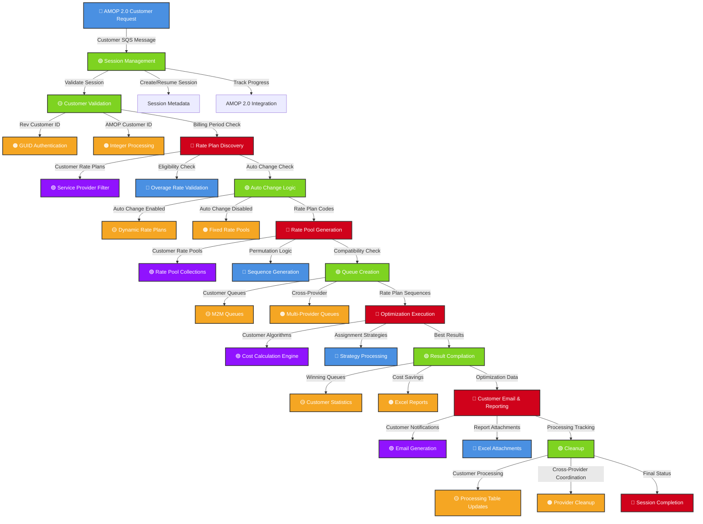
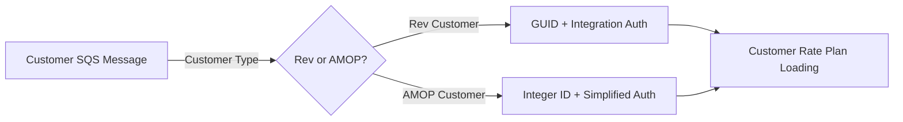
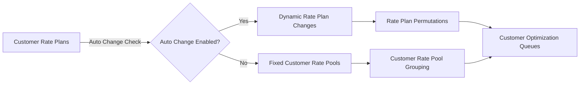
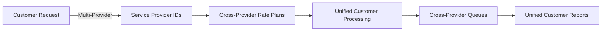
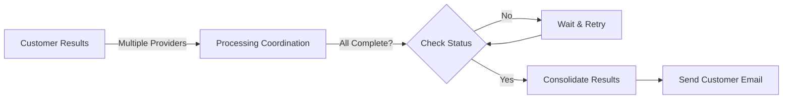

# Customer Optimization System - Data Flow Diagram

## Complete Customer Optimization Data Flow with Colors

## Detailed Process Flow with Color Coding

### 🔵 **Blue Components - Initialization & Authentication**
- **AMOP 2.0 Customer Request**: Initial trigger from customer interface
- **GUID Authentication**: Rev customer authentication process
- **Overage Rate Validation**: Validates rate plan eligibility
- **Sequence Generation**: Creates rate plan permutations
- **Strategy Processing**: Executes assignment strategies
- **Excel Attachments**: Generates customer reports

### 🟢 **Green Components - Core Processing**
- **Session Management**: Manages customer optimization sessions
- **Customer Validation**: Validates customer data and permissions
- **Auto Change Logic**: Processes rate plan change rules
- **Queue Creation**: Creates optimization work queues
- **Result Compilation**: Compiles optimization results
- **Cleanup**: Final cleanup and session completion

### 🟡 **Yellow Components - Customer Data Processing**
- **Integer Processing**: AMOP customer ID processing
- **Dynamic Rate Plans**: Auto change enabled processing
- **Rate Pool Collections**: Customer rate pool grouping
- **M2M Queues**: M2M portal queue creation
- **Customer Statistics**: Customer optimization statistics
- **Processing Table Updates**: Customer processing tracking

### 🟠 **Orange Components - Multi-Provider & Advanced**
- **Fixed Rate Pools**: Auto change disabled processing
- **Multi-Provider Queues**: Cross-provider queue creation
- **Excel Reports**: Customer report generation
- **Provider Cleanup**: Cross-provider cleanup coordination

### 🔴 **Red Components - Decision Points & Core Logic**
- **Rate Plan Discovery**: Discovers customer rate plans
- **Rate Pool Generation**: Generates customer rate pools
- **Optimization Execution**: Executes optimization algorithms
- **Customer Email & Reporting**: Customer notification system
- **Session Completion**: Final session status

### 🟣 **Purple Components - Filtering & Calc**
- **Service Provider Filter**: Filters by service provider
- **Cost Calculation Engine**: Calculates customer costs
- **Email Generation**: Generates customer emails

## Customer-Specific Data Flow Elements

### Customer Input Processing

### Rate Plan Processing Flow

### Cross-Provider Processing

### Customer Email Coordination

## Legend

| Color | Represents | Key Functions |
|-------|------------|---------------|
| 🔵 Blue | Initialization & Auth | Request processing, authentication, validation |
| 🟢 Green | Core Processing | Session management, validation, compilation |
| 🟡 Yellow | Customer Data | Customer-specific data processing and tracking |
| 🟠 Orange | Multi-Provider | Cross-provider and advanced processing |
| 🔴 Red | Decision Points | Core logic and decision-making processes |
| 🟣 Purple | Filtering & Calc | Data filtering, validation, and calculations |

This comprehensive DFD shows the complete customer optimization flow with color-coded components for easy understanding of the different processing stages and their relationships.