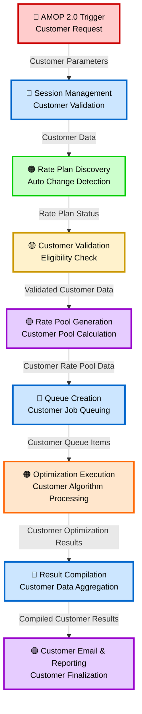

# Customer Optimization System - Styled Data Flow Diagram

## Customer Optimization Data Flow (Similar to Carrier Style)

## Detailed Customer Optimization Flow

### 🔴 **AMOP 2.0 Trigger - Customer Request**
- **Function**: Initial customer optimization trigger from AMOP interface
- **Input**: Customer SQS message with customer identification
- **Parameters**: Customer ID (Rev/AMOP), Billing Period, Service Provider
- **Output**: Customer parameters for session management

### 🔵 **Session Management - Customer Validation** 
- **Function**: Manages customer optimization sessions and validates customer data
- **Process**: 
  - Create/Resume customer optimization session
  - Validate customer type (Rev GUID vs AMOP Integer)
  - Check authentication credentials
  - Initialize customer metadata
- **Output**: Validated customer data for rate plan discovery

### 🟢 **Rate Plan Discovery - Auto Change Detection**
- **Function**: Discovers customer-specific rate plans and detects auto change capability
- **Process**:
  - Load customer rate plans from billing period
  - Filter by customer eligibility and service provider
  - Detect Auto Change Rate Plan capability
  - Group rate plans by customer rate pool ID
- **Output**: Customer rate plan status and auto change configuration

### 🟡 **Customer Validation - Eligibility Check**
- **Function**: Validates customer data integrity and rate plan eligibility
- **Process**:
  - Validate rate plan overage rates > 0
  - Check data per overage charge > 0
  - Verify customer device associations
  - Filter devices by customer rate plan codes
- **Output**: Validated customer data ready for rate pool generation

### 🟣 **Rate Pool Generation - Customer Pool Calculation**
- **Function**: Generates customer rate pools and calculates optimization sequences
- **Process**:
  - Create customer rate pool collections
  - Generate rate plan permutations (max 15 per group)
  - Apply customer-specific auto change logic
  - Calculate customer cost optimization potential
- **Output**: Customer rate pool data with optimization sequences

### 🔵 **Queue Creation - Customer Job Queuing**
- **Function**: Creates customer optimization work queues for parallel processing
- **Process**:
  - Generate customer optimization queues
  - Assign rate plan sequences to queues
  - Create communication groups for customer devices
  - Support both M2M and Cross-Provider queuing
- **Output**: Customer queue items ready for optimization execution

### 🟠 **Optimization Execution - Customer Algorithm Processing**
- **Function**: Executes customer-specific optimization algorithms
- **Process**:
  - Load customer rate pools and device assignments
  - Execute customer assignment strategies:
    - No Grouping + Largest to Smallest
    - No Grouping + Smallest to Largest
    - Group by Communication Plan (M2M only)
  - Calculate customer costs with proration
  - Select best customer assignment strategy
- **Output**: Customer optimization results with cost calculations

### 🔵 **Result Compilation - Customer Data Aggregation**
- **Function**: Compiles customer optimization results across queues
- **Process**:
  - Identify winning customer queues (lowest cost)
  - Compile customer cost savings statistics
  - Generate customer device assignment data
  - Create customer optimization summaries
- **Output**: Compiled customer results ready for reporting

### 🟣 **Customer Email & Reporting - Customer Finalization**
- **Function**: Generates customer reports and coordinates email delivery
- **Process**:
  - Generate customer-specific Excel reports
  - Coordinate customer email across service providers
  - Update OptimizationCustomerProcessing table
  - Handle cross-provider customer result consolidation
  - Send consolidated customer optimization email
- **Output**: Customer optimization finalization and cleanup

## Customer-Specific Data Labels

| Data Flow | Description | Customer-Specific Elements |
|-----------|-------------|---------------------------|
| **Customer Parameters** | Initial customer request data | Customer ID, Customer Type, Billing Period |
| **Customer Data** | Validated customer session data | Session metadata, customer authentication |
| **Rate Plan Status** | Customer rate plan information | Auto change capability, customer eligibility |
| **Validated Customer Data** | Processed customer information | Device associations, rate plan codes |
| **Customer Rate Pool Data** | Customer optimization sequences | Rate pool collections, permutations |
| **Customer Queue Items** | Customer work queue assignments | M2M/Cross-Provider queues, device groups |
| **Customer Optimization Results** | Algorithm execution results | Assignment strategies, cost calculations |
| **Compiled Customer Results** | Aggregated customer data | Winning assignments, cost savings |

## Key Customer Optimization Differences

### **Customer-Specific Features:**
- **Auto Change Rate Plan Logic**: Dynamic rate plan changes for customers
- **Customer Rate Pools**: Customer-specific device pooling and optimization
- **Cross-Provider Support**: Multi-carrier customer optimization
- **AMOP 2.0 Integration**: Direct customer interface integration
- **Customer Email Coordination**: Consolidated reporting across providers

### **Customer Processing Types:**
- **Rev Customers**: GUID-based with integration authentication
- **AMOP Customers**: Integer-based with simplified processing
- **Cross-Provider**: Multi-carrier customer coordination

This diagram follows the same visual style as your Carrier Optimization DFD while highlighting the customer-specific processes and data flows unique to the Customer Optimization system.