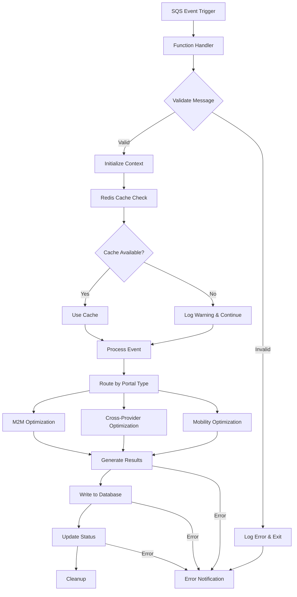
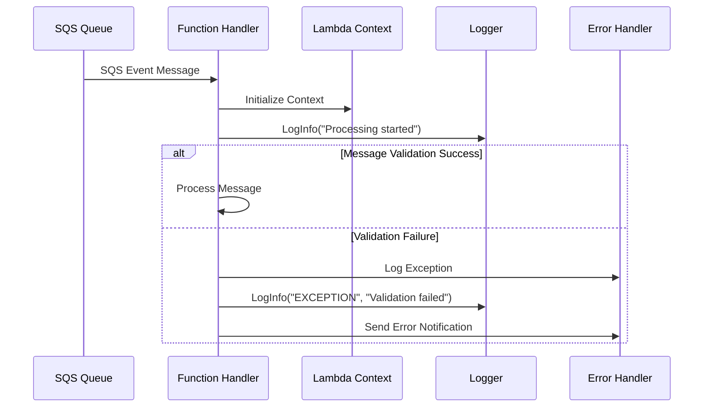
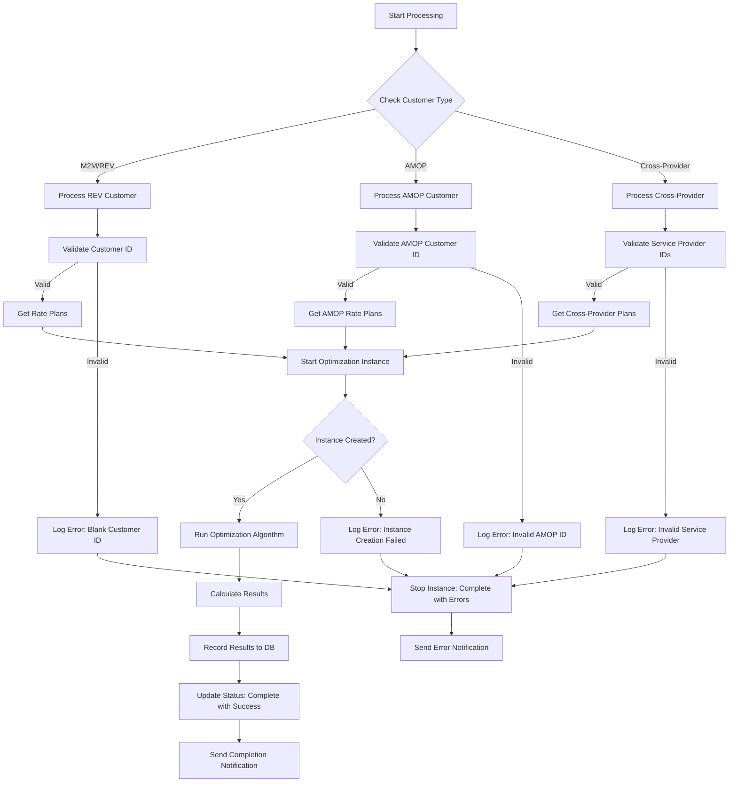
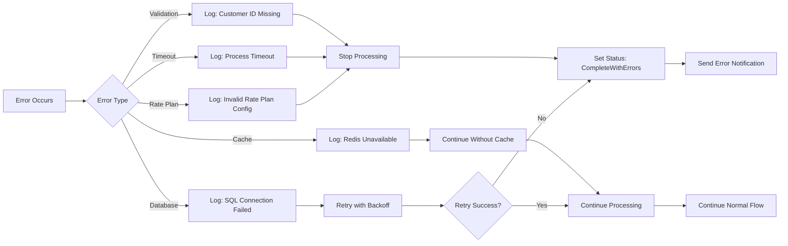
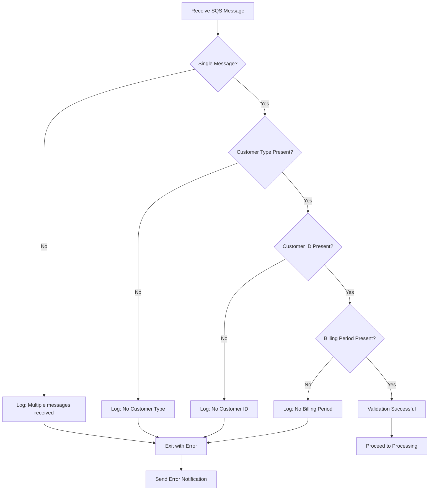
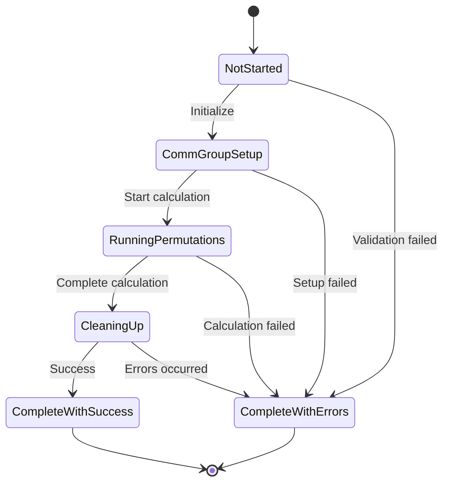
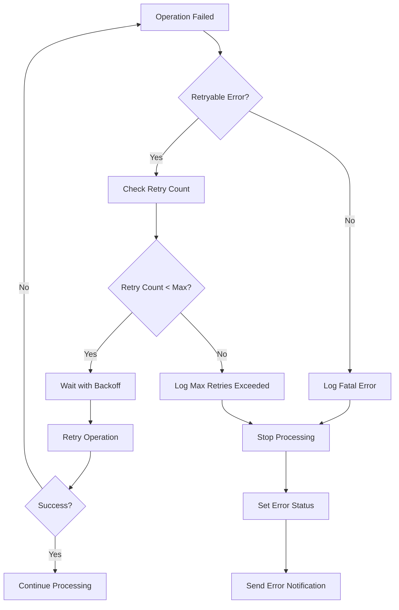

# Customer Optimization Flow with Error Logging

## Overview
The Customer Optimization system is a cloud-based solution that optimizes SIM card cost assignments for customers across different portal types (M2M, Cross-Provider, Mobility). This document outlines the complete flow with error handling and logging mechanisms.

## System Architecture



## Main Flow Components

### 1. Entry Point Flow



### 2. Customer Optimization Processing Flow



## Error Handling and Logging

### Error Categories

| Error Type | Log Level | Action | Notification |
|------------|-----------|--------|--------------|
| **Validation Errors** | EXCEPTION | Stop processing | Email to admin |
| **Database Errors** | EXCEPTION | Retry with backoff | Email to admin |
| **Cache Errors** | WARNING | Continue without cache | Log only |
| **Rate Plan Errors** | EXCEPTION | Stop optimization | Email to admin |
| **Timeout Errors** | EXCEPTION | Mark as failed | Email to admin |

### Error Logging Format

```csharp
// Standard error logging pattern used throughout the system
LogInfo(context, "EXCEPTION", $"Error message with details: {ex.Message}");
LogInfo(context, "EXCEPTION", $"Stack trace: {ex.StackTrace}");
```

### Key Error Scenarios



## Detailed Process Flows

### 1. Message Validation Flow



### 2. Optimization Instance Management



### 3. Error Recovery and Retry Logic



## Database Operations and Error Handling

### Critical Database Operations

1. **Optimization Instance Management**
   - Create instance: `INSERT INTO OptimizationInstance`
   - Update status: `UPDATE OptimizationInstance SET RunStatusId`
   - Stop instance: `UPDATE OptimizationInstance SET RunEndTime`

2. **Result Recording**
   - Record rate pool assignments
   - Update total costs
   - Save optimization results

3. **Error Tracking**
   - Log error messages in OptimizationCustomerProcessing
   - Track failed operations with timestamps
   - Maintain error count metrics

### SQL Error Handling Pattern

```csharp
try
{
    // Database operation
    using (var conn = new SqlConnection(connectionString))
    {
        // SQL commands
    }
}
catch (SqlException ex)
{
    LogInfo(context, "EXCEPTION", 
        $"SQL Error: {ex.Message}, ErrorCode:{ex.ErrorCode}-{ex.Number}");
    LogInfo(context, "EXCEPTION", $"Stack Trace: {ex.StackTrace}");
    
    // Set error status and notify
    StopOptimizationInstance(context, instanceId, OptimizationStatus.CompleteWithErrors);
}
catch (Exception ex)
{
    LogInfo(context, "EXCEPTION", $"General Error: {ex.Message}");
    LogInfo(context, "EXCEPTION", $"Stack Trace: {ex.StackTrace}");
}
```

## Monitoring and Alerting

### Key Metrics to Monitor

1. **Performance Metrics**
   - Processing time per customer
   - Queue processing rate
   - Cache hit/miss ratio
   - Database response times

2. **Error Metrics**
   - Error rate by error type
   - Failed optimization instances
   - Retry count distribution
   - Timeout occurrences

3. **Business Metrics**
   - Customers processed per hour
   - Cost optimization savings
   - Rate plan assignment accuracy

### Alert Configuration

```yaml
alerts:
  high_error_rate:
    condition: error_rate > 5%
    action: notify_admin
    
  processing_timeout:
    condition: processing_time > 300s
    action: notify_admin
    
  cache_unavailable:
    condition: cache_miss_rate > 90%
    action: log_warning
    
  database_errors:
    condition: sql_error_count > 10/hour
    action: notify_admin
```

## Best Practices for Error Handling

### 1. Logging Standards

- **Always include context**: Customer ID, Instance ID, Queue ID
- **Use structured logging**: Include error codes and categories
- **Log at appropriate levels**: INFO, WARNING, EXCEPTION
- **Include stack traces**: For debugging and root cause analysis

### 2. Error Recovery

- **Implement retry logic**: With exponential backoff
- **Graceful degradation**: Continue without non-critical components
- **Circuit breaker pattern**: For external dependencies
- **Timeout handling**: Prevent indefinite waits

### 3. Notification Strategy

- **Immediate alerts**: For critical system failures
- **Batched notifications**: For non-critical warnings
- **Escalation procedures**: For unresolved issues
- **Status dashboards**: For real-time monitoring

## Configuration Management

### Environment Variables

| Variable | Purpose | Error Handling |
|----------|---------|----------------|
| `QueuesPerInstance` | Controls processing load | Default to 5 if not set |
| `SanityCheckTimeLimit` | Timeout for operations | Default to 180s if not set |
| `ErrorNotificationEmailReceiver` | Alert destination | Log error if not configured |
| `Redis Connection String` | Cache configuration | Continue without cache if invalid |

### Error Handling for Missing Configuration

```csharp
// Example configuration validation
if (QueuesPerInstance == 0)
{
    QueuesPerInstance = DEFAULT_QUEUES_PER_INSTANCE;
    LogInfo(context, "WARNING", "QueuesPerInstance not configured, using default");
}

if (string.IsNullOrEmpty(ErrorNotificationEmailReceiver))
{
    LogInfo(context, "WARNING", "Error notification email not configured");
}
```

## Conclusion

The Customer Optimization system implements comprehensive error handling and logging to ensure reliable processing of customer data. The multi-layered approach includes:

- **Proactive validation** at entry points
- **Graceful error recovery** with retry mechanisms
- **Comprehensive logging** for troubleshooting
- **Real-time monitoring** and alerting
- **Structured error categorization** for appropriate responses

This design ensures system resilience while maintaining visibility into operations and quick issue resolution.