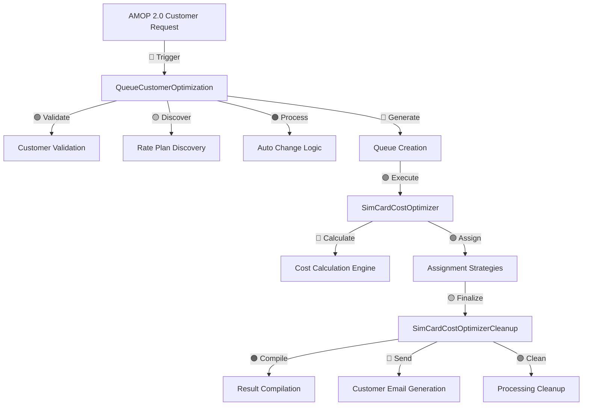

# Customer Optimization System - Complete Technical Documentation

## Executive Summary
The Customer Optimization System is a sophisticated AWS Lambda-based pipeline that minimizes SIM card operational costs for individual customers through intelligent rate plan optimization. The system processes customer device populations, analyzes customer-specific usage patterns, and optimizes rate plan assignments using advanced algorithms across three main Lambda functions with integrated AMOP 2.0 support.

## System Architecture & Flow

### Core Components
1. **QueueCustomerOptimization** - Orchestrates the entire customer optimization process
2. **AltaworxSimCardCostOptimizer** - Executes customer-specific optimization algorithms
3. **AltaworxSimCardCostOptimizerCleanup** - Finalizes customer results and handles cleanup

### Data Flow Overview
Customer Request → Customer Validation → Rate Plan Discovery → Auto Change Logic → 
Rate Pool Generation → Queue Creation → Optimization Execution → Result Compilation → 
Customer Email & Reporting → Cleanup

## DATA FLOW DIAGRAM


## 1. QueueCustomerOptimization Lambda

### Purpose
Primary orchestrator that initiates and manages customer-specific optimization processes with support for both M2M and Cross-Provider customer scenarios.

### Execution Triggers
• **AMOP 2.0 Integration**: Direct customer optimization requests via SQS messages
• **Customer Types**: Revenue (Rev) customers and AMOP customers
• **Portal Support**: M2M Portal and Cross-Provider optimizations
• **Manual Execution**: On-demand customer optimizations from AMOP interface

### Core Logic Flow

#### 1.1 Customer Validation & Processing
**Receive Customer Request → Validate Customer Type → Check Authentication → Verify Billing Period → Process Customer Data**

Key Validation Rules:
- Validates Customer ID (GUID) or AMOP Customer ID (Integer) presence
- Ensures billing period information is available (BillPeriodId or BillYear/BillMonth)
- Verifies integration authentication credentials for Rev customers
- Validates service provider associations and tenant permissions
- Supports execution override for manual customer runs

Customer Processing Logic:
- **Rev Customers**: Uses GUID-based customer identification with integration authentication
- **AMOP Customers**: Uses integer-based customer identification with simplified processing
- **Cross-Provider**: Processes customers across multiple service providers simultaneously
- **Tenant Isolation**: Ensures customer data isolation across tenants

#### 1.2 Rate Plan Discovery & Validation
**Load Customer Rate Plans → Validate Auto Change Eligibility → Check Bill in Advance → Group by Rate Pool → Filter Rate Plans**

Rate Plan Processing:
- Retrieves customer-specific rate plans from billing period and service provider
- Filters rate plans by customer eligibility and service provider compatibility
- Groups rate plans by Auto Change Rate Plan capability
- Validates rate plan overage rates and data charges (must be > 0)
- Creates customer rate pool collections for optimization

Auto Change Logic:
- **Auto Change Enabled**: Allows optimization algorithm to change customer rate plans dynamically
- **Auto Change Disabled**: Uses customer rate pools for fixed rate plan groupings
- **Rate Pool Collections**: Creates collections of compatible customer rate plans
- **Customer Rate Pool ID**: Links devices to specific customer rate pools for pooled optimization

#### 1.3 Bill in Advance Processing
**Check BIA Eligibility → Load Next Billing Period → Configure Charge Type → Set Optimization Mode → Validate BIA Logic**

Bill in Advance Features:
- Identifies customer rate plans eligible for Bill in Advance processing
- Loads next billing period for customer advance billing calculations
- Sets charge type to OverageOnly for advance billing scenarios
- Currently disabled pending new customer logic implementation (PORT-166)
- Reserved for future customer bill in advance functionality

Bill in Advance Logic:
- **BIA Eligibility**: Checks customer rate plans for IsBillInAdvanceEligible flag
- **Next Period Loading**: Retrieves subsequent billing period for customer
- **Charge Type Override**: Changes from RateChargeAndOverage to OverageOnly
- **Future Implementation**: Placeholder for customer-specific BIA calculations

#### 1.4 Device Processing by Customer Rate Plans
**Group by Customer Rate Pool ID → Process Auto Change Groups → Generate Customer Permutations → Create Customer Queues → Validate Device Counts**

Processing Strategies:
1. **Customer Rate Pool Processing**: Groups customer devices by rate pool ID for pooled optimization
2. **Auto Change Processing**: Groups customer devices by rate plan code for dynamic rate plan changes
3. **Permutation Generation**: Creates all valid customer rate plan combinations for testing
4. **Queue Creation**: Generates customer optimization queues for parallel processing

Customer Rate Plan Permutation Logic:
- Generates sequences of compatible customer rate plans for testing
- Limits permutations to prevent combinatorial explosion (max 15 rate plans per customer group)
- Orders sequences by customer cost optimization potential
- Filters out invalid customer rate plan combinations
- Applies customer-specific rate plan change rules

Device Processing Rules:
- **Minimum Device Limit**: Requires > 1 customer device for optimization algorithm execution
- **Rate Plan Code Filtering**: Filters customer devices by rate plan codes
- **Customer Rate Pool Grouping**: Groups devices by customer rate pool assignments
- **Auto Change Validation**: Validates rate plans for auto change eligibility

#### 1.5 Cross-Provider Customer Optimization
**Multi-Provider Discovery → Service Provider Filtering → Cross-Provider Rate Plans → Unified Customer Processing → Cross-Provider Queue Generation**

Cross-Provider Features:
- Processes customers across multiple service providers simultaneously
- Filters rate plans by service provider compatibility and customer eligibility
- Uses unified billing periods across providers for customer optimization
- Generates cross-provider optimization queues for customer processing
- Manages customer billing across different provider billing cycles

Cross-Provider Logic:
- **Customer Loading**: Retrieves optimization customer data across providers
- **Service Provider Filtering**: Filters by specified service provider IDs or all providers
- **Rate Plan Compatibility**: Ensures rate plans work across multiple service providers
- **Unified Processing**: Coordinates customer optimization across different carriers
- **Cross-Provider Reporting**: Generates unified customer reports across providers

#### 1.6 Rate Pool Sequence Generation

**GenerateRatePoolSequences()**: Creates optimized sequences of customer rate plans for assignment testing.

Process Flow:
**Input Customer Rate Plans → Filter Compatible Plans → Generate Customer Permutations → Apply Customer Logic → Rank by Customer Cost Potential → Return Customer Sequences**

Key Operations:
1. **Customer Compatibility**: Ensures rate plans work with customer billing cycles and requirements
2. **Customer Cost Ranking**: Orders plans by customer cost-effectiveness and savings potential
3. **Customer Sequence Generation**: Creates logical customer assignment sequences
4. **Customer Optimization**: Prioritizes sequences with highest customer savings potential

**GenerateRatePoolSequencesByRatePlanTypes()**: Generates customer sequences that maintain diversity across rate plan types.

Process Flow:
**Group by Customer Plan Type → Ensure Customer Type Coverage → Generate Balanced Customer Sequences → Apply Customer Type-Specific Rules → Optimize for Customer Diversity → Return Customer Sequences**

Key Operations:
1. **Customer Type Classification**: Groups plans by type (data, voice, SMS, etc.) for customer
2. **Customer Diversity Maintenance**: Ensures each customer sequence covers different plan types
3. **Customer Balanced Generation**: Creates sequences with appropriate type distribution for customer
4. **Customer Type-Specific Optimization**: Applies rules specific to each plan type for customer

Sequence Characteristics:
- **Customer Ordering**: Sequences arranged by customer cost-effectiveness (lowest customer cost first)
- **Customer Filtering**: Eliminates sequences with incompatible customer plan combinations
- **Customer Limits**: First instance limited by RATE_PLAN_SEQUENCES_FIRST_INSTANCE_LIMIT
- **Customer Batching**: Sequences split into batches of RATE_PLAN_SEQUENCES_BATCH_SIZE

#### Sequence Characteristics

**Customer Ordering Principles:**
• **Customer Cost Priority**: Lower-cost plans ranked higher for customer savings
• **Customer Overage Efficiency**: Plans with better overage rates prioritized for customer
• **Customer Usage Alignment**: Plans matched to customer expected usage patterns
• **Customer Type Diversity**: Sequences include variety of plan types for customer

**Customer Filtering Criteria:**
• **Customer Minimum Overage Rate**: Plans must have overage_rate > 0 for customer eligibility
• **Customer Valid Data Charges**: Plans must have data_per_overage_charge > 0 for customer
• **Customer Compatibility**: Plans must be compatible with customer service provider
• **Customer Availability**: Plans must be active and available for customer use

**Customer Limits and Constraints:**
• **Customer First Instance Limit**: Initial customer processing limited to prevent timeout
• **Customer Batch Size**: Customer sequences processed in configurable batches
• **Customer Maximum Permutations**: Prevents combinatorial explosion for customer processing
• **Customer Time Constraints**: Sequences limited by Lambda execution time for customer

## 2. AltaworxSimCardCostOptimizer Lambda

### Purpose
Executes customer-specific optimization algorithms to find the best rate plan assignments for customer devices with support for customer rate pools and auto change logic.

### Execution Flow

#### 2.1 Customer Message Processing
**Receive Customer Queue IDs → Validate Customer Queue Status → Load Customer Instance Data → Process Customer Queues → Execute Customer Optimization → Save Customer Results**

Customer Processing Logic:
- Loads customer-specific optimization instances with customer metadata
- Processes customer rate pools instead of standard communication plans
- Applies customer-specific optimization settings and constraints
- Uses customer rate plan filtering logic and customer eligibility rules

#### 2.2 Customer Optimization Execution Modes

**Customer Standard Processing:**
- Loads all required customer data for optimization
- Executes full customer optimization algorithm
- Saves customer results to database with customer-specific metadata

**Customer Continuation Processing:**
- Resumes from Redis cache for long-running customer optimizations
- Continues customer algorithm execution from checkpoint
- Handles Lambda timeout scenarios for customer processing

Customer Cache Management:
- **Customer Redis Integration**: Uses Redis cache for customer long-running optimizations
- **Customer Checkpoint Logic**: Saves customer optimization state for continuation
- **Customer Cache Validation**: Validates Redis connection for customer processing
- **Customer Cache Recovery**: Recovers customer optimization from cache failures

#### 2.3 Customer Assignment Strategies
The system executes customer-focused assignment strategies in sequence:

**Customer Strategy 1: No Grouping + Largest to Smallest**
- Processes customer devices individually
- Assigns highest usage customer devices first
- Optimizes for maximum customer cost reduction

**Customer Strategy 2: No Grouping + Smallest to Largest**
- Processes customer devices individually
- Assigns lowest usage customer devices first
- Optimizes for customer plan utilization

**Customer Strategy 3: Group by Communication Plan + Largest to Smallest (M2M only)**
- Groups customer devices by communication plan
- Processes high-usage customer groups first
- Maintains customer plan consistency

**Customer Strategy 4: Group by Communication Plan + Smallest to Largest (M2M only)**
- Groups customer devices by communication plan
- Processes low-usage customer groups first
- Optimizes for customer bulk assignments

Customer Strategy Selection:
- **M2M Customer Portal**: All four strategies for comprehensive customer optimization
- **Cross-Provider Customer Portal**: No Grouping only due to cross-provider customer complexity
- **Customer Rate Pool Optimization**: Uses customer rate pools for device grouping
- **Customer Auto Change Logic**: Applies auto change rules for customer rate plan optimization

#### 2.4 Customer Cost Calculation Engine
**Calculate Customer Base Cost → Apply Customer Proration → Calculate Customer Overage → Add Customer Regulatory Fees → Apply Customer Taxes → Generate Customer Total Cost**

Customer Cost Components:
- **Customer Base Cost**: Monthly plan cost × (customer billing days / 30)
- **Customer Overage Cost**: Excess customer usage × customer overage rate
- **Customer Regulatory Fees**: Customer-specific carrier fees
- **Customer Taxes**: Customer location-based tax calculations
- **Customer Proration**: Customer billing cycle proration (currently disabled for customer optimization)

Customer Cost Calculation Features:
- **Customer Charge Types**: Supports RateChargeAndOverage and OverageOnly for customer
- **Customer Billing Period**: Uses customer-specific billing periods
- **Customer Rate Pool Pooling**: Allows usage sharing across customer devices in same pool
- **Customer Cost Optimization**: Optimizes total customer cost across all devices

#### 2.5 Customer Result Evaluation
**Compare Customer Strategy Results → Select Best Customer Assignment → Validate Customer Cost Savings → Record Customer Optimization Details → Update Customer Queue Status**

Customer Result Processing:
- **Customer Best Result Selection**: Chooses optimal customer assignment strategy
- **Customer Cost Validation**: Validates customer cost savings and optimization benefits
- **Customer Metadata Recording**: Records customer-specific optimization details
- **Customer Result Storage**: Stores customer results with customer identifiers

#### 2.6 Customer Rate Pool Processing
**Load Customer Rate Pools → Filter by Customer Eligibility → Generate Customer Collections → Execute Customer Algorithms → Record Customer Results**

Customer Rate Pool Features:
- **Customer Rate Pool ID**: Links customer devices to specific rate pools
- **Customer Filtering**: Filters devices by customer rate plan codes
- **Customer Pooled Usage**: Allows usage sharing across customer devices in same pool
- **Customer Optimization Groups**: Uses customer-specific grouping logic

Customer Rate Pool Logic:
- **Customer Pool Assignment**: Assigns customer devices to appropriate rate pools
- **Customer Pool Optimization**: Optimizes customer costs within rate pool constraints
- **Customer Pool Validation**: Validates customer rate pool eligibility
- **Customer Pool Reporting**: Records customer savings by rate pool

## 3. AltaworxSimCardCostOptimizerCleanup Lambda

### Purpose
Finalizes customer optimization results, generates customer-specific reports, handles customer post-optimization tasks, and coordinates customer processing across service providers.

### Execution Flow

#### 3.1 Customer Queue Monitoring
**Check Customer Queue Depths → Monitor Customer Processing Status → Apply Customer Exponential Backoff → Validate Customer Completion → Handle Customer Retries**

Customer Monitoring Logic:
- Polls all customer optimization queues for completion
- Uses exponential backoff for customer processing (30s → 60s → 120s → max 300s)
- Retries up to 10 times before customer timeout
- Tracks customer queue depths and processing status
- Handles customer-specific retry logic and error recovery

Customer Queue Management:
- **Customer Queue Depth Monitoring**: Monitors customer optimization queue progress
- **Customer Processing Validation**: Validates customer optimization completion
- **Customer Retry Logic**: Implements customer-specific retry mechanisms
- **Customer Timeout Handling**: Manages customer optimization timeouts

#### 3.2 Customer Result Compilation
**Identify Customer Winning Queues → Compile Customer Results → Generate Customer Statistics → Create Customer Reports → Clean Up Customer Temporary Data**

Customer Compilation Process:
- Selects winning customer assignment for each customer rate pool group
- Compiles customer cost savings and optimization statistics
- Generates customer-specific Excel reports with device assignments
- Cleans up non-winning customer optimization results
- Creates customer optimization summaries with customer metadata

Customer Result Processing:
- **Customer Winning Selection**: Chooses best customer optimization results
- **Customer Statistics Generation**: Compiles customer optimization statistics
- **Customer Report Creation**: Generates customer-specific reports and assignments
- **Customer Data Cleanup**: Removes temporary customer optimization data

#### 3.3 Customer Report Generation

**M2M Customer Reports:**
- Customer device assignment spreadsheets with customer-specific formatting
- Customer cost savings summaries with customer optimization details
- Customer rate plan utilization statistics
- Customer optimization group details and customer metadata

**Cross-Provider Customer Reports:**
- Customer cross-provider optimization summaries across multiple carriers
- Customer device assignment by service provider with customer identification
- Customer cost analysis across carriers with unified customer view
- Customer unified billing reports with cross-provider customer data

**Customer Report Features:**
- **Customer Excel Generation**: Creates customer-specific Excel reports
- **Customer Cost Analysis**: Provides detailed customer cost breakdowns
- **Customer Assignment Details**: Shows customer device assignments and changes
- **Customer Optimization Summary**: Summarizes customer optimization results

#### 3.4 Customer Post-Optimization Tasks

**Customer Email Notifications:**
- Sends customer optimization results to customer stakeholders
- Includes customer-specific Excel attachments with assignments
- Provides customer cost savings summaries and optimization details
- Uses customer-specific email templates and customer addresses
- Coordinates customer email delivery across service providers

**Customer Processing Tracking:**
- Updates OptimizationCustomerProcessing table with customer data
- Tracks customer optimization session progress across providers
- Manages customer processing state across multiple service providers
- Handles customer-specific cleanup logic and customer data management

**Customer Session Management:**
- Waits for all customer instances to complete before final customer email
- Coordinates customer optimization across multiple service providers
- Manages customer processing delays and customer retry logic
- Sends consolidated customer optimization results via email

Customer Email Logic:
- **Customer Email Coordination**: Coordinates customer emails across service providers
- **Customer Processing Delays**: Implements customer-specific delays for processing
- **Customer Email Retry**: Retries customer email delivery with exponential backoff
- **Customer Consolidation**: Consolidates customer results across providers

#### 3.5 Customer Rate Plan Updates
**Evaluate Customer Time Remaining → Estimate Customer Update Processing → Queue Customer Rate Plan Updates → Send Customer Go/No-Go Notifications**

Customer Rate Plan Update Features:
- **Customer Update Evaluation**: Evaluates time remaining in customer billing cycle
- **Customer Processing Time**: Estimates customer update processing time
- **Customer Automatic Updates**: Queues automatic customer rate plan updates if sufficient time
- **Customer Update Notifications**: Sends customer go/no-go notifications for updates

Customer Update Logic:
- **Customer Time Calculation**: Calculates customer billing cycle time remaining
- **Customer Update Estimation**: Estimates time needed for customer rate plan updates
- **Customer Update Decision**: Decides whether to proceed with customer updates
- **Customer Update Queuing**: Queues customer rate plan updates for processing

## Assignment Strategy Implementation

### Customer Strategy Selection Logic
**Portal Type → Customer Type → Customer Optimization Settings → Customer Strategy List**

**M2M Customer Portal:**
- Customer No Grouping + Largest/Smallest
- Customer Group by Communication Plan + Largest/Smallest

**Cross-Provider Customer Portal:**
- Customer No Grouping only (due to cross-provider customer complexity)

**Customer Strategy Selection:**
- **Customer Portal Detection**: Determines customer portal type
- **Customer Settings Loading**: Loads customer-specific optimization settings
- **Customer Strategy Assignment**: Assigns appropriate customer strategies
- **Customer Execution Planning**: Plans customer strategy execution order

### Customer Strategy Execution Flow
**Load Customer Configuration → Prepare Customer Device Groups → Execute Customer Assignment Algorithm → Calculate Customer Costs → Evaluate Customer Results → Select Best Customer Strategy**

Customer Strategy Processing:
- **Customer Configuration**: Loads customer-specific settings and constraints
- **Customer Device Preparation**: Prepares customer devices for optimization
- **Customer Algorithm Execution**: Executes customer assignment algorithms
- **Customer Cost Calculation**: Calculates customer costs for each strategy
- **Customer Result Evaluation**: Evaluates customer optimization results

### Customer Cost Optimization Logic
```
For each customer strategy:
  For each customer device group:
    For each customer rate plan sequence:
      Calculate customer assignment cost
      Compare with customer baseline
      Track best customer assignment
  Select lowest-cost customer assignment
Select best customer strategy result
```

Customer Optimization Process:
- **Customer Strategy Iteration**: Processes each customer strategy systematically
- **Customer Group Processing**: Handles customer device groups appropriately
- **Customer Sequence Testing**: Tests customer rate plan sequences
- **Customer Cost Comparison**: Compares customer costs across options
- **Customer Best Selection**: Selects optimal customer assignment

## Database Tables and Data Flow

### Customer Core Tables
**OptimizationSession**: Tracks customer optimization sessions across service providers
**OptimizationInstance**: Represents individual customer optimization runs per service provider
**OptimizationQueue**: Manages customer optimization work queues with customer rate pools
**OptimizationCustomerProcessing**: Tracks customer processing state and progress across providers
**JasperDeviceStaging**: Temporary storage for customer device sync (when applicable)

### Customer Data Flow Between Components

**Customer Session Data Flow:**
```
AMOP 2.0 Customer Request → OptimizationSession → OptimizationInstance → OptimizationQueue → 
Customer Device Processing → Customer Results Storage → Customer Report Generation
```

**Customer Device Data Flow:**
```
Customer Rate Plans → Customer Device Processing → Customer Rate Pool Assignment → 
Customer Cost Calculation → Customer Result Storage
```

**Customer Result Data Flow:**
```
Customer Optimization Results → Customer Result Compilation → Customer Report Generation → 
Customer Email Delivery → Customer Processing Cleanup
```

### Customer-Specific Data Management
**Customer Identification:**
- **Rev Customer**: Uses GUID-based customer identification with RevCustomerId
- **AMOP Customer**: Uses integer-based customer identification with AMOPCustomerId
- **Cross-Provider Customer**: Supports both customer types across multiple providers

**Customer Processing Coordination:**
- **Customer Session Management**: Coordinates customer optimization across service providers
- **Customer Instance Tracking**: Tracks customer instances per service provider
- **Customer Result Consolidation**: Consolidates customer results across providers
- **Customer Email Coordination**: Coordinates customer email delivery

### Customer Advanced Features

#### Customer Auto Change Rate Plan Logic
- **Customer Rate Plan Discovery**: Identifies customer-eligible rate plans for auto change
- **Customer Permutation Generation**: Creates customer rate plan sequences for testing
- **Customer Cost Comparison**: Compares customer costs across rate plan options
- **Customer Assignment Selection**: Selects optimal customer rate plan assignments

#### Customer Rate Pool Processing
- **Customer Rate Pool Grouping**: Groups customer devices by rate pool assignments
- **Customer Pooled Usage**: Allows usage sharing across customer devices in same pool
- **Customer Pool Optimization**: Optimizes customer costs within rate pool constraints
- **Customer Pool Reporting**: Reports customer savings by rate pool

#### Customer Bill in Advance
- **Customer BIA Eligibility**: Checks customer rate plans for bill in advance capability
- **Customer BIA Calculation**: Calculates customer advance billing charges (not yet implemented)
- **Customer BIA Logic**: Reserved for future customer bill in advance features
- **Customer BIA Reporting**: Planned customer advance billing reports

#### Cross-Provider Customer Support
- **Multi-Provider Customer Processing**: Handles customer optimization across multiple carriers
- **Cross-Provider Customer Rate Plans**: Uses rate plans compatible across multiple service providers
- **Cross-Provider Customer Billing**: Manages customer billing across different provider billing cycles
- **Cross-Provider Customer Reporting**: Generates unified customer reports across providers

This documentation provides a comprehensive technical overview of the Customer Optimization process, covering all requested aspects from customer initialization through customer-specific cleanup, with detailed explanations of customer rate pool processing, customer assignment strategies, and customer-focused system architecture.