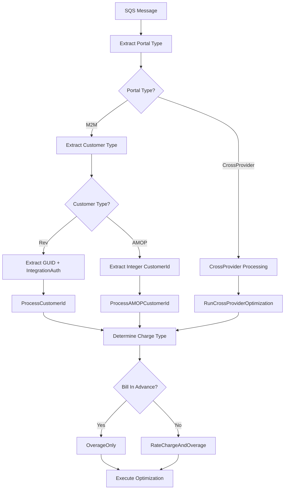

# Optimization Type Detection Analysis

## WHAT is being detected?

The system detects **multiple optimization types** to determine the appropriate processing workflow:

### 1. **Portal Type Detection**
- **M2M Portal Type**: Machine-to-Machine optimization
- **CrossProvider Portal Type**: Cross-provider customer optimization  
- **Mobility Portal Type**: Mobility customer optimization

### 2. **Customer Type Detection**
- **Rev Customers**: Legacy GUID-based customers
- **AMOP Customers**: Modern integer-based customers

### 3. **Optimization Charge Type Detection**
- **RateChargeAndOverage**: Standard billing with rate charges and overage
- **OverageOnly**: Bill-in-advance scenario with only overage charges

### 4. **Customer Optimization vs Carrier Optimization**
- **Customer Optimization**: Optimizes for specific customers (`IsCustomerOptimization = true`)
- **Carrier Optimization**: Optimizes for carrier groups (`IsCustomerOptimization = false`)

## WHY is optimization type detection needed?

### 1. **Different Processing Workflows**
- Rev customers require integration authentication and account number lookup
- AMOP customers use simplified direct processing
- CrossProvider requires different repository and optimization logic

### 2. **Billing Model Variations**
- Bill-in-advance customers only pay overage charges
- Standard customers pay both rate charges and overage
- Different portal types have different rate pool creation strategies

### 3. **Authentication Requirements**
- Rev customers need `IntegrationAuthenticationId` validation
- AMOP customers bypass integration authentication
- CrossProvider uses specialized customer lookup

### 4. **Performance Optimization**
- Different portal types use optimized data retrieval methods
- Customer optimization uses different SIM pooling strategies
- Rate plan processing varies by optimization type

## HOW is optimization type detection implemented?

### Algorithmic Detection Process

```
1. SQS MESSAGE ANALYSIS
   ├── Extract "CustomerType" → SiteTypes enum (Rev/AMOP)
   ├── Extract "PortalTypeId" → PortalTypes enum (M2M/CrossProvider/Mobility)
   └── Extract "ChargeType" → OptimizationChargeType enum

2. PORTAL TYPE BRANCHING
   IF PortalType == M2M:
       → ProcessCustomerOptimizationByPortalType()
   ELSE:
       → ProcessCrossProviderCustomerOptimization()

3. CUSTOMER TYPE BRANCHING
   IF CustomerType == SiteTypes.Rev:
       ├── Validate GUID CustomerId
       ├── Require IntegrationAuthenticationId  
       └── Call ProcessCustomerId()
   ELSE (AMOP):
       ├── Validate Integer AMOPCustomerId
       ├── No integration auth required
       └── Call ProcessAMOPCustomerId()

4. CHARGE TYPE DETERMINATION
   IF useBillInAdvance == true:
       → chargeType = OptimizationChargeType.OverageOnly
   ELSE:
       → chargeType = OptimizationChargeType.RateChargeAndOverage

5. OPTIMIZATION TYPE ROUTING
   ├── Customer Optimization: Use customer-specific rate plans
   ├── Carrier Optimization: Use comm plans and optimization groups
   └── CrossProvider: Use specialized cross-provider logic
```

### Detection Logic Flow



## Code Locations

### Primary Detection Logic
**File**: `AltaworxSimCardCostQueueCustomerOptimization.cs`

#### 1. Portal Type Detection
```csharp
// Lines 124-133
PortalTypes portalType = PortalTypes.M2M;
if (message.MessageAttributes.ContainsKey(SQSMessageKeyConstant.PORTAL_TYPE_ID))
{
    portalType = (PortalTypes)Convert.ToInt32(message.MessageAttributes[SQSMessageKeyConstant.PORTAL_TYPE_ID].StringValue);
}
if (portalType == PortalTypes.M2M)
{
    await ProcessCustomerOptimizationByPortalType(context, message, ...);
}
else
{
    await ProcessCrossProviderCustomerOptimization(context, message, ...);
}
```

#### 2. Customer Type Detection
```csharp
// Lines 102-103
SiteTypes customerType = (SiteTypes)int.Parse(message.MessageAttributes["CustomerType"].StringValue);

// Lines 188-196 - Customer Type Branching
if (customerType == SiteTypes.Rev)
{
    var integrationAuthenticationId = int.Parse(message.MessageAttributes["IntegrationAuthenticationId"].StringValue);
    await ProcessCustomerId(context, tenantId, customerId, ...);
}
else
{
    ArgumentNullException.ThrowIfNull(amopCustomerId);
    await ProcessAMOPCustomerId(context, tenantId, customerType, amopCustomerId.Value, ...);
}
```

#### 3. Optimization Charge Type Detection
```csharp
// Lines 322-325 (Rev Customers)
var chargeType = OptimizationChargeType.RateChargeAndOverage;
if (useBillInAdvance)
{
    chargeType = OptimizationChargeType.OverageOnly;
}

// Lines 437-440 (AMOP Customers)  
var chargeType = OptimizationChargeType.RateChargeAndOverage;
if (useBillInAdvance)
{
    chargeType = OptimizationChargeType.OverageOnly;
}

// Line 729 (CrossProvider)
OptimizationChargeType chargeType = GetChargeType(useBillInAdvance);
```

### REV Customer Processing Locations

#### Rev Customer Method
**File**: `AltaworxSimCardCostQueueCustomerOptimization.cs`
**Method**: `ProcessCustomerId()` (Lines 275-394)

```csharp
private async Task ProcessCustomerId(KeySysLambdaContext context, int tenantId, Guid customerId,
    int? serviceProviderId, int? billingPeriodId, string messageId, int integrationAuthenticationId,
    long optimizationSessionId, bool usesProration, bool isLastInstance, SiteTypes customerType, string additionalData)
{
    // Rev-specific processing:
    // - GetRevAccountNumber(context, customerId)
    // - Uses integrationAuthenticationId for authentication
    // - PortalTypes.M2M for optimization instance creation
    // - RevAccountNumber for error notifications
}
```

#### Rev Customer Validation
```csharp
// Lines 157-164
Guid customerId = Guid.Empty;
if (message.MessageAttributes.ContainsKey("CustomerId"))
{
    customerId = Guid.Parse(message.MessageAttributes["CustomerId"].StringValue);
}
if (customerType == SiteTypes.Rev && (string.IsNullOrEmpty(customerId.ToString()) || customerId == Guid.Empty))
{
    LogInfo(context, "EXCEPTION", "Blank Customer Id provided in message");
    return;
}
```

### AMOP Customer Processing Locations

#### AMOP Customer Method
**File**: `AltaworxSimCardCostQueueCustomerOptimization.cs`
**Method**: `ProcessAMOPCustomerId()` (Lines 396-508)

```csharp
private async Task ProcessAMOPCustomerId(KeySysLambdaContext context, int tenantId, SiteTypes customerType, int AMOPCustomerId,
    int? serviceProviderId, int? billingPeriodId, string messageId,
    long optimizationSessionId, bool usesProration, bool isLastInstance, string additionalData)
{
    // AMOP-specific processing:
    // - Uses AMOPCustomerId directly (no account number lookup)
    // - No integration authentication required (null values)
    // - GetCustomerRatePlans with customerType and AMOPCustomerId parameters
}
```

#### AMOP Customer Validation
```csharp
// Lines 168-172
int? amopCustomerId = null;
if (message.MessageAttributes.ContainsKey(SQSMessageKeyConstant.AMOP_CUSTOMER_ID))
{
    amopCustomerId = int.Parse(message.MessageAttributes[SQSMessageKeyConstant.AMOP_CUSTOMER_ID].StringValue);
}
// Later: ArgumentNullException.ThrowIfNull(amopCustomerId);
```

### CrossProvider Processing Location
**File**: `AltaworxSimCardCostQueueCustomerOptimization.cs`
**Method**: `RunCrossProviderCustomerOptimization()` (Lines 682-774)

```csharp
private async Task RunCrossProviderCustomerOptimization(KeySysLambdaContext context, int tenantId, int customerId, SiteTypes customerType, ...)
{
    // CrossProvider-specific processing:
    // - crossProviderOptimizationRepository.GetOptimizationCustomer()
    // - GetCrossProviderCustomerRatePlans()
    // - StartCrossProviderOptimizationInstance()
    // - ProcessCrossProviderDevicesByCustomerRatePlans()
}
```

### Supporting Infrastructure

#### Charge Type Detection (Multiple files)
**File**: `AltaworxSimCardCostOptimizer.cs` (Lines 100-103)
```csharp
OptimizationChargeType chargeType = OptimizationChargeType.RateChargeAndOverage;
if (message.MessageAttributes.ContainsKey("ChargeType") && int.TryParse(message.MessageAttributes["ChargeType"].StringValue, out var intChargeType))
{
    chargeType = (OptimizationChargeType)intChargeType;
}
```

#### Customer vs Carrier Optimization Detection
**File**: `AltaworxSimCardCostOptimizer.cs` (Lines 196-208)
```csharp
// M2M carrier optimization
if (instance.PortalType == PortalTypes.M2M && !instance.IsCustomerOptimization)
{
    // Use comm plans
}
// Mobility carrier optimization  
if (instance.PortalType == PortalTypes.Mobility && !instance.IsCustomerOptimization)
{
    // Use optimization groups
}
if (instance.IsCustomerOptimization)
{
    // Customer-specific optimization logic
}
```

## Error Handling by Type

### Rev Customer Errors
- Missing CustomerId: "No Customer Id provided in message"
- Empty GUID: "Blank Customer Id provided in message"
- Missing IntegrationAuth: Expected in message attributes

### AMOP Customer Errors  
- Missing AMOPCustomerId: `ArgumentNullException.ThrowIfNull(amopCustomerId)`
- No additional authentication validation

### Portal Type Errors
- Invalid Portal Type: Handled by `OptimizationErrorHandler.OnPortalTypeError()`
- Missing Portal Type: Defaults to `PortalTypes.M2M`

## Performance Impact

### Rev Customers (Higher Overhead)
- GUID parsing and validation
- Account number database lookup via `GetRevAccountNumber()`
- Integration authentication validation
- Additional parameter passing

### AMOP Customers (Lower Overhead)
- Simple integer ID handling
- Direct customer ID usage in queries
- No authentication lookup
- Streamlined parameter passing

### CrossProvider (Specialized Processing)
- Dedicated repository methods
- Cross-provider rate plan retrieval
- Specialized optimization instance creation
- Multi-service provider support

This optimization type detection system enables the platform to handle multiple customer types, billing models, and optimization scenarios through a unified but flexible processing pipeline.