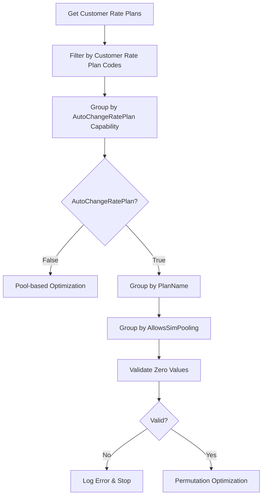
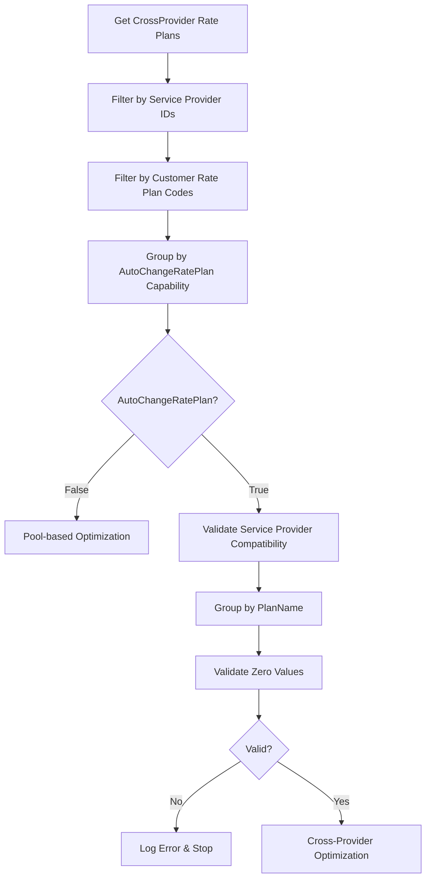

# Rate Plan Processing Analysis

## 1. Customer-Specific Rate Plan Retrieval

### What, Why, How

**WHAT**: The system retrieves customer-specific rate plans from billing period data based on customer type, service provider, and tenant information.

**WHY**: Customer-specific rate plans are needed to ensure optimization uses only the rate plans available to that particular customer during their billing cycle, preventing invalid plan assignments.

**HOW**: The system calls different retrieval methods based on customer type (Rev vs AMOP) and portal type (M2M vs CrossProvider), using customer ID, billing period, service provider, and tenant parameters to fetch applicable rate plans.

### Algorithm

```
CUSTOMER RATE PLAN RETRIEVAL ALGORITHM:

1. DETERMINE customer type and portal context
   ├── IF CustomerType == Rev AND PortalType == M2M
   │   └── Call GetCustomerRatePlans(context, customerId, billingPeriodId, serviceProviderId, tenantId)
   ├── IF CustomerType == AMOP AND PortalType == M2M  
   │   └── Call GetCustomerRatePlans(context, Guid.Empty, billingPeriodId, serviceProviderId, tenantId, customerType, AMOPCustomerId)
   └── IF PortalType == CrossProvider
       └── Call GetCrossProviderCustomerRatePlans(context, serviceProviderIds, customerType, customerIds, billingPeriod, tenantId)

2. VALIDATE rate plan collection
   ├── Check if ratePlans.Count > 0
   ├── IF empty THEN log "No Comm Groups and/or Rate Plans for this Instance"
   └── IF valid THEN proceed to processing

3. ASSESS bill-in-advance eligibility
   ├── Count ratePlans where IsBillInAdvanceEligible == true
   ├── Set useBillInAdvance = (count > 0)
   └── Store for charge type determination

4. RETURN rate plan collection for further processing
   └── Pass to ProcessDevicesByCustomerRatePlans() method
```

### Code Locations

**Primary File**: `AltaworxSimCardCostQueueCustomerOptimization.cs`

#### Rev Customer Rate Plan Retrieval
**Line 285**
```csharp
var ratePlans = GetCustomerRatePlans(context, customerId, (int)billingPeriodId, serviceProviderId, tenantId);
```

#### AMOP Customer Rate Plan Retrieval  
**Line 403**
```csharp
var ratePlans = GetCustomerRatePlans(context, Guid.Empty, (int)billingPeriodId, serviceProviderId, tenantId, customerType, AMOPCustomerId);
```

#### CrossProvider Rate Plan Retrieval
**Line 697**
```csharp
var ratePlans = customerRatePlanRepository.GetCrossProviderCustomerRatePlans(ParameterizedLog(context), serviceProviderIds, customerType, new List<int> { customerId }, billingPeriod, tenantId);
```

#### Bill-in-Advance Eligibility Check
**Lines 287, 404, 699**
```csharp
var useBillInAdvance = ratePlans.Count(x => x.IsBillInAdvanceEligible) > 0;
```

---

## 2. Rate Plan Filtering by Customer Eligibility and Service Provider

### What, Why, How

**WHAT**: The system filters rate plans based on customer eligibility criteria, service provider compatibility, and customer rate plan codes assigned to devices.

**WHY**: Filtering ensures only valid and applicable rate plans are used for optimization, preventing assignments to incompatible plans and ensuring service provider constraints are respected.

**HOW**: The system applies multiple filter layers including customer rate plan code validation, service provider ID matching, and auto-change rate plan service provider compatibility checks.

### Algorithm

```
RATE PLAN FILTERING ALGORITHM:

1. FILTER by customer rate plan codes
   ├── Get optimizationSimCards with CustomerRatePlanCode
   ├── Filter optimizationSimCards.Where(s => !string.IsNullOrWhiteSpace(s.CustomerRatePlanCode))
   └── Only process devices with assigned rate plan codes

2. FILTER by service provider compatibility (CrossProvider only)
   ├── IF serviceProviderIds provided
   ├── Parse serviceProviderIds string to list
   ├── Filter autoChangeRatePlans where ServiceProviderIds contains all required providers
   └── IF no valid plans found THEN log error and exit

3. FILTER by rate plan codes from devices
   ├── Extract ratePlanCodes from simCardsByRatePoolId
   ├── Get distinct rate plan codes from devices
   ├── Filter ratePlans.Where(x => ratePlanCodes.Contains(x.PlanName))
   └── Only use rate plans that match device assignments

4. VALIDATE filtered results
   ├── Check if filtered rate plans collection is not empty
   ├── IF empty THEN log appropriate error message
   └── IF valid THEN proceed to grouping
```

### Code Locations

**Primary File**: `AltaworxSimCardCostQueueCustomerOptimization.cs`

#### Customer Rate Plan Code Filtering
**Lines 514, 788**
```csharp
optimizationSimCards = optimizationSimCards.Where(s => !string.IsNullOrWhiteSpace(s.CustomerRatePlanCode)).ToList();
```

#### Service Provider Filtering (CrossProvider)
**Lines 807-813**
```csharp
if (autoChangeRatePlans.Any() && !string.IsNullOrWhiteSpace(serviceProviderIds))
{
    var serviceProviderIdList = serviceProviderIds.Replace(" ", "").Split(CommonConstants.STRING_ITEMS_SEPERATOR).ToList();
    autoChangeRatePlans = autoChangeRatePlans.Where(x => x.ServiceProviderIds.Split(CommonConstants.STRING_ITEMS_SEPERATOR).ToList().ContainsAllItems(serviceProviderIdList)).ToList();
    if (!autoChangeRatePlans.Any())
    {
        LogInfo(context, CommonConstants.ERROR, string.Format(LogCommonStrings.NO_VALID_CROSS_PROVIDER_CUSTOMER_RATE_PLAN_FOUND, serviceProviderIds));
        return true;
    }
}
```

#### Rate Plan Code Matching
**Lines 538, 542, 824**
```csharp
var ratePlanCodes = simCardsByRatePoolId.Select(x => x.CustomerRatePlanCode).Distinct();
// ...
var ratePlansForPool = ratePlans.Where(x => ratePlanCodes.Contains(x.PlanName));
```

---

## 3. Rate Plan Grouping by Auto Change Rate Plan Capability

### What, Why, How

**WHAT**: The system groups rate plans based on their Auto Change Rate Plan capability, separating plans that allow automatic rate plan changes from those that don't.

**WHY**: Auto Change Rate Plan capability determines the optimization strategy - plans with this capability use permutation-based optimization while non-auto-change plans use pooled optimization by customer rate pool.

**HOW**: The system uses LINQ filtering to separate rate plans into two groups: those with AutoChangeRatePlan=true for algorithmic optimization and those with AutoChangeRatePlan=false for pool-based optimization.

### Algorithm

```
RATE PLAN GROUPING BY AUTO CHANGE CAPABILITY ALGORITHM:

1. SEPARATE rate plans by AutoChangeRatePlan capability
   ├── ratePlansByCustomerRatePool = ratePlans.Where(ratePlan => !ratePlan.AutoChangeRatePlan)
   └── autoChangeRatePlans = ratePlans.Where(ratePlan => ratePlan.AutoChangeRatePlan)

2. PROCESS non-auto-change rate plans (Customer Rate Pool)
   ├── IF ratePlansByCustomerRatePool.Any()
   ├── Validate zero value rate plans
   ├── Call ProcessDevicesWithAutoChangeDisabledRatePlans()
   └── Use pooled optimization strategy

3. PROCESS auto-change rate plans (Algorithmic Optimization)  
   ├── Group by CustomerRatePoolId for device organization
   ├── IF CustomerRatePoolId == null (auto-change eligible)
   ├── Group ratePlans by PlanName for permutation optimization
   └── Call ProcessPlanNameGroup() for each group

4. APPLY SIM pooling sub-grouping (for auto-change plans)
   ├── Within each PlanName group
   ├── Group by AllowsSimPooling capability
   ├── Process each pooling group separately
   └── Apply different optimization rules per pooling type

5. VALIDATE grouping results
   ├── Ensure each group has valid rate plans
   ├── Check device count per group meets minimum thresholds
   └── Proceed with appropriate optimization strategy
```

### Code Locations

**Primary File**: `AltaworxSimCardCostQueueCustomerOptimization.cs`

#### Auto Change Rate Plan Separation
**Lines 518, 791**
```csharp
var ratePlansByCustomerRatePool = ratePlans.Where(ratePlan => !ratePlan.AutoChangeRatePlan).ToList();
```

**Lines 549, 806, 835**
```csharp
var ratePlansByCodes = ratePlans.Where(ratePlan => ratePlan.AutoChangeRatePlan && ratePlanCodes.Contains(ratePlan.PlanName)).GroupBy(x => x.PlanName);
```

#### Rate Pool Grouping Logic
**Lines 533-556**
```csharp
var simCardsByRatePoolIds = optimizationSimCards.GroupBy(x => x.CustomerRatePoolId).Distinct();

foreach (var simCardsByRatePoolId in simCardsByRatePoolIds)
{
    if (simCardsByRatePoolId.Key != null)
    {
        // Process pooled rate plans
        var ratePlansForPool = ratePlans.Where(x => ratePlanCodes.Contains(x.PlanName));
        isError = await ProcessRatePoolGroup(context, ...);
    }
    else
    {
        // Process auto-change rate plans with permutation logic
        var ratePlansByCodes = ratePlans.Where(ratePlan => ratePlan.AutoChangeRatePlan && ratePlanCodes.Contains(ratePlan.PlanName)).GroupBy(x => x.PlanName);
    }
}
```

#### SIM Pooling Sub-Grouping
**Lines 567-568**
```csharp
foreach (var ratePlanGroup in planNameGroup.GroupBy(x => x.AllowsSimPooling))
{
    LogInfo(context, LogTypeConstant.Info, $"Allows SIM Pooling: {ratePlanGroup.Key}");
```

---

## 4. Rate Plan Validation (Overage Rates and Data Charges)

### What, Why, How

**WHAT**: The system validates that rate plans have non-zero overage rates and data per overage charges to ensure proper cost calculations during optimization.

**WHY**: Zero-value overage rates or data charges would break the optimization algorithm's cost calculations and could lead to incorrect rate plan assignments or division-by-zero errors.

**HOW**: The system checks each rate plan's DataPerOverageCharge and OverageRate properties, rejecting any plans with zero values and logging detailed error messages with plan names for correction.

### Algorithm

```
RATE PLAN VALIDATION ALGORITHM:

1. EXTRACT rate plans for validation group
   ├── Get groupRatePlans from current processing group
   └── Prepare for zero-value checking

2. IDENTIFY zero-value rate plans
   ├── Find plans where DataPerOverageCharge == 0.0M
   ├── Find plans where OverageRate == 0.0M  
   ├── Combine into zeroValueRatePlans collection
   └── Get distinct list of invalid plans

3. VALIDATE rate plan values
   ├── IF zeroValueRatePlans.Count > 0
   ├── Log detailed exception with plan names
   ├── Include planNameGroup.Key for context
   └── Return true to indicate error and stop processing

4. LOG validation details
   ├── Create error message with PlanDisplayName list
   ├── Include instruction to update to non-zero values
   ├── Use LogTypeConstant.Exception for severity
   └── Provide Environment.NewLine formatting

5. HANDLE validation results
   ├── IF validation fails THEN stop optimization process
   ├── IF validation passes THEN continue with optimization
   └── Use return value to control workflow
```

### Code Locations

**Primary File**: `AltaworxSimCardCostQueueCustomerOptimization.cs`

#### Zero Value Rate Plan Detection
**Lines 573-578**
```csharp
var zeroValueRatePlans = groupRatePlans.FindAll(x => x.DataPerOverageCharge == 0.0M || x.OverageRate == 0.0M);
if (zeroValueRatePlans.Count > 0)
{
    LogInfo(context, LogTypeConstant.Exception, $"The following rate plans in '{planNameGroup.Key}' has Data per Overage Charge or Overage Rate of 0. Please update to a non-zero value.{Environment.NewLine} {string.Join(',', zeroValueRatePlans.Select(ratePlan => ratePlan.PlanDisplayName))}");
    return true;
}
```

#### Validation Method Calls
**Lines 521, 794**
```csharp
if (CheckZeroValueRatePlans(context, instanceId, ratePlansByCustomerRatePool, shouldStopInstance: true))
{
    return true;
}
```

#### Rate Plan Property Validation
The validation checks two critical properties:
- **DataPerOverageCharge**: Must be > 0.0M for proper data cost calculations
- **OverageRate**: Must be > 0.0M for proper overage billing calculations

## Rate Plan Processing Flow Comparison

### Standard M2M Processing


### CrossProvider Processing


## Error Handling Summary

### Rate Plan Retrieval Errors
- **No Rate Plans Found**: "No Comm Groups and/or Rate Plans for this Instance"
- **Empty Customer ID**: Customer-specific validation errors
- **Invalid Billing Period**: Billing period validation failures

### Filtering Errors  
- **Invalid Service Provider**: "NO_VALID_CROSS_PROVIDER_CUSTOMER_RATE_PLAN_FOUND"
- **No Matching Rate Plan Codes**: Silent filtering, continues with available plans
- **Missing Customer Rate Plan Codes**: Devices filtered out of optimization

### Grouping Errors
- **Insufficient Rate Plans**: "AUTO_CHANGE_MINIMUM_RATE_PLAN_LIMIT_REACHED"
- **Exceeds Rate Plan Limit**: "The rate plan count exceeds the limit of 15"
- **No Devices for Group**: "No more device to optimize for rate plan in group"

### Validation Errors
- **Zero Value Rate Plans**: "Data per Overage Charge or Overage Rate of 0. Please update to a non-zero value"
- **Missing Required Properties**: Validation failures stop optimization process
- **Rate Plan Incompatibility**: Service provider mismatch errors

## Performance Optimization Strategies

### Rate Plan Retrieval
- **Customer Type Specific Calls**: Different methods for Rev vs AMOP customers
- **Filtered Queries**: Only retrieve relevant rate plans for billing period
- **Cached Results**: Rate plans cached per optimization session

### Filtering Efficiency  
- **Early Filtering**: Remove invalid plans before expensive operations
- **LINQ Optimization**: Use efficient Where() clauses for filtering
- **Service Provider Pre-filtering**: Reduce plan sets before detailed processing

### Grouping Performance
- **Hierarchical Grouping**: Group by major categories first, then sub-categories
- **Lazy Evaluation**: Process groups only when needed
- **Memory Management**: Dispose of unused plan collections

### Validation Speed
- **Early Exit**: Stop validation on first error found
- **Batch Validation**: Validate entire groups rather than individual plans
- **Property Caching**: Cache frequently accessed rate plan properties