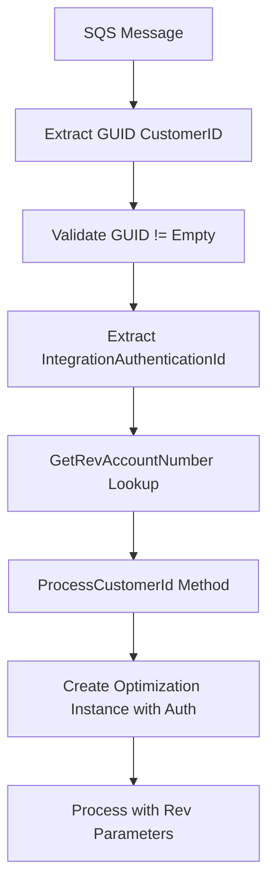
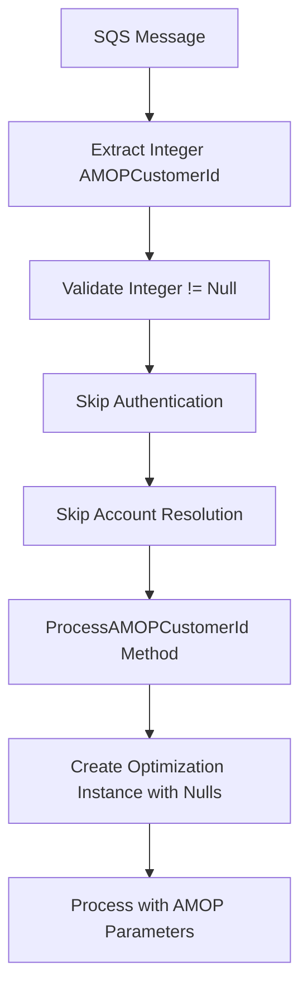

# Optimization Type Detection: Rev vs AMOP Customers

## Rev Customers

### What, Why, How

**WHAT**: Rev customers use GUID-based customer identification with integration authentication for optimization processing.

**WHY**: Rev customers represent the legacy system requiring complex authentication layers and account number resolution to maintain backward compatibility with existing customer databases.

**HOW**: The system validates GUID customer IDs, requires integration authentication credentials, and performs account number lookup before routing to Rev-specific optimization workflows.

### Algorithm

```
REV CUSTOMER OPTIMIZATION ALGORITHM:

1. EXTRACT customer type from SQS message
   IF CustomerType == SiteTypes.Rev THEN proceed

2. VALIDATE Rev customer identification
   ├── Extract CustomerId as GUID from message attributes
   ├── Parse GUID string to Guid object
   ├── Check if GUID is not empty or null
   └── IF invalid THEN log exception and exit

3. AUTHENTICATE Rev customer
   ├── Extract IntegrationAuthenticationId from message attributes
   ├── Parse as integer for authentication validation
   └── Store for downstream processing

4. RESOLVE Rev account information
   ├── Call GetRevAccountNumber(context, customerId)
   ├── Retrieve account number from database using GUID
   └── Store revAccountNumber for billing operations

5. DETERMINE optimization charge type
   ├── Check rate plans for IsBillInAdvanceEligible
   ├── IF useBillInAdvance == true THEN chargeType = OverageOnly
   └── ELSE chargeType = RateChargeAndOverage

6. EXECUTE Rev optimization workflow
   ├── Call ProcessCustomerId() method
   ├── Use integrationAuthenticationId for authentication
   ├── Use revAccountNumber for device queries
   ├── Create M2M portal type optimization instance
   └── Process devices with Rev-specific parameters

7. HANDLE Rev-specific error scenarios
   ├── Missing GUID → "No Customer Id provided in message"
   ├── Empty GUID → "Blank Customer Id provided in message"
   └── Missing IntegrationAuth → Exception during processing
```

### Code Locations

**Primary File**: `AltaworxSimCardCostQueueCustomerOptimization.cs`

#### Detection Point
**Lines 188-191**
```csharp
if (customerType == SiteTypes.Rev)
{
    var integrationAuthenticationId = int.Parse(message.MessageAttributes["IntegrationAuthenticationId"].StringValue);
    await ProcessCustomerId(context, tenantId, customerId, serviceProviderId, billingPeriodId, messageId, integrationAuthenticationId, optimizationSessionId, usesProration, isLastInstance, customerType, additionalData);
}
```

#### GUID Validation
**Lines 157-164**
```csharp
Guid customerId = Guid.Empty;
if (message.MessageAttributes.ContainsKey("CustomerId"))
{
    customerId = Guid.Parse(message.MessageAttributes["CustomerId"].StringValue);
}
if (customerType == SiteTypes.Rev && (string.IsNullOrEmpty(customerId.ToString()) || customerId == Guid.Empty))
{
    LogInfo(context, "EXCEPTION", "Blank Customer Id provided in message");
    return;
}
```

#### Rev Processing Method
**Lines 275-394**
```csharp
private async Task ProcessCustomerId(KeySysLambdaContext context, int tenantId, Guid customerId,
    int? serviceProviderId, int? billingPeriodId, string messageId, int integrationAuthenticationId,
    long optimizationSessionId, bool usesProration, bool isLastInstance, SiteTypes customerType, string additionalData)
```

#### Account Resolution
**Line 282**
```csharp
var revAccountNumber = GetRevAccountNumber(context, customerId);
```

#### Charge Type Determination
**Lines 322-325**
```csharp
var chargeType = OptimizationChargeType.RateChargeAndOverage;
if (useBillInAdvance)
{
    chargeType = OptimizationChargeType.OverageOnly;
}
```

---

## AMOP Customers

### What, Why, How

**WHAT**: AMOP customers use integer-based customer identification with simplified authentication for streamlined optimization processing.

**WHY**: AMOP customers represent the modernized system designed for improved performance by eliminating complex authentication layers and providing direct customer ID management.

**HOW**: The system validates integer customer IDs, bypasses integration authentication requirements, and uses the customer ID directly for optimization workflows without additional account resolution.

### Algorithm

```
AMOP CUSTOMER OPTIMIZATION ALGORITHM:

1. EXTRACT customer type from SQS message
   IF CustomerType != SiteTypes.Rev THEN proceed as AMOP

2. VALIDATE AMOP customer identification
   ├── Extract AMOPCustomerId as integer from message attributes
   ├── Parse string to integer value
   ├── Check if integer is not null
   └── IF invalid THEN throw ArgumentNullException

3. BYPASS authentication requirements
   ├── No IntegrationAuthenticationId required
   ├── No additional authentication validation
   └── Use null values for authentication parameters

4. SKIP account resolution step
   ├── No GetRevAccountNumber() call needed
   ├── Use AMOPCustomerId directly in all operations
   └── No additional database lookups for account information

5. DETERMINE optimization charge type
   ├── Check rate plans for IsBillInAdvanceEligible
   ├── IF useBillInAdvance == true THEN chargeType = OverageOnly
   └── ELSE chargeType = RateChargeAndOverage

6. EXECUTE AMOP optimization workflow
   ├── Call ProcessAMOPCustomerId() method
   ├── Pass null for integrationAuthenticationId
   ├── Pass null for revAccountNumber
   ├── Create M2M portal type optimization instance
   └── Process devices with AMOP-specific parameters

7. HANDLE AMOP-specific error scenarios
   ├── Missing AMOPCustomerId → ArgumentNullException
   ├── Invalid integer format → Parse exception
   └── No additional authentication validation errors
```

### Code Locations

**Primary File**: `AltaworxSimCardCostQueueCustomerOptimization.cs`

#### Detection Point
**Lines 194-196**
```csharp
else
{
    ArgumentNullException.ThrowIfNull(amopCustomerId);
    await ProcessAMOPCustomerId(context, tenantId, customerType, amopCustomerId.Value, serviceProviderId, billingPeriodId, messageId, optimizationSessionId, usesProration, isLastInstance, additionalData);
}
```

#### Integer Validation
**Lines 168-172**
```csharp
int? amopCustomerId = null;
if (message.MessageAttributes.ContainsKey(SQSMessageKeyConstant.AMOP_CUSTOMER_ID))
{
    amopCustomerId = int.Parse(message.MessageAttributes[SQSMessageKeyConstant.AMOP_CUSTOMER_ID].StringValue);
}
```

#### AMOP Processing Method
**Lines 396-508**
```csharp
private async Task ProcessAMOPCustomerId(KeySysLambdaContext context, int tenantId, SiteTypes customerType, int AMOPCustomerId,
    int? serviceProviderId, int? billingPeriodId, string messageId,
    long optimizationSessionId, bool usesProration, bool isLastInstance, string additionalData)
```

#### Direct ID Usage
**Line 403**
```csharp
var ratePlans = GetCustomerRatePlans(context, Guid.Empty, (int)billingPeriodId, serviceProviderId, tenantId, customerType, AMOPCustomerId);
```

#### Charge Type Determination
**Lines 437-440**
```csharp
var chargeType = OptimizationChargeType.RateChargeAndOverage;
if (useBillInAdvance)
{
    chargeType = OptimizationChargeType.OverageOnly;
}
```

#### Simplified Instance Creation
**Lines 433-434**
```csharp
var instanceId = StartOptimizationInstanceWithBillingPeriod(context, tenantId, messageId,
    billingPeriod.Id, null, null, PortalTypes.M2M, optimizationSessionId,
    useBillInAdvance, billInAdvanceBillingPeriodId, AMOPCustomerId);
```

## Key Differences Summary

| Aspect | Rev Customers | AMOP Customers |
|--------|--------------|----------------|
| **ID Type** | GUID (Lines 157-164) | Integer (Lines 168-172) |
| **Authentication** | Required IntegrationAuthenticationId | None (null values) |
| **Account Resolution** | GetRevAccountNumber() call | Direct ID usage |
| **Processing Method** | ProcessCustomerId() | ProcessAMOPCustomerId() |
| **Performance** | Higher overhead | Lower overhead |
| **Parameters** | GUID + Auth + Account | Integer only |
| **Validation Logic** | Empty GUID check | Null integer check |
| **Error Messages** | "Blank Customer Id provided" | ArgumentNullException |

## Optimization Flow Comparison

### Rev Customer Flow


### AMOP Customer Flow


## Performance Impact Analysis

### Rev Customers (Higher Overhead)
- **GUID Processing**: String to GUID conversion and validation
- **Database Lookup**: Additional query for account number resolution
- **Authentication**: Integration authentication parameter validation
- **Memory Usage**: Larger GUID storage vs integer
- **Processing Time**: Multiple validation steps and database calls

### AMOP Customers (Lower Overhead)
- **Integer Processing**: Simple string to integer conversion
- **Direct Usage**: No additional database lookups required
- **Simplified Auth**: Bypasses authentication validation
- **Memory Efficiency**: Smaller integer storage
- **Processing Speed**: Streamlined workflow with fewer steps

## Migration Strategy Implications

The dual customer type support suggests a migration strategy:

1. **Legacy Support**: Rev customers maintain existing functionality
2. **Modern Path**: AMOP customers use optimized processing
3. **Gradual Migration**: System supports both types simultaneously
4. **Performance Benefits**: AMOP customers gain improved processing speed
5. **Future Direction**: Eventual migration from Rev to AMOP system