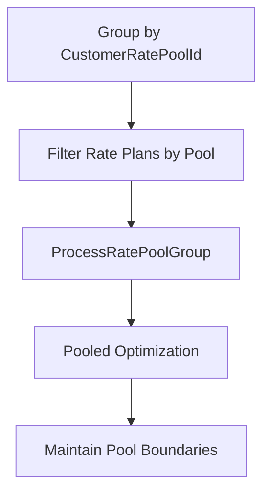
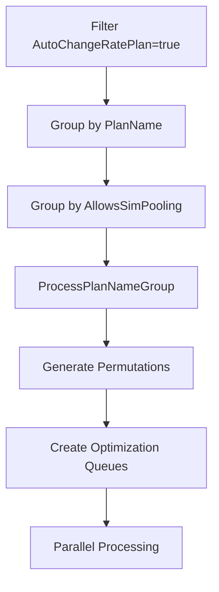
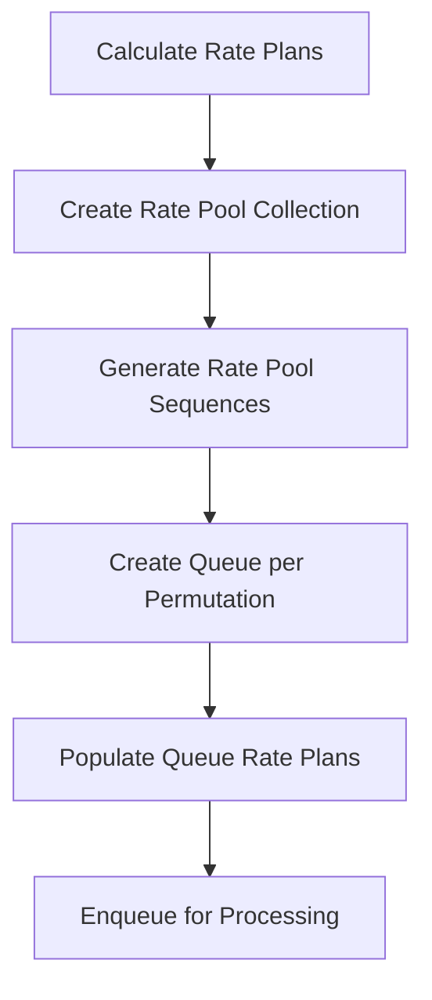

# Advanced Optimization Features Analysis

## 1. Auto Change Logic

Auto Change Logic determines whether the optimization algorithm can dynamically change rate plans during optimization or uses fixed customer rate pool groupings.

### Algorithm
```
1. Check ratePlan.AutoChangeRatePlan property for each rate plan
2. Split into two collections: enabled vs disabled
3. Process disabled plans with fixed customer rate pool groupings
4. Process enabled plans with dynamic permutation optimization
5. Apply appropriate optimization strategy per group
```

### Code Locations

**Primary File**: `AltaworxSimCardCostQueueCustomerOptimization.cs`

#### Auto Change Disabled Processing
```csharp
var ratePlansByCustomerRatePool = ratePlans.Where(ratePlan => !ratePlan.AutoChangeRatePlan).ToList();
if (ratePlansByCustomerRatePool.Any())
{
    if (CheckZeroValueRatePlans(context, instanceId, ratePlansByCustomerRatePool, shouldStopInstance: true))
    {
        return true;
    }
    else
    {
        optimizationSimCards = ProcessDevicesWithAutoChangeDisabledRatePlans(context, integrationAuthenticationId, usesProration, revAccountNumber, AMOPCustomerId, billingPeriod, nextBillingPeriod, instanceId, optimizationSimCards, ratePlansByCustomerRatePool, tenantId);
    }
}
```

#### Auto Change Enabled Processing
```csharp
var ratePlansByCodes = ratePlans.Where(ratePlan => ratePlan.AutoChangeRatePlan && ratePlanCodes.Contains(ratePlan.PlanName)).GroupBy(x => x.PlanName);
foreach (var ratePlansByCode in ratePlansByCodes)
{
    isError = await ProcessPlanNameGroup(context, integrationAuthenticationId, usesProration, revAccountNumber, AMOPCustomerId, billingPeriod, instanceId, chargeType, ratePlansByCode, simCardsByRatePoolId.ToList());
}
```

#### CrossProvider Auto Change Processing
```csharp
var autoChangeRatePlans = ratePlans.Where(ratePlan => ratePlan.AutoChangeRatePlan);
if (autoChangeRatePlans.Any() && !string.IsNullOrWhiteSpace(serviceProviderIds))
{
    var serviceProviderIdList = serviceProviderIds.Replace(" ", "").Split(CommonConstants.STRING_ITEMS_SEPERATOR).ToList();
    autoChangeRatePlans = autoChangeRatePlans.Where(x => x.ServiceProviderIds.Split(CommonConstants.STRING_ITEMS_SEPERATOR).ToList().ContainsAllItems(serviceProviderIdList)).ToList();
    if (!autoChangeRatePlans.Any())
    {
        LogInfo(context, CommonConstants.ERROR, string.Format(LogCommonStrings.NO_VALID_CROSS_PROVIDER_CUSTOMER_RATE_PLAN_FOUND, serviceProviderIds));
        return true;
    }
}
```

---

## 2. Bill in Advance Features

Bill in Advance Features identify rate plans eligible for advance billing processing, load next billing periods, and set charge types to OverageOnly for advance billing scenarios.

### Algorithm
```
1. Count rate plans with IsBillInAdvanceEligible == true
2. Override to false (currently disabled via PORT-166)
3. Load next billing period for advance calculations
4. Validate billing period exists for advance billing
5. Set charge type to OverageOnly if enabled, else RateChargeAndOverage
6. Skip advance calculation logic (pending new implementation)
```

### Code Locations

**Primary File**: `AltaworxSimCardCostQueueCustomerOptimization.cs`

#### Bill in Advance Eligibility Detection
```csharp
var useBillInAdvance = ratePlans.Count(x => x.IsBillInAdvanceEligible) > 0;
//Disable bill in advance logic until new logic is defined (PORT-166)
useBillInAdvance = false;

LogInfo(context, "INFO", $"Use Bill In Advance: {useBillInAdvance}");
```

#### Next Billing Period Loading
```csharp
BillingPeriod nextBillingPeriod = null;
if (billingPeriod != null)
{
    nextBillingPeriod = GetNextBillingPeriod(context, billingPeriod.ServiceProviderId, billingPeriod.BillingPeriodEnd);
}

var billInAdvanceBillingPeriodId = nextBillingPeriod?.Id;

if (useBillInAdvance && (billInAdvanceBillingPeriodId == null || billingPeriod == null))
{
    LogInfo(context, "ERROR", $"A Billing Period past Billing Period Id could not be found for this Customer. So, billing in advance is not possible at this time. Optimization not run.");
    return;
}
```

#### Charge Type Setting
```csharp
var chargeType = OptimizationChargeType.RateChargeAndOverage;
if (useBillInAdvance)
{
    chargeType = OptimizationChargeType.OverageOnly;
}
```

#### Bill in Advance Calculation Logic (Currently Disabled)
```csharp
if (useBillInAdvance)
{
    LogInfo(context, LogTypeConstant.Info, "Bill In Advance calculation logic is not implemented for Optimization with Auto Change Rate Plan enabled.");
}
```

---

## 3. Processing Strategies

Processing Strategies encompass four key approaches: Customer Rate Pool Processing, Auto Change Processing, Permutation Generation, and Queue Creation for parallel processing.

### 3.1 Customer Rate Pool Processing

Groups devices by customer rate pool ID for pooled optimization where rate plans are fixed.

#### Algorithm
```
1. Group devices by CustomerRatePoolId
2. Process each rate pool group separately
3. Filter rate plans by matching rate plan codes
4. Call ProcessRatePoolGroup for pooled optimization
5. Maintain pool integrity during optimization
```

#### Code Locations
```csharp
var simCardsByRatePoolIds = optimizationSimCards.GroupBy(x => x.CustomerRatePoolId).Distinct();

foreach (var simCardsByRatePoolId in simCardsByRatePoolIds)
{
    LogInfo(context, CommonConstants.INFO, $"RatePoolId: {simCardsByRatePoolId}");
    var ratePlanCodes = simCardsByRatePoolId.Select(x => x.CustomerRatePlanCode).Distinct();
    var isError = false;
    if (simCardsByRatePoolId.Key != null)
    {
        var ratePlansForPool = ratePlans.Where(x => ratePlanCodes.Contains(x.PlanName));
        isError = await ProcessRatePoolGroup(context, integrationAuthenticationId, usesProration, revAccountNumber, AMOPCustomerId, billingPeriod, instanceId, chargeType, ratePlansForPool, simCardsByRatePoolId.ToList(), simCardsByRatePoolId?.Key, queuesPerInstance: QueuesPerInstance);
    }
}
```

### 3.2 Auto Change Processing

Groups devices by rate plan code for dynamic rate plan changes during optimization.

#### Algorithm
```
1. Filter rate plans where AutoChangeRatePlan == true
2. Group by PlanName for similar plans
3. Apply permutation-based optimization
4. Handle SIM pooling sub-grouping
5. Validate optimization constraints and proceed
```

#### Code Locations
```csharp
var ratePlansByCodes = ratePlans.Where(ratePlan => ratePlan.AutoChangeRatePlan && ratePlanCodes.Contains(ratePlan.PlanName)).GroupBy(x => x.PlanName);
foreach (var ratePlansByCode in ratePlansByCodes)
{
    isError = await ProcessPlanNameGroup(context, integrationAuthenticationId, usesProration, revAccountNumber, AMOPCustomerId, billingPeriod, instanceId, chargeType, ratePlansByCode, simCardsByRatePoolId.ToList());
}
```

### 3.3 Permutation Generation

Creates all valid rate plan combinations for testing during optimization to find the most cost-effective assignments.

#### Algorithm
```
1. Calculate max average usage for rate plans
2. Create rate pools and rate pool collection
3. Generate all valid permutations of rate pool assignments
4. Create optimization queue for each permutation
5. Persist permutation data for parallel processing
```

#### Code Locations
```csharp
// Create rate pool collection for permutation
var commPlanGroupId = CreateCommPlanGroup(context, instanceId);
var calculatedPlans = RatePoolCalculator.CalculateMaxAvgUsage(groupRatePlans, null);
var ratePools = RatePoolFactory.CreateRatePools(calculatedPlans, billingPeriod, usesProration, chargeType);
var ratePoolCollection = RatePoolCollectionFactory.CreateRatePoolCollection(ratePools);

// Generate permutations and create queues
GeneratePermutationQueueRatePlans(context, usesProration, billingPeriod, instanceId, commPlanGroupId, ratePoolCollection, commGroupRatePlanTable);

private void GeneratePermutationQueueRatePlans(KeySysLambdaContext context, bool usesProration, BillingPeriod billingPeriod, long instanceId, long commPlanGroupId, RatePoolCollection ratePoolCollection, DataTable commGroupRatePlanTable)
{
    LogInfo(context, LogTypeConstant.Sub, detail: $"Start GenerateRatePoolSequences for {ratePoolCollection.RatePools.Count} Rate Plans");
    var ratePoolSequences = RatePoolAssigner.GenerateRatePoolSequences(ratePoolCollection.RatePools);
    LogInfo(context, LogTypeConstant.Sub, "End GenerateRatePoolSequences");
}
```

### 3.4 Queue Creation

Generates optimization queues for parallel processing of different optimization scenarios and rate plan combinations.

#### Algorithm
```
1. Create optimization queues for each scenario
2. Populate queues with rate plan assignments
3. Enqueue optimization tasks for parallel execution
4. Handle special queue scenarios for unused devices
```

#### Code Locations

#### Queue Creation Methods
```csharp
// Create queue for rate plan permutation
var queueId = CreateQueue(context, instanceId, commPlanGroupId, billingPeriod.ServiceProviderId, usesProration);

// Create queue for unused devices
var unusedQueueId = CreateQueue(context, instanceId, unusedCommPlanGroupId, null, usesProration);
```

#### Queue Population and Execution
```csharp
// Enqueue optimization runs for parallel processing
await EnqueueOptimizationRunsAsync(context, instanceId, new List<long>() { commPlanGroupId }, chargeType, QueuesPerInstance, skipLowerCostCheck: true, isCustomerOptimization: true);

// Add rate plans to queue with sequence tracking
var dtQueueRatePlanTemp = AddRatePlansToQueue(queueId, ratePoolSequence, commGroupRatePlanTable);
if (dtQueueRatePlanTemp != null && dtQueueRatePlanTemp.Rows.Count > 0)
{
    foreach (DataRow dr in dtQueueRatePlanTemp.Rows)
    {
        dtQueueRatePlan.Rows.Add(dr.ItemArray);
    }
}
```

## Processing Strategy Flow Comparison

### Customer Rate Pool Processing Flow


### Auto Change Processing Flow


### Permutation Generation Flow


## Error Handling Summary

### Auto Change Logic Errors
- **Zero Value Rate Plans**: Validation prevents optimization with invalid rate plans
- **Service Provider Mismatch**: CrossProvider validation ensures compatible rate plans
- **Empty Plan Groups**: Validation prevents processing of empty rate plan collections

### Bill in Advance Errors
- **Missing Next Period**: Error when next billing period cannot be found
- **Implementation Status**: Clear logging that feature is currently disabled
- **Validation Failures**: Proper error handling for advance billing prerequisites

### Processing Strategy Errors
- **Insufficient Devices**: Minimum device count validation for optimization viability
- **Rate Plan Limits**: Maximum rate plan count validation to prevent complexity explosion
- **Queue Creation Failures**: Error handling for queue creation and population issues