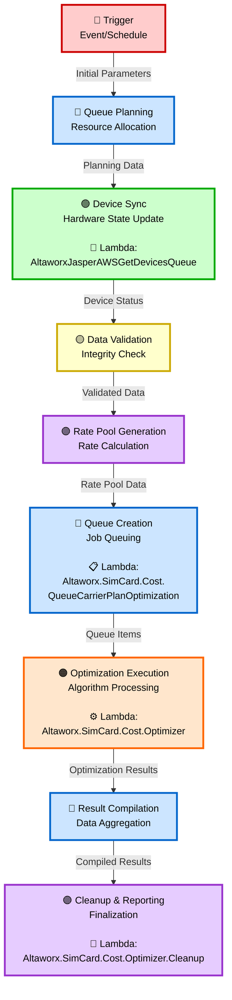

# Carrier Optimization Data Flow Diagram (DFD) with Lambda Functions

## Visual DFD - Carrier Optimization Process



## Detailed Process Flow with Lambda Integration

### 1. 🔴 **Trigger - Event/Schedule**
- **Stage**: Initial Trigger
- **Input**: Event triggers or scheduled runs
- **Output**: Initial Parameters
- **Description**: Initiates carrier optimization process
- **Color**: Red

---

### 2. 🔵 **Queue Planning - Resource Allocation**
- **Stage**: Planning & Resource Management
- **Input**: Initial Parameters
- **Output**: Planning Data
- **Description**: Allocates resources and plans optimization queue
- **Color**: Blue

---

### 3. 🟢 **Device Sync - Hardware State Update**
- **Stage**: Device Data Retrieval
- **Lambda Function**: **`AltaworxJasperAWSGetDevicesQueue`**
- **Input**: Planning Data
- **Output**: Device Status
- **Description**: Synchronizes device information from Jasper AWS
- **Lambda Responsibilities**:
  - Queue device data retrieval requests
  - Fetch current device states from Jasper
  - Synchronize hardware state information
  - Provide updated device status for optimization
- **Color**: Green

---

### 4. 🟡 **Data Validation - Integrity Check**
- **Stage**: Data Validation
- **Input**: Device Status
- **Output**: Validated Data
- **Description**: Validates data integrity and performs quality checks
- **Color**: Yellow

---

### 5. 🟣 **Rate Pool Generation - Rate Calculation**
- **Stage**: Rate Pool Management
- **Input**: Validated Data
- **Output**: Rate Pool Data
- **Description**: Generates carrier-specific rate pools and calculations
- **Color**: Purple

---

### 6. 🔵 **Queue Creation - Job Queuing**
- **Stage**: Job Queue Management
- **Lambda Function**: **`Altaworx.SimCard.Cost.QueueCarrierPlanOptimization`**
- **Input**: Rate Pool Data
- **Output**: Queue Items
- **Description**: Creates and manages carrier plan optimization jobs
- **Lambda Responsibilities**:
  - Schedule carrier plan optimization jobs
  - Manage queue prioritization and load balancing
  - Handle job distribution across resources
  - Track optimization job status and progress
- **Color**: Blue

---

### 7. 🟠 **Optimization Execution - Algorithm Processing**
- **Stage**: Core Processing
- **Lambda Function**: **`Altaworx.SimCard.Cost.Optimizer`**
- **Input**: Queue Items
- **Output**: Optimization Results
- **Description**: Executes carrier plan optimization algorithms
- **Lambda Responsibilities**:
  - Execute carrier plan optimization algorithms
  - Process rate plan comparisons and analysis
  - Calculate cost optimization scenarios
  - Generate optimization recommendations
  - Manage computational resources
- **Color**: Orange

---

### 8. 🔵 **Result Compilation - Data Aggregation**
- **Stage**: Result Processing
- **Input**: Optimization Results
- **Output**: Compiled Results
- **Description**: Aggregates and compiles optimization results
- **Color**: Blue

---

### 9. 🟣 **Cleanup & Reporting - Finalization**
- **Stage**: Finalization & Cleanup
- **Lambda Function**: **`Altaworx.SimCard.Cost.Optimizer.Cleanup`**
- **Input**: Compiled Results
- **Output**: Final Reports and Clean System
- **Description**: Performs cleanup operations and generates final reports
- **Lambda Responsibilities**:
  - Clean up temporary optimization data
  - Finalize optimization results and recommendations
  - Generate comprehensive carrier optimization reports
  - Manage resource cleanup and system maintenance
  - Archive results and maintain audit trails
- **Color**: Purple

---

## Lambda Functions Summary

| **Lambda Function** | **Stage** | **Purpose** | **Key Responsibilities** |
|---------------------|-----------|-------------|--------------------------|
| `AltaworxJasperAWSGetDevicesQueue` | Device Sync (3) | Device Data Retrieval | Jasper AWS integration, device state sync |
| `Altaworx.SimCard.Cost.QueueCarrierPlanOptimization` | Queue Creation (6) | Job Queue Management | Optimization job scheduling and prioritization |
| `Altaworx.SimCard.Cost.Optimizer` | Optimization Execution (7) | Core Processing | Carrier plan optimization algorithms |
| `Altaworx.SimCard.Cost.Optimizer.Cleanup` | Cleanup & Reporting (9) | Post-Processing | Resource cleanup and final reporting |

## Data Flow Chain

```
Initial Parameters → Planning Data → Device Status → Validated Data → 
Rate Pool Data → Queue Items → Optimization Results → 
Compiled Results → Final Reports
```

## Lambda Execution Sequence

1. **AltaworxJasperAWSGetDevicesQueue** - Retrieves and synchronizes device data
2. **Altaworx.SimCard.Cost.QueueCarrierPlanOptimization** - Queues optimization jobs
3. **Altaworx.SimCard.Cost.Optimizer** - Processes optimization algorithms
4. **Altaworx.SimCard.Cost.Optimizer.Cleanup** - Cleans up and finalizes results

## Architecture Benefits

- **🔴 Event-Driven**: Automated triggering via events or schedules
- **📱 Device Integration**: Real-time device synchronization with Jasper AWS
- **📋 Queue Management**: Efficient job scheduling and resource allocation
- **⚙️ Optimization Engine**: Advanced carrier plan optimization processing
- **🧹 Automated Cleanup**: Resource management and comprehensive reporting
- **🔵 Scalability**: Queue-based architecture for handling multiple carriers
- **🟣 Reliability**: Data validation and cleanup ensure system stability