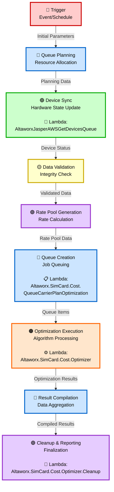

# Carrier Optimization Data Flow Diagram with Lambda Functions

## Visual DFD with Lambda Integration

## Lambda Function Integration Details

### 🟢 Device Sync Stage (3rd Stage)
**Lambda Function:** `AltaworxJasperAWSGetDevicesQueue`
- **Purpose:** Retrieves device information from Jasper AWS
- **Input:** Planning Data
- **Output:** Device Status
- **Responsibilities:**
  - Queue device data retrieval requests
  - Fetch current device states from Jasper
  - Synchronize hardware state information
  - Provide device status for optimization

### 🔵 Queue Creation Stage (6th Stage)  
**Lambda Function:** `Altaworx.SimCard.Cost.QueueCarrierPlanOptimization`
- **Purpose:** Manages carrier plan optimization job queuing
- **Input:** Rate Pool Data
- **Output:** Queue Items
- **Responsibilities:**
  - Schedule carrier plan optimization jobs
  - Manage queue prioritization
  - Handle job distribution and load balancing
  - Track optimization job status

### 🟠 Optimization Execution Stage (7th Stage)
**Lambda Function:** `Altaworx.SimCard.Cost.Optimizer`
- **Purpose:** Core carrier plan optimization processing
- **Input:** Queue Items
- **Output:** Optimization Results
- **Responsibilities:**
  - Execute carrier plan optimization algorithms
  - Process rate plan comparisons
  - Calculate cost optimization scenarios
  - Generate optimization recommendations

### 🟣 Cleanup & Reporting Stage (9th Stage)
**Lambda Function:** `Altaworx.SimCard.Cost.Optimizer.Cleanup`
- **Purpose:** Post-processing cleanup and finalization
- **Input:** Compiled Results
- **Output:** Final Reports
- **Responsibilities:**
  - Clean up temporary optimization data
  - Finalize optimization results
  - Generate comprehensive reports
  - Manage resource cleanup and system maintenance

## Data Flow Sequence
1. **Initial Parameters** → Queue Planning
2. **Planning Data** → Device Sync (AltaworxJasperAWSGetDevicesQueue λ)
3. **Device Status** → Data Validation
4. **Validated Data** → Rate Pool Generation
5. **Rate Pool Data** → Queue Creation (QueueCarrierPlanOptimization λ)
6. **Queue Items** → Optimization Execution (Optimizer λ)
7. **Optimization Results** → Result Compilation
8. **Compiled Results** → Cleanup & Reporting (Optimizer.Cleanup λ)

## Lambda Execution Order
1. **AltaworxJasperAWSGetDevicesQueue** - Device data retrieval
2. **Altaworx.SimCard.Cost.QueueCarrierPlanOptimization** - Job queuing
3. **Altaworx.SimCard.Cost.Optimizer** - Core optimization
4. **Altaworx.SimCard.Cost.Optimizer.Cleanup** - Cleanup and finalization

## Architecture Benefits
- **🔴 Automated Triggering:** Event-driven or scheduled optimization runs
- **📱 Device Integration:** Real-time device state synchronization with Jasper
- **📋 Queue Management:** Efficient job scheduling and resource allocation
- **⚙️ Optimization Engine:** Advanced carrier plan optimization algorithms
- **🧹 Cleanup Operations:** Automated resource management and reporting
- **🔵 Scalability:** Queue-based processing for handling multiple carrier optimizations
- **🟣 Reliability:** Comprehensive validation and cleanup processes