# Cross-Provider Customer Optimization Data Flow Diagram (DFD) with Lambda Functions

## Visual DFD - Cross-Provider Customer Optimization Process

```mermaid
flowchart TD
    A["🔴 AMOP 2.0 Trigger<br/>Cross-Provider Customer Request"] --> |Customer Parameters<br/>Multi-Provider Settings| B
    
    B["🔷 Cross-Provider Session Management<br/>Multi-Provider Customer Validation"] --> |Validated Customer Data<br/>Provider Associations| C
    
    C["🟢 Cross-Provider Rate Plan Discovery<br/>Multi-Provider Auto Change Detection"] --> |Cross-Provider Rate Plan Status<br/>Provider-Specific Capabilities| D
    
    D["🟡 Cross-Provider Customer Validation<br/>Multi-Provider Eligibility Check"] --> |Validated Multi-Provider Customer Data<br/>Cross-Provider Eligibility Status| E
    
    E["🟣 Cross-Provider Rate Pool Generation<br/>Multi-Provider Customer Pool Calculation"] --> |Cross-Provider Rate Pool Data<br/>Provider-Specific Pool Configurations| F
    
    F["🔵 Multi-Provider Queue Creation<br/>Cross-Provider Customer Job Queuing<br/><br/>📋 Lambda:<br/>Altaworx.SimCard.Cost.<br/>QueueCustomerOptimization"] --> |Cross-Provider Queue Items<br/>Provider-Specific Job Assignments| G
    
    G["🌸 Multi-Provider Optimization Execution<br/>Cross-Provider Customer Algorithm Processing<br/><br/>⚙️ Lambda:<br/>Altaworx.SimCard.Cost.Optimizer"] --> |Cross-Provider Optimization Results<br/>Multi-Provider Cost Analysis| H
    
    H["🔵 Cross-Provider Result Compilation<br/>Multi-Provider Customer Data Aggregation"] --> |Compiled Cross-Provider Results<br/>Consolidated Multi-Provider Statistics| I
    
    I["🟣 Cross-Provider Customer Email & Reporting<br/>Multi-Provider Customer Finalization"] --> |Multi-Provider Reports<br/>Multi-Provider Optimization Summary| J
    
    J["🔷 Cross-Provider Processing Cleanup<br/>Multi-Provider Session Finalization<br/><br/>🧹 Lambda:<br/>Altaworx.SimCard.Cost.Optimizer.Cleanup"]

    classDef redBox fill:#ff9999,stroke:#cc0000,stroke-width:3px,color:#000000
    classDef tealBox fill:#66cccc,stroke:#009999,stroke-width:3px,color:#000000
    classDef greenBox fill:#99ff99,stroke:#00cc00,stroke-width:3px,color:#000000
    classDef yellowBox fill:#ffff99,stroke:#cccc00,stroke-width:3px,color:#000000
    classDef purpleBox fill:#cc99ff,stroke:#9933cc,stroke-width:3px,color:#000000
    classDef blueBox fill:#99ccff,stroke:#0066cc,stroke-width:3px,color:#000000
    classDef pinkBox fill:#ff99cc,stroke:#cc0066,stroke-width:3px,color:#000000

    class A redBox
    class B,J tealBox
    class C greenBox
    class D yellowBox
    class E,I purpleBox
    class F,H blueBox
    class G pinkBox
```



## Detailed Process Flow with Lambda Integration

### 1. 🔴 **AMOP 2.0 Trigger - Cross-Provider Customer Request**
- **Stage**: Initial Multi-Provider Trigger
- **Input**: Cross-provider customer requests
- **Output**: Customer Parameters, Multi-Provider Settings
- **Description**: Initiates cross-provider customer optimization process
- **Color**: Red

---

### 2. 🔷 **Cross-Provider Session Management - Multi-Provider Customer Validation**
- **Stage**: Multi-Provider Authentication & Session
- **Input**: Customer Parameters, Multi-Provider Settings
- **Output**: Validated Customer Data, Provider Associations
- **Description**: Validates customer credentials across multiple providers and manages session state
- **Color**: Teal

---

### 3. 🟢 **Cross-Provider Rate Plan Discovery - Multi-Provider Auto Change Detection**
- **Stage**: Multi-Provider Discovery & Analysis
- **Input**: Validated Customer Data, Provider Associations
- **Output**: Cross-Provider Rate Plan Status, Provider-Specific Capabilities
- **Description**: Analyzes rate plans across multiple providers and detects optimization opportunities
- **Color**: Light Green

---

### 4. 🟡 **Cross-Provider Customer Validation - Multi-Provider Eligibility Check**
- **Stage**: Multi-Provider Validation
- **Input**: Cross-Provider Rate Plan Status, Provider-Specific Capabilities
- **Output**: Validated Multi-Provider Customer Data, Cross-Provider Eligibility Status
- **Description**: Performs eligibility verification across multiple providers
- **Color**: Yellow

---

### 5. 🟣 **Cross-Provider Rate Pool Generation - Multi-Provider Customer Pool Calculation**
- **Stage**: Multi-Provider Pool Management
- **Input**: Validated Multi-Provider Customer Data, Cross-Provider Eligibility Status
- **Output**: Cross-Provider Rate Pool Data, Provider-Specific Pool Configurations
- **Description**: Generates customer-specific rate pools across multiple providers
- **Color**: Purple

---

### 6. 🔵 **Multi-Provider Queue Creation - Cross-Provider Customer Job Queuing**
- **Stage**: Multi-Provider Queue Management
- **Lambda Function**: **`Altaworx.SimCard.Cost.QueueCustomerOptimization`**
- **Input**: Cross-Provider Rate Pool Data, Provider-Specific Pool Configurations
- **Output**: Cross-Provider Queue Items, Provider-Specific Job Assignments
- **Description**: Creates optimization jobs and manages customer queuing across providers
- **Lambda Responsibilities**:
  - Handle cross-provider job scheduling and prioritization
  - Manage queue state across multiple provider systems
  - Track customer job progress across providers
  - Coordinate provider-specific optimization workflows
- **Color**: Blue

---

### 7. 🌸 **Multi-Provider Optimization Execution - Cross-Provider Customer Algorithm Processing**
- **Stage**: Multi-Provider Core Processing
- **Lambda Function**: **`Altaworx.SimCard.Cost.Optimizer`**
- **Input**: Cross-Provider Queue Items, Provider-Specific Job Assignments
- **Output**: Cross-Provider Optimization Results, Multi-Provider Cost Analysis
- **Description**: Executes optimization algorithms across multiple providers
- **Lambda Responsibilities**:
  - Execute cross-provider cost optimization algorithms
  - Process rate plan comparisons across multiple providers
  - Calculate multi-provider optimization scenarios
  - Generate provider-specific and consolidated recommendations
  - Manage computational resources for multi-provider processing
- **Color**: Pink

---

### 8. 🔵 **Cross-Provider Result Compilation - Multi-Provider Customer Data Aggregation**
- **Stage**: Multi-Provider Result Processing
- **Input**: Cross-Provider Optimization Results, Multi-Provider Cost Analysis
- **Output**: Compiled Cross-Provider Results, Consolidated Multi-Provider Statistics
- **Description**: Aggregates and compiles optimization results across providers
- **Color**: Blue

---

### 9. 🟣 **Cross-Provider Customer Email & Reporting - Multi-Provider Customer Finalization**
- **Stage**: Multi-Provider Communication & Reporting
- **Input**: Compiled Cross-Provider Results, Consolidated Multi-Provider Statistics
- **Output**: Multi-Provider Reports, Multi-Provider Optimization Summary
- **Description**: Generates reports and sends customer notifications for multi-provider optimization
- **Color**: Purple

---

### 10. 🔷 **Cross-Provider Processing Cleanup - Multi-Provider Session Finalization**
- **Stage**: Multi-Provider Finalization & Cleanup
- **Lambda Function**: **`Altaworx.SimCard.Cost.Optimizer.Cleanup`**
- **Input**: Multi-Provider Reports, Multi-Provider Optimization Summary
- **Output**: Clean System State, Archived Multi-Provider Results
- **Description**: Performs cleanup operations and finalizes multi-provider sessions
- **Lambda Responsibilities**:
  - Clean up temporary multi-provider optimization data
  - Finalize cross-provider optimization results
  - Archive provider-specific and consolidated results
  - Manage resource cleanup across provider systems
  - Maintain audit trails for multi-provider operations
- **Color**: Teal

---

## Lambda Functions Summary

| **Lambda Function** | **Stage** | **Purpose** | **Key Responsibilities** |
|---------------------|-----------|-------------|--------------------------|
| `Altaworx.SimCard.Cost.QueueCustomerOptimization` | Multi-Provider Queue Creation (6) | Cross-Provider Job Management | Multi-provider job scheduling, queue coordination |
| `Altaworx.SimCard.Cost.Optimizer` | Multi-Provider Optimization Execution (7) | Cross-Provider Processing | Multi-provider optimization algorithms, cost analysis |
| `Altaworx.SimCard.Cost.Optimizer.Cleanup` | Cross-Provider Processing Cleanup (10) | Multi-Provider Cleanup | Resource cleanup, result archival, session finalization |

## Cross-Provider Data Flow Chain

```
Customer Parameters & Multi-Provider Settings → 
Validated Customer Data & Provider Associations → 
Cross-Provider Rate Plan Status & Provider-Specific Capabilities → 
Validated Multi-Provider Customer Data & Cross-Provider Eligibility Status → 
Cross-Provider Rate Pool Data & Provider-Specific Pool Configurations → 
Cross-Provider Queue Items & Provider-Specific Job Assignments → 
Cross-Provider Optimization Results & Multi-Provider Cost Analysis → 
Compiled Cross-Provider Results & Consolidated Multi-Provider Statistics → 
Multi-Provider Reports & Multi-Provider Optimization Summary → 
Clean System State & Archived Multi-Provider Results
```

## Lambda Execution Sequence

1. **Altaworx.SimCard.Cost.QueueCustomerOptimization** - Manages cross-provider job queuing and coordination
2. **Altaworx.SimCard.Cost.Optimizer** - Processes multi-provider optimization algorithms
3. **Altaworx.SimCard.Cost.Optimizer.Cleanup** - Cleans up and finalizes multi-provider results

## Cross-Provider Architecture Benefits

- **🔴 Multi-Provider Triggering**: Automated cross-provider optimization initiation
- **🔷 Provider Coordination**: Session management across multiple provider systems
- **🟢 Cross-Provider Discovery**: Comprehensive rate plan analysis across providers
- **🟡 Multi-Provider Validation**: Eligibility checks across provider networks
- **🟣 Consolidated Pool Management**: Unified rate pool generation and reporting
- **🔵 Cross-Provider Queue Management**: Efficient job scheduling across providers
- **🌸 Multi-Provider Optimization**: Advanced algorithms for cross-provider scenarios
- **🧹 Comprehensive Cleanup**: Complete resource management across all providers
- **📊 Consolidated Reporting**: Unified view of multi-provider optimization results
- **🔄 Provider Abstraction**: Seamless integration across different provider APIs