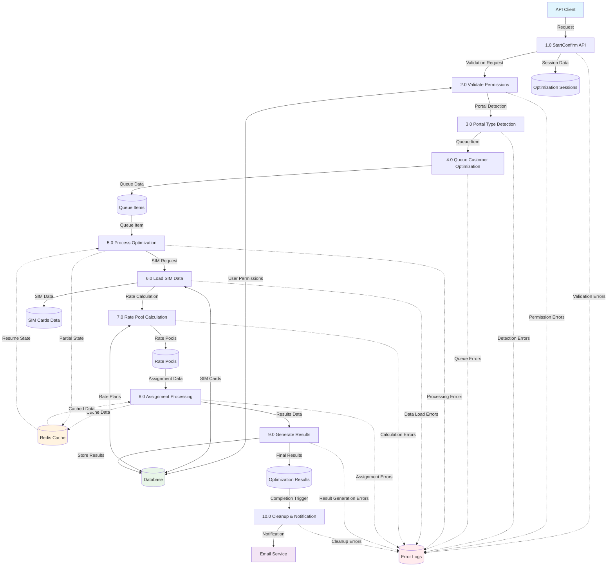

# Customer Optimization Data Flow Diagram

## Overview
This DFD shows the customer optimization process flow with error handling and logging mechanisms.

## Data Flow Diagram



## Process Descriptions

### 1.0 StartConfirm API
- **Input**: API Request with optimization parameters
- **Output**: Session creation, validation trigger
- **Error Logging**: Invalid request format, missing parameters

### 2.0 Validate Permissions
- **Input**: User credentials, session data
- **Output**: Permission validation result
- **Error Logging**: Unauthorized access, invalid credentials

### 3.0 Portal Type Detection
- **Input**: Session parameters
- **Output**: Portal type (M2M/Mobility/Cross-Provider)
- **Error Logging**: Unknown portal type, configuration errors

### 4.0 Queue Customer Optimization
- **Input**: Portal type, optimization parameters
- **Output**: Queue item creation
- **Error Logging**: Queue service failures, resource limits

### 5.0 Process Optimization
- **Input**: Queue items
- **Output**: Processing triggers, state management
- **Error Logging**: Processing failures, timeout errors

### 6.0 Load SIM Data
- **Input**: Portal type, filtering criteria
- **Output**: SIM cards dataset
- **Error Logging**: Data access failures, empty datasets

### 7.0 Rate Pool Calculation
- **Input**: SIM data, rate plan configurations
- **Output**: Calculated rate pools
- **Error Logging**: Calculation errors, invalid rate plans

### 8.0 Assignment Processing
- **Input**: Rate pools, SIM assignments
- **Output**: Optimization assignments
- **Error Logging**: Assignment conflicts, resource exhaustion

### 9.0 Generate Results
- **Input**: Assignment data
- **Output**: Optimization results
- **Error Logging**: Result generation failures, data inconsistencies

### 10.0 Cleanup & Notification
- **Input**: Completion status
- **Output**: Email notifications, resource cleanup
- **Error Logging**: Notification failures, cleanup errors

## Data Stores

| Store | Description | Error Conditions |
|-------|-------------|-----------------|
| Optimization Sessions | Active optimization sessions | Session corruption, timeout |
| Queue Items | Processing queue entries | Queue overflow, item corruption |
| SIM Cards Data | Device and usage information | Data staleness, access failures |
| Rate Pools | Available rate configurations | Pool exhaustion, invalid rates |
| Optimization Results | Final optimization outcomes | Result corruption, storage failures |

## Error Handling Strategy

### Error Categories
1. **Validation Errors**: Input validation, permission checks
2. **Processing Errors**: Calculation failures, resource limits
3. **Data Errors**: Database access, data integrity issues
4. **System Errors**: Service unavailability, timeout conditions

### Error Logging Format
```json
{
  "timestamp": "ISO-8601",
  "process_id": "Process identifier",
  "error_type": "Category",
  "error_code": "Specific error code",
  "message": "Human readable message",
  "context": {
    "session_id": "Optimization session",
    "user_id": "Requesting user",
    "portal_type": "Portal variant"
  }
}
```

### Recovery Mechanisms
- **Retry Logic**: Automatic retry for transient failures
- **State Persistence**: Cache intermediate states for resumption
- **Graceful Degradation**: Partial results when possible
- **Notification**: Alert administrators for critical failures