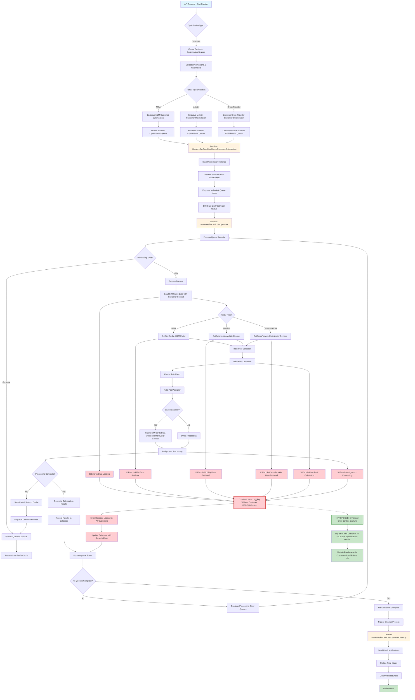

# Customer Optimization Flow - Data Flow Diagram

## Issue Identified
**Problem**: Customer ID and ICCID were missing if there was an error. In version 2.0, an Error message was added to all customers, making it hard to identify which specific customer had an error.

## Problem Details

### Current Issue (Version 2.0)
1. **Missing Context in Error Handling**: When errors occur during customer optimization processing, the error logging mechanism doesn't capture the specific Customer ID and ICCID that caused the issue.

2. **Generic Error Broadcasting**: Errors are logged generically and applied to all customers in the optimization session, making it impossible to identify which specific customer data caused the problem.

3. **Difficult Troubleshooting**: Support teams cannot efficiently identify and resolve customer-specific issues because the error context is lost.

### Error Occurrence Points
The issue can occur at multiple stages in the customer optimization flow:
- **Data Loading Phase**: When retrieving customer SIM card data
- **Portal-Specific Data Retrieval**: During M2M, Mobility, or Cross-Provider data fetching
- **Rate Pool Calculation**: When calculating optimal rate pools for customers
- **Assignment Processing**: During the rate pool assignment process

### Proposed Solution
Implement enhanced error context capture that includes:
- **Customer ID**: Specific identifier of the affected customer
- **ICCID**: SIM card identifier that experienced the issue
- **Error Details**: Specific error message and stack trace
- **Processing Stage**: Which stage of the optimization process failed
- **Timestamp**: When the error occurred

This would enable targeted error resolution and better customer support.