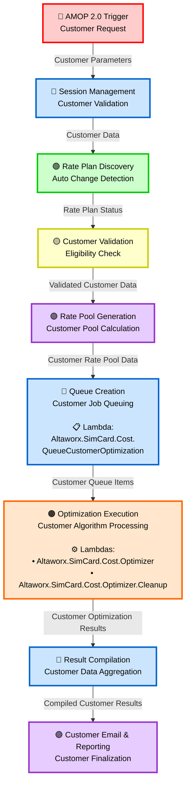

# Enhanced Data Flow Diagram with Lambda Functions

## Visual DFD with Lambda Integration

## Lambda Function Details

### 🔵 Queue Creation Stage
**Lambda Function:** `Altaworx.SimCard.Cost.QueueCustomerOptimization`
- **Purpose:** Manages customer job queuing and scheduling
- **Input:** Customer Rate Pool Data
- **Output:** Customer Queue Items
- **Responsibilities:**
  - Job prioritization and scheduling
  - Queue state management
  - Customer job tracking

### 🟠 Optimization Execution Stage
**Primary Lambda:** `Altaworx.SimCard.Cost.Optimizer`
- **Purpose:** Core optimization processing engine
- **Responsibilities:**
  - Executes cost optimization algorithms
  - Processes customer-specific scenarios
  - Manages computational resources

**Cleanup Lambda:** `Altaworx.SimCard.Cost.Optimizer.Cleanup`
- **Purpose:** Post-processing cleanup operations
- **Responsibilities:**
  - Resource cleanup and management
  - Data sanitization
  - System stability maintenance

## Data Flow Sequence
1. **Customer Parameters** → Session Management
2. **Customer Data** → Rate Plan Discovery  
3. **Rate Plan Status** → Customer Validation
4. **Validated Customer Data** → Rate Pool Generation
5. **Customer Rate Pool Data** → Queue Creation (QueueCustomerOptimization λ)
6. **Customer Queue Items** → Optimization Execution (Optimizer & Cleanup λ)
7. **Customer Optimization Results** → Result Compilation
8. **Compiled Customer Results** → Email & Reporting

## Architecture Overview
- **🔴 Red:** Initial trigger point
- **🔵 Blue:** Management and compilation stages  
- **🟢 Green:** Discovery and analysis
- **🟡 Yellow:** Validation processes
- **🟣 Purple:** Generation and finalization
- **🟠 Orange:** Core processing with lambda integration