# SIM Card Cost Optimization Data Flow

This document provides a comprehensive data flow diagram for the custom SIM card cost optimization system from start to end.

## System Overview

The optimization system is designed to analyze SIM card usage patterns and recommend optimal rate plans for both carrier and customer optimization scenarios. It supports multiple portal types (M2M, Mobility, Cross-Provider) and uses AWS Lambda functions with SQS queues for scalable processing.

## Data Flow Diagram

```mermaid
graph TB
    A[API Request - StartConfirm] --> B{Optimization Type?}
    
    B -->|Customer| C[Create Customer Optimization Session]
    B -->|Carrier| D[Create Carrier Optimization Session]
    
    C --> E[Validate Permissions & Parameters]
    D --> F[Validate Admin Permissions]
    
    E --> G{Portal Type Detection}
    F --> H[Enqueue Carrier Optimization]
    
    G -->|M2M| I[Enqueue M2M Customer Optimization]
    G -->|Mobility| J[Enqueue Mobility Customer Optimization]
    G -->|Cross-Provider| K[Enqueue Cross-Provider Customer Optimization]
    
    I --> L[M2M Customer Optimization Queue]
    J --> M[Mobility Customer Optimization Queue]
    K --> N[Cross-Provider Customer Optimization Queue]
    H --> O[Carrier Optimization Queue]
    
    L --> P[Lambda: AltaworxSimCardCostQueueCustomerOptimization]
    M --> P
    N --> P
    O --> Q[Lambda: Carrier Optimization Function]
    
    P --> R[Start Optimization Instance]
    Q --> S[Start Carrier Optimization Instance]
    
    R --> T[Create Communication Plan Groups]
    S --> U[Create Rate Plan Pools]
    
    T --> V[Enqueue Individual Queue Items]
    U --> W[Enqueue Rate Plan Calculations]
    
    V --> X[SIM Card Cost Optimizer Queue]
    W --> X
    
    X --> Y[Lambda: AltaworxSimCardCostOptimizer]
    
    Y --> Z[Process Queue Records]
    Z --> AA{Processing Type?}
    
    AA -->|Initial| BB[ProcessQueues]
    AA -->|Continue| CC[ProcessQueuesContinue]
    
    BB --> DD[Load SIM Cards Data]
    CC --> EE[Resume from Redis Cache]
    
    DD --> FF{Portal Type?}
    FF -->|M2M| GG[GetSimCards - M2M Portal]
    FF -->|Mobility| HH[GetOptimizationMobilityDevices]
    FF -->|Cross-Provider| II[GetCrossProviderOptimizationDevices]
    
    GG --> JJ[Rate Pool Collection]
    HH --> JJ
    II --> JJ
    
    JJ --> KK[Rate Pool Calculator]
    KK --> LL[Create Rate Pools]
    LL --> MM[Rate Pool Assigner]
    
    MM --> NN{Cache Enabled?}
    NN -->|Yes| OO[Cache SIM Cards Data]
    NN -->|No| PP[Direct Processing]
    
    OO --> QQ[Assignment Processing]
    PP --> QQ
    
    QQ --> RR{Processing Complete?}
    RR -->|No| SS[Save Partial State to Cache]
    RR -->|Yes| TT[Generate Optimization Results]
    
    SS --> UU[Enqueue Continue Process]
    UU --> CC
    
    TT --> VV[Record Results to Database]
    VV --> WW[Update Queue Status]
    
    WW --> XX{All Queues Complete?}
    XX -->|No| YY[Continue Processing Other Queues]
    XX -->|Yes| ZZ[Mark Instance Complete]
    
    YY --> Z
    ZZ --> AAA[Trigger Cleanup Process]
    
    AAA --> BBB[Lambda: AltaworxSimCardCostOptimizerCleanup]
    BBB --> CCC[Send Email Notifications]
    CCC --> DDD[Update Final Status]
    DDD --> EEE[Clean Up Resources]
    
    EEE --> FFF[End Process]
    
    style A fill:#e1f5fe
    style FFF fill:#c8e6c9
    style Y fill:#fff3e0
    style P fill:#fff3e0
    style BBB fill:#fff3e0
```

## Detailed Process Flow

### 1. API Entry Point
- **Controller**: `OptimizationApiController.StartConfirm()`
- **Input**: `OptimizationRequestDto` with parameters like billing period, service provider, optimization type
- **Authentication**: Validates user permissions and tenant access
- **Session Creation**: Creates `OptimizationSession` record with unique GUID

### 2. Optimization Type Routing

#### Customer Optimization Path:
1. **Portal Type Detection**: Determines M2M, Mobility, or Cross-Provider based on service provider
2. **Customer Filtering**: Gets eligible customers based on portal type and permissions
3. **Queue Creation**: Creates SQS messages for each customer with delay to prevent database flooding

#### Carrier Optimization Path:
1. **Admin Validation**: Ensures user has admin privileges
2. **Rate Plan Analysis**: Analyzes carrier rate plans for optimization opportunities
3. **Queue Creation**: Creates carrier-specific optimization queues

### 3. Queue Processing

#### Customer Queue Processing (`AltaworxSimCardCostQueueCustomerOptimization`):
1. **Message Processing**: Handles SQS messages with customer information
2. **Instance Creation**: Creates optimization instances with billing period context
3. **Communication Plan Grouping**: Groups devices by communication plans
4. **Batch Queue Creation**: Creates batches of queue items for processing

#### Core Optimization Processing (`AltaworxSimCardCostOptimizer`):
1. **Queue Item Processing**: Processes individual queue items from SQS
2. **Data Loading**: Loads SIM card usage data based on portal type
3. **Rate Pool Creation**: Creates rate pools using `RatePoolFactory`
4. **Assignment Logic**: Uses `RatePoolAssigner` for optimal rate plan assignment

### 4. Assignment Algorithm

#### Data Processing:
- **SIM Card Grouping**: Groups by communication plan or no grouping based on portal type
- **Usage Analysis**: Analyzes data usage patterns and SMS charges
- **Rate Pool Sequencing**: Determines optimal rate plan sequences

#### Assignment Strategies:
- **No Grouping + Largest to Smallest**: Assigns high-usage devices first
- **No Grouping + Smallest to Largest**: Assigns low-usage devices first  
- **Group by Communication Plan + Largest to Smallest**: Groups by comm plan, then largest first
- **Group by Communication Plan + Smallest to Largest**: Groups by comm plan, then smallest first

#### Caching Strategy:
- **Redis Cache**: Stores partial assignment state for large processing jobs
- **Continuation Processing**: Resumes from cached state if processing exceeds time limits
- **Chaining**: Uses SQS message chaining for large optimization jobs

### 5. Result Processing

#### Database Updates:
- **Assignment Records**: Saves optimal rate plan assignments per SIM card
- **Cost Calculations**: Records total costs, base rates, rate charges, and overage costs
- **Queue Status**: Updates queue processing status and completion time

#### Result Aggregation:
- **Instance Summary**: Aggregates results across all queues in an instance
- **Cost Optimization**: Calculates total savings and optimization recommendations
- **Error Handling**: Tracks and reports any processing errors

### 6. Cleanup and Notification

#### Cleanup Process (`AltaworxSimCardCostOptimizerCleanup`):
1. **Status Verification**: Ensures all instances are complete
2. **Email Notifications**: Sends completion emails to stakeholders
3. **Resource Cleanup**: Cleans up temporary data and cache entries
4. **Final Status Update**: Marks optimization session as complete

#### Monitoring and Progress:
- **Progress Tracking**: Updates progress percentage throughout the process
- **AMOP 2.0 Integration**: Sends progress updates to AMOP 2.0 system
- **Error Notifications**: Sends error notifications for failed optimizations

## Key Components

### Data Models:
- **OptimizationSession**: Main session tracking
- **OptimizationInstance**: Individual optimization runs
- **OptimizationQueue**: Queue items for processing
- **SimCard**: Device data with usage information
- **RatePool**: Rate plan collections and assignments

### Processing Components:
- **RatePoolCalculator**: Calculates optimal rate pool configurations
- **RatePoolAssigner**: Assigns SIM cards to optimal rate pools
- **RatePoolFactory**: Creates rate pool instances
- **OptimizationResultDbWriter**: Saves results to database

### Infrastructure:
- **AWS SQS**: Message queuing for scalable processing
- **AWS Lambda**: Serverless processing functions
- **Redis Cache**: Temporary state storage for large jobs
- **SQL Server**: Persistent data storage

## Error Handling

### Retry Logic:
- **SQL Retry Policy**: Automatic retry for database connection issues
- **SQS Message Retry**: Dead letter queues for failed messages
- **Lambda Timeout Handling**: Graceful handling of processing time limits

### Monitoring:
- **CloudWatch Logging**: Comprehensive logging throughout the process
- **Email Notifications**: Error notifications to administrators
- **Status Tracking**: Real-time status updates in the database

## Performance Optimizations

### Scalability Features:
- **Parallel Processing**: Multiple Lambda instances process queues simultaneously
- **Batch Processing**: Groups operations to reduce database load
- **Caching**: Redis cache for expensive operations and large datasets
- **Delayed Queuing**: Prevents database flooding with staggered message delivery

### Resource Management:
- **Connection Pooling**: Efficient database connection management
- **Memory Management**: Careful handling of large datasets
- **Time Limits**: Sanity check time limits to prevent runaway processes
- **Queue Management**: Efficient SQS message handling and cleanup