# Customer Optimization Flow Diagram

```mermaid
graph TB
    A[API Request - StartConfirm] --> B{Optimization Type?}
    
    B -->|Customer| C[Create Customer Optimization Session]
    
    C --> E[Validate Permissions & Parameters]
    
    E --> G{Portal Type Detection}
    
    G -->|M2M| I[Enqueue M2M Customer Optimization]
    G -->|Mobility| J[Enqueue Mobility Customer Optimization]
    G -->|Cross-Provider| K[Enqueue Cross-Provider Customer Optimization]
    
    I --> L[M2M Customer Optimization Queue]
    J --> M[Mobility Customer Optimization Queue]
    K --> N[Cross-Provider Customer Optimization Queue]
    
    L --> P[Lambda: AltaworxSimCardCostQueueCustomerOptimization]
    M --> P
    N --> P
    
    P --> R[Start Optimization Instance]
    
    R --> T[Create Communication Plan Groups]
    
    T --> V[Enqueue Individual Queue Items]
    
    V --> X[SIM Card Cost Optimizer Queue]
    
    X --> Y[Lambda: AltaworxSimCardCostOptimizer]
    
    Y --> Z[Process Queue Records]
    Z --> AA{Processing Type?}
    
    AA -->|Initial| BB[ProcessQueues]
    AA -->|Continue| CC[ProcessQueuesContinue]
    
    BB --> DD[Load SIM Cards Data]
    CC --> EE[Resume from Redis Cache]
    
    DD --> FF{Portal Type?}
    FF -->|M2M| GG[GetSimCards - M2M Portal]
    FF -->|Mobility| HH[GetOptimizationMobilityDevices]
    FF -->|Cross-Provider| II[GetCrossProviderOptimizationDevices]
    
    GG --> JJ[Rate Pool Collection]
    HH --> JJ
    II --> JJ
    
    JJ --> KK[Rate Pool Calculator]
    KK --> LL[Create Rate Pools]
    LL --> MM[Rate Pool Assigner]
    
    MM --> NN{Cache Enabled?}
    NN -->|Yes| OO[Cache SIM Cards Data]
    NN -->|No| PP[Direct Processing]
    
    OO --> QQ[Assignment Processing]
    PP --> QQ
    
    QQ --> RR{Processing Complete?}
    RR -->|No| SS[Save Partial State to Cache]
    RR -->|Yes| TT[Generate Optimization Results]
    
    SS --> UU[Enqueue Continue Process]
    UU --> CC
    
    TT --> VV[Record Results to Database]
    VV --> WW[Update Queue Status]
    
    WW --> XX{All Queues Complete?}
    XX -->|No| YY[Continue Processing Other Queues]
    XX -->|Yes| ZZ[Mark Instance Complete]
    
    YY --> Z
    ZZ --> AAA[Trigger Cleanup Process]
    
    AAA --> BBB[Lambda: AltaworxSimCardCostOptimizerCleanup]
    BBB --> CCC[Send Email Notifications]
    CCC --> DDD[Update Final Status]
    DDD --> EEE[Clean Up Resources]
    
    EEE --> FFF[End Process]
    
    %% Error Handling Flows
    E --> E1{Validation Failed?}
    E1 -->|Yes| E2[Log Validation Error]
    E2 --> E3[Return Error Response]
    E3 --> E4[End with Error]
    
    P --> P1{Lambda Execution Failed?}
    P1 -->|Yes| P2[Log Lambda Error]
    P2 --> P3[Update Instance Status to Failed]
    P3 --> P4[Send Error Notification]
    P4 --> P5[End with Error]
    
    DD --> DD1{Data Load Failed?}
    DD1 -->|Yes| DD2[Log Data Error]
    DD2 --> DD3[Mark Queue Item as Failed]
    DD3 --> DD4[Update Instance Status]
    DD4 --> DD5[End Processing]
    
    GG --> GG1{API Call Failed?}
    GG1 -->|Yes| GG2[Log API Error]
    HH --> HH1{API Call Failed?}
    HH1 -->|Yes| HH2[Log API Error]
    II --> II1{API Call Failed?}
    II1 -->|Yes| II2[Log API Error]
    
    GG2 --> ERR1[Handle Data Retrieval Error]
    HH2 --> ERR1
    II2 --> ERR1
    
    ERR1 --> ERR2[Mark Queue Item as Failed]
    ERR2 --> ERR3[Update Instance Status]
    ERR3 --> ERR4[Continue with Other Queues]
    
    KK --> KK1{Calculation Failed?}
    KK1 -->|Yes| KK2[Log Calculation Error]
    KK2 --> KK3[Use Default Rate Pools]
    KK3 --> LL
    
    VV --> VV1{Database Save Failed?}
    VV1 -->|Yes| VV2[Log Database Error]
    VV2 --> VV3[Retry Database Operation]
    VV3 --> VV4{Retry Successful?}
    VV4 -->|No| VV5[Mark Results as Incomplete]
    VV4 -->|Yes| WW
    VV5 --> WW
    
    BBB --> BBB1{Cleanup Failed?}
    BBB1 -->|Yes| BBB2[Log Cleanup Error]
    BBB2 --> BBB3[Send Error Alert]
    BBB3 --> DDD
    
    CCC --> CCC1{Email Send Failed?}
    CCC1 -->|Yes| CCC2[Log Email Error]
    CCC2 --> CCC3[Queue Email Retry]
    CCC3 --> DDD
    
    %% Styling
    style A fill:#e1f5fe
    style FFF fill:#c8e6c9
    style Y fill:#fff3e0
    style P fill:#fff3e0
    style BBB fill:#fff3e0
    
    %% Error Styling
    style E4 fill:#ffcdd2
    style P5 fill:#ffcdd2
    style DD5 fill:#ffcdd2
    style ERR1 fill:#ffe0b2
    style ERR2 fill:#ffe0b2
    style ERR3 fill:#ffe0b2
    style ERR4 fill:#ffe0b2
    style VV5 fill:#fff3e0
    style BBB2 fill:#fff3e0
    style CCC2 fill:#fff3e0
```

## Error Handling Details

### Validation Errors
- **Location**: Permission & Parameter validation step
- **Actions**: 
  - Log detailed validation error
  - Return structured error response to client
  - Terminate process gracefully

### Lambda Execution Errors
- **Location**: Lambda function invocations
- **Actions**:
  - Log lambda execution errors with context
  - Update optimization instance status to "Failed"
  - Send error notifications to administrators
  - Terminate process

### Data Loading Errors
- **Location**: SIM Cards data loading
- **Actions**:
  - Log data retrieval errors
  - Mark specific queue item as failed
  - Update overall instance status
  - Continue processing other queues if possible

### API Call Failures
- **Location**: Portal-specific data retrieval calls
- **Actions**:
  - Log API errors with response details
  - Handle data retrieval errors gracefully
  - Mark affected queue items as failed
  - Continue processing unaffected queues

### Calculation Errors
- **Location**: Rate pool calculations
- **Actions**:
  - Log calculation errors
  - Fall back to default rate pools
  - Continue processing with fallback data

### Database Operation Errors
- **Location**: Results recording
- **Actions**:
  - Log database errors
  - Implement retry mechanism
  - Mark results as incomplete if retries fail
  - Continue with status updates

### Cleanup and Notification Errors
- **Location**: Final cleanup and email notifications
- **Actions**:
  - Log cleanup/email errors
  - Send error alerts to administrators
  - Queue email retries for failed notifications
  - Complete process even if cleanup partially fails

## Flow Summary

1. **Initiation**: API request starts customer optimization session
2. **Validation**: Permissions and parameters are validated
3. **Portal Detection**: System determines portal type (M2M, Mobility, Cross-Provider)
4. **Queue Processing**: Optimization requests are queued and processed by Lambda functions
5. **Data Processing**: SIM card data is loaded and processed based on portal type
6. **Rate Calculation**: Rate pools are calculated and assigned
7. **Caching**: Large datasets are cached for performance
8. **Results Generation**: Optimization results are generated and stored
9. **Cleanup**: Resources are cleaned up and notifications sent
10. **Error Handling**: Comprehensive error handling at each critical step