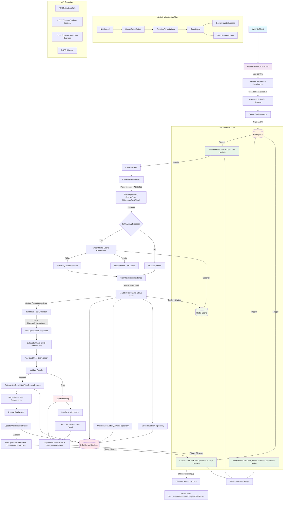

# Altaworx SimCard Cost Optimizer - System Flow Diagram

## Key Components Explanation

### 1. **API Layer (OptimizationApiController)**
- Handles HTTP requests from web UI
- Validates user authentication and permissions
- Creates optimization sessions
- Queues SQS messages for processing

### 2. **Lambda Functions**
- **AltaworxSimCardCostOptimizer**: Main optimization processing
- **AltaworxSimCardCostQueueCustomerOptimization**: Customer-specific optimization
- **AltaworxSimCardCostOptimizerCleanup**: Post-processing cleanup

### 3. **Optimization Workflow**
1. Parse SQS message attributes (QueueIds, ChargeType, etc.)
2. Start optimization instance with status tracking
3. Load device data and rate plans from database
4. Build rate pool collections
5. Run optimization algorithms to find best cost scenarios
6. Validate and record results
7. Update status and trigger cleanup

### 4. **Status Management**
- **NotStarted** → **CommGroupSetup** → **RunningPermutations** → **CleaningUp** → **Complete**
- Error states lead to **CompleteWithErrors**
- Success states lead to **CompleteWithSuccess**

### 5. **Data Flow**
- Input: Customer devices, billing periods, rate plans
- Processing: Cost calculations, optimization algorithms
- Output: Optimized rate assignments, cost savings reports

### 6. **Infrastructure**
- **SQS**: Message queuing for asynchronous processing
- **Lambda**: Serverless compute for optimization logic
- **SQL Server**: Primary data storage
- **Redis**: Optional caching layer for performance
- **CloudWatch**: Logging and monitoring